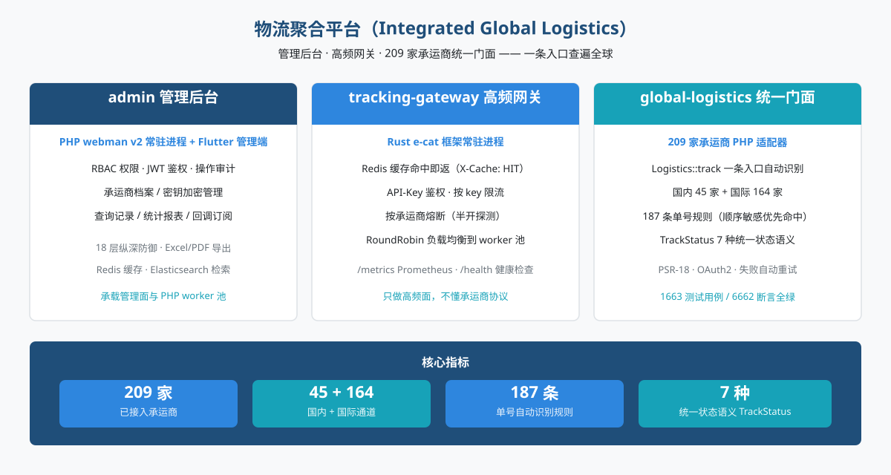
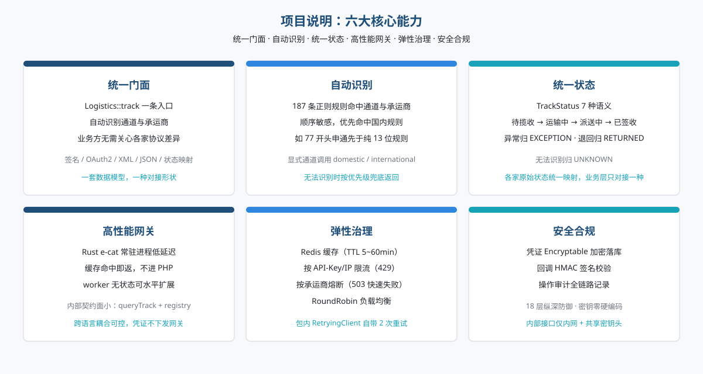
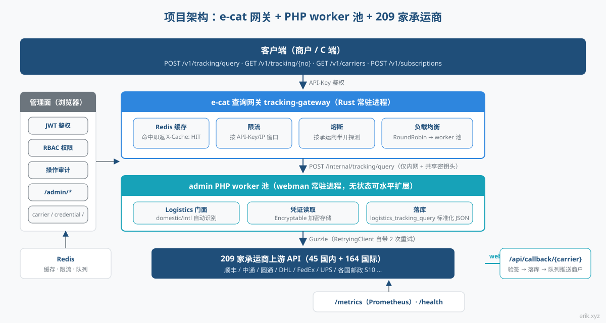
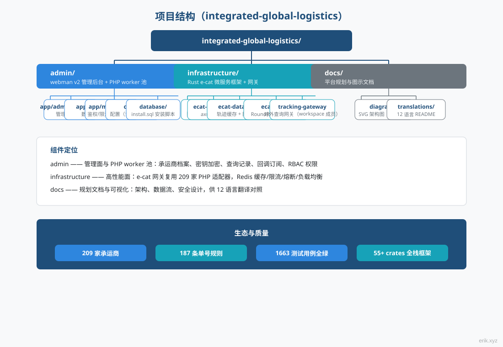
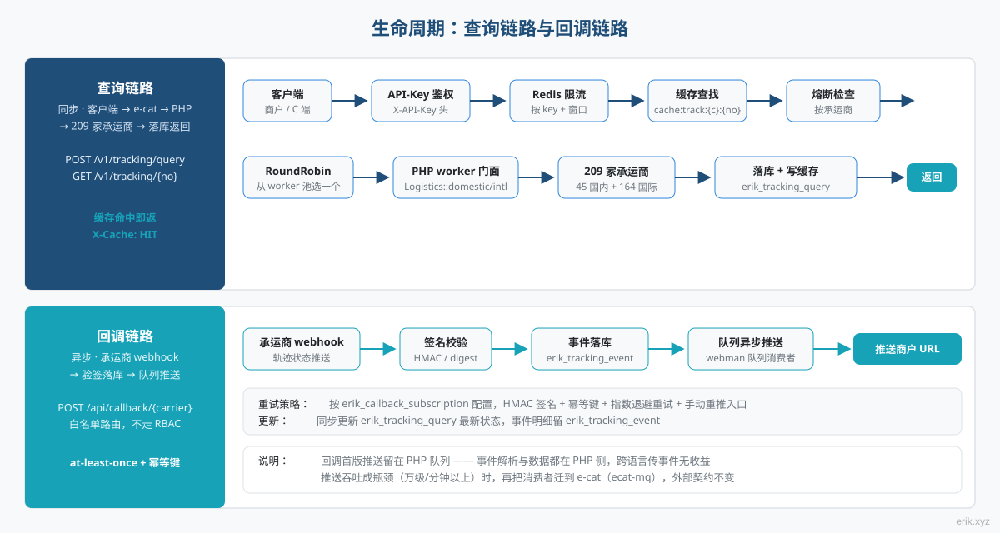
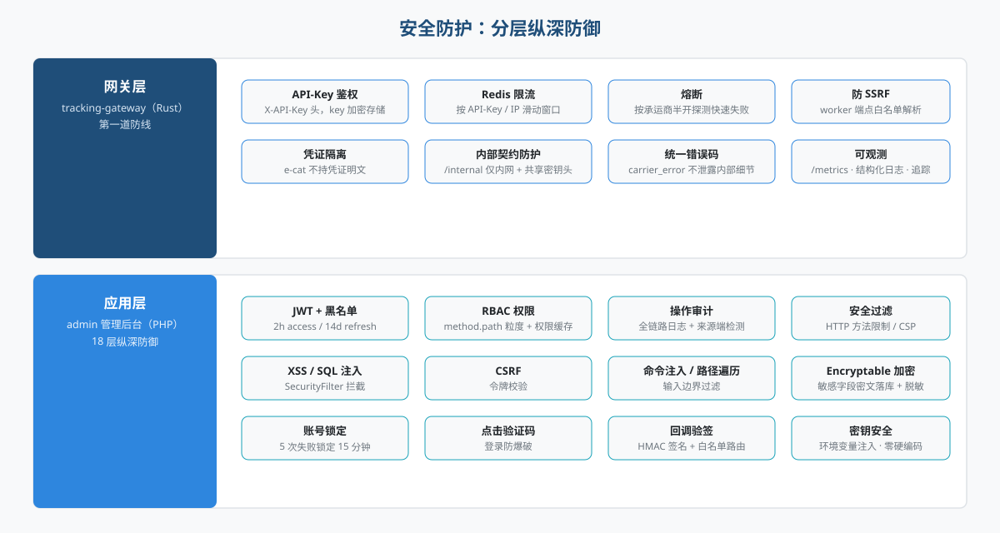

# 物流聚合平台（Integrated Global Logistics）

全球物流轨迹查询的一站式平台：**admin 管理后台**（PHP webman + Flutter）承载管理面与查询 worker 池，**e-cat 高频网关**（Rust 常驻进程）扛住查询流量，**global-logistics 统一门面**（209 家承运商 PHP 适配器）一条入口查遍全球。


> 支持语言：[[English / 英语]](docs/translations/en/README.md) · [[한국어 / 韩语]](docs/translations/ko/README.md) · [[Русский / 俄语]](docs/translations/ru/README.md) · [[Deutsch / 德语]](docs/translations/de/README.md) · [[Français / 法语]](docs/translations/fr/README.md) · [[Español / 西班牙语]](docs/translations/es/README.md) · [[Português / 葡萄牙语]](docs/translations/pt/README.md) · [[हिन्दी / 印地语]](docs/translations/hi/README.md) · [[العربية / 阿拉伯语]](docs/translations/ar/README.md) · [[বাংলা / 孟加拉语]](docs/translations/bn/README.md) · [[Bahasa Indonesia / 印尼语]](docs/translations/id/README.md) · [[日本語 / 日语]](docs/translations/ja/README.md)（[跳到翻译](#翻译)）

## 项目介绍



物流聚合平台把全球 **209 家**快递 / 邮政承运商的轨迹查询统一收敛为一个平台：商户与 C 端只传入一个单号，平台自动识别国内 / 国际通道与承运商，无需关心各家协议差异（签名、OAuth2、XML/JSON、状态映射）。

平台由三个组件协作组成：

- **admin 管理后台**（PHP webman v2 + Flutter）—— 管理面与 PHP worker 池：承运商档案、密钥加密管理、查询记录、统计报表、回调订阅配置，RBAC / JWT / 操作审计体系完备；
- **tracking-gateway 高频网关**（Rust e-cat 框架）—— 对外查询 API 的第一道入口：Redis 缓存、限流、按承运商熔断、worker 负载均衡，只做高频面，不懂承运商协议；
- **global-logistics 统一门面**（PHP 包）—— 209 家承运商适配器（国内 45 + 国际 164）、187 条单号自动识别规则、`TrackStatus` 7 种统一状态语义。

**当前进度**：M1 管理面（承运商/凭证/查询记录/订阅 CRUD）、M2 查询网关（对外 API 全链路）、M3 回调订阅、M4 监控统计、M5 对外 OpenAPI 文档与 M6 五份客户端 SDK 均已完成 —— 客户端 → e-cat → worker → 承运商的轨迹查询链路可演示，Python / PHP / Node.js / Go / Rust 五份零依赖 SDK 拷贝即用。

## 项目说明



- **一条入口**：`Logistics::track($trackingNo)` 自动识别国内 / 国际通道与承运商，业务层只对接一种形状；
- **自动识别**：187 条单号正则规则顺序敏感、优先命中国内通道；识别不了的场景可显式调用 `domestic()` / `international()`；
- **统一状态**：各家五花八门的原始状态映射为统一的 `TrackStatus` 枚举（待揽收 / 运输中 / 派送中 / 已签收 / 异常 / 退回 / 无法识别）；
- **全球覆盖**：DHL、FedEx、UPS、USPS 四大快递与各国邮政 S10 系统（欧洲、拉美加勒比、非洲中东、亚太四区域）；
- **对外 API**：e-cat 查询网关提供 API-Key 鉴权、Redis 缓存命中（`X-Cache: HIT`）、限流 429、按承运商熔断 503、RoundRobin worker 负载均衡；五份零依赖 SDK（Python / PHP / Node.js / Go / Rust）拷贝即用；
- **查询全审计**：每次查询落库 `logistics_tracking_query`（成功/失败、耗时、错误码），管理面可查可统计；
- **密钥零硬编码**：各家密钥全部经配置注入，数据库层用 Encryptable 密文存储，代码与密钥完全分离。

## 项目架构



查询链路：**客户端 → e-cat 查询网关 → PHP worker 池 → 209 家承运商**。

e-cat 网关（Rust）负责对外 API 的 API-Key 鉴权、Redis 缓存命中、限流、按承运商熔断与 RoundRobin 负载均衡；缓存命中、限流拒绝、熔断快速失败都在 e-cat 侧完成，PHP worker 只承接真实查询流量，水平扩展只需加 worker。

**e-cat 复用 209 家 PHP 适配器的分工方案**：209 个适配器是 PHP（`src/Carriers/Domestic` 45 家 + `International` 164 家），Rust 重写是数月工程且丧失上游包持续更新收益；e-cat 不需要懂承运商协议，只依赖一个稳定的内部契约（`/internal/tracking/query` + `/internal/carriers` 注册表同步）。凭证永不下发到 e-cat，安全边界清晰。

管理面（浏览器）→ `/admin/*`：JWT + RBAC 权限 + 操作审计，覆盖 carrier / carrier-credential / tracking-query / callback-subscription / statistics。

## 项目结构



```
integrated-global-logistics/
├── admin/                          # PHP webman v2 管理后台 + worker 池
│   ├── app/
│   │   ├── admin/controller/       # 管理端控制器（carrier、tracking、统计等）
│   │   ├── api/                    # API v1（验证码 / 登录 / 刷新令牌）
│   │   ├── common/                 # Hashids / Snowflake / 加密脱敏服务
│   │   ├── middleware/             # 安全过滤 / 限流 / JWT / RBAC / 审计
│   │   └── model/                  # 数据模型（logistics_ 前缀，snowflake 主键）
│   ├── apps/
│   │   ├── flutter/                # Flutter Web 管理后台（PC 风格）
│   │   └── harmonyos/              # HarmonyOS 原生客户端
│   ├── config/                     # 配置（含中文注释）
│   ├── database/
│   │   └── install.sql             # SQL 安装脚本（含权限种子数据）
│   └── docs/                       # API / 架构 / 设计 / 安全文档（12 语言）
├── infrastructure/                 # Rust e-cat 微服务框架 + 查询网关
│   ├── ecat/                       # 聚合 crate（App 骨架）
│   ├── ecat-transport-http/        # axum HTTP 传输
│   ├── ecat-data-redis/            # 轨迹缓存 + 限流存储
│   ├── ecat-client/                # RoundRobin 负载均衡
│   └── tracking-gateway/           # 对外查询网关（workspace 新成员）
├── sdk/                            # 对外 API 客户端 SDK（Python / PHP / Node.js / Go / Rust）
└── docs/                           # 平台规划与图示
    ├── diagrams/                   # SVG 架构图（本 README 引用）
    ├── translations/               # 12 语言 README
    └── logistics-aggregation-platform-plan.md  # 实施规划
```

## 生命周期



**查询链路（同步）**：客户端 → API-Key 鉴权 → Redis 限流 → 缓存查找（命中即返，`X-Cache: HIT`）→ 熔断检查（OPEN 则 503 快速失败）→ RoundRobin 选 worker → PHP worker 的 `Logistics` 门面（包内 RetryingClient 自带 2 次重试）→ 209 家承运商 → 落库 `logistics_tracking_query` + 写缓存 → 返回标准化 JSON。

**回调链路（异步）**：承运商 webhook → `/api/callback/{carrier}` 白名单路由 + 签名校验 → 落库 `logistics_tracking_event` + 更新查询记录 → 写入 webman 队列 → 异步消费者按订阅配置推送到商户回调 URL（HMAC 签名 + 幂等键 + 指数退避重试 + 手动重推入口）。

> 回调推送首版留在 PHP 队列 —— 事件解析与数据都在 PHP 侧，跨语言传事件无收益；若推送吞吐成为瓶颈（万级/分钟以上），再把消费者迁到 e-cat（ecat-mq + retry 中间件），外部契约不变。

## 安全防护



分层纵深防御，要点如下：

- **网关层**（tracking-gateway）：API-Key 鉴权、Redis 限流（按 key / IP）、按承运商熔断、防 SSRF（worker 端点白名单解析）；`/internal` 仅监听内网 + 共享密钥头；凭证隔离 —— e-cat 不持凭证明文；
- **应用层**（admin）：JWT + 黑名单（2h access / 14d refresh）、RBAC method.path 粒度权限、操作审计全链路记录；`SecurityFilter` 拦截 XSS / SQL 注入 / CSRF / 命令注入 / 路径遍历；敏感数据 `Encryptable` 加密落库 + 脱敏导出；登录 5 次失败锁定 15 分钟 + 点击验证码；
- **回调安全**：白名单路由 + HMAC 签名校验，at-least-once 投递 + 幂等键防重复推送；
- **统一错误语义**：限流 429、熔断 503、承运商错误 `carrier_error`，不向客户端泄露内部细节。

## 快速开始

**admin 管理后台**（PHP webman）：

```bash
cd admin
composer install
php start.php start
```

启动后浏览器访问安装向导完成数据库初始化和管理员创建：`http://localhost:8787/install`（默认端口 8787，可在 `config/server.php` 修改）。

**infrastructure 查询网关**（Rust e-cat）：

```bash
cd infrastructure
cargo build --offline
TRACKING_GATEWAY_CONFIG=tracking-gateway/config/config.json ./target/debug/tracking-gateway
```

网关默认监听 `0.0.0.0:8080`（`tracking-gateway/config/config.json` 可改），worker 指向 PHP internal 端点（默认 `http://127.0.0.1:8787`），API-Key 与内部令牌在配置中声明。

**SDK 调用**（五份零依赖客户端，拷贝即用）：

```python
from tracking_client import TrackingClient
client = TrackingClient("demo-api-key", "http://127.0.0.1:8080")
result = client.query_tracking("LX123456789CN")
```

```bash
curl -H "X-API-Key: demo-api-key" http://127.0.0.1:8080/v1/tracking/query \
  -H "Content-Type: application/json" -d '{"tracking_no": "LX123456789CN"}'
```

各语言用法与示例见 [sdk/README.md](sdk/README.md)。

详细部署见 [admin/README.md](admin/README.md)（Docker Compose 编排 5 个服务：Nginx / PHP / MySQL / Redis / Elasticsearch）与实施规划文档。

## 文档

- [admin/docs/API.md](admin/docs/API.md) —— API 参考（统一响应格式、错误码、认证流程、限流策略、中间件链路）
- [admin/docs/ARCHITECTURE.md](admin/docs/ARCHITECTURE.md) —— 架构设计
- [admin/docs/DESIGN.md](admin/docs/DESIGN.md) —— 设计文档
- [admin/docs/SECURITY.md](admin/docs/SECURITY.md) —— 安全架构
- [docs/logistics-aggregation-platform-plan.md](docs/logistics-aggregation-platform-plan.md) —— 平台实施规划（架构、数据流、数据库设计、API 契约、里程碑）
- [admin/README.md](admin/README.md) —— 管理后台完整说明（技术栈、数据库规范、部署、CI/CD）
- [sdk/README.md](sdk/README.md) —— 对外 API 客户端 SDK（Python / PHP / Node.js / Go / Rust，五份零依赖，拷贝即用）

## 翻译

| 语言 | 链接 |
|------|------|
| English / 英语 | [docs/translations/en/README.md](docs/translations/en/README.md) |
| 한국어 / 韩语 | [docs/translations/ko/README.md](docs/translations/ko/README.md) |
| Русский / 俄语 | [docs/translations/ru/README.md](docs/translations/ru/README.md) |
| Deutsch / 德语 | [docs/translations/de/README.md](docs/translations/de/README.md) |
| Français / 法语 | [docs/translations/fr/README.md](docs/translations/fr/README.md) |
| Español / 西班牙语 | [docs/translations/es/README.md](docs/translations/es/README.md) |
| Português / 葡萄牙语 | [docs/translations/pt/README.md](docs/translations/pt/README.md) |
| हिन्दी / 印地语 | [docs/translations/hi/README.md](docs/translations/hi/README.md) |
| العربية / 阿拉伯语 | [docs/translations/ar/README.md](docs/translations/ar/README.md) |
| বাংলা / 孟加拉语 | [docs/translations/bn/README.md](docs/translations/bn/README.md) |
| Bahasa Indonesia / 印尼语 | [docs/translations/id/README.md](docs/translations/id/README.md) |
| 日本語 / 日语 | [docs/translations/ja/README.md](docs/translations/ja/README.md) |

## 开源不易，欢迎支持

| 微信 | 支付宝 |
|:---:|:---:|
|  |  |

### 全球转账打赏（跨境汇款）

**收款人信息**

- 收款人姓名：WANG KEXUN
- 收款账户号码：881015918251

**收款银行**

- ZA Bank SWIFT Code：AABLHKHHXXX
- 银行名称：ZA Bank Limited
- 银行编号：387
- 银行地址：Core F, Cyberport 3, 100 Cyberport Road, Hong Kong

**跨境汇款代理银行（如需）**

> 此为跨境汇款代理银行（中转银行）信息，非收款银行信息。请向汇款银行查询是否需要提供跨境汇款代理银行信息。

- **汇入港元、人民币及美元**，代理银行为 Citibank：
  - 银行名称：Citibank N.A. Hong Kong
  - SWIFT Code：CITIHKHXXXX
  - 银行编号：006
  - 分行名称：Hong Kong Branch
  - 分行编号：391
  - 银行地址：Citibank Tower, Citibank Plaza, 3 Garden Road, Central, Hong Kong
- **汇入其他币种**，代理银行为 BNY Mellon：
  - 银行名称：THE BANK OF NEW YORK MELLON
  - SWIFT Code：IRVTUS3NXXX
  - 银行地址：THE BANK OF NEW YORK MELLON, 240 GREENWICH STREET, NEW YORK, United States

### 虚拟币打赏 (Crypto Donation)

如果这个项目对你有帮助，欢迎扫描二维码打赏支持，谢谢！

| 主网 (Network) | 二维码 (QR Code) | 钱包地址 (Wallet Address) |
|---|---|---|
| BNB Smart Chain (BEP20) | [](docs/coin/1.jpg) | `0x355d429f97511897ccb4e271ec888205f9ab6629` |
| Tron (TRC20) | [](docs/coin/2.jpg) | `TEdDHWLajt1XvqtPDWmQctdrJaC3pzZZzz` |
| Ethereum (ERC20) | [](docs/coin/3.jpg) | `0x355d429f97511897ccb4e271ec888205f9ab6629` |
| Aptos | [](docs/coin/4.jpg) | `0x836e3780edfc3f7b2372b39e2a1a3a5d7adfaccd96c726f21cfde1b50dd68030` |
| Plasma | [](docs/coin/5.jpg) | `0x355d429f97511897ccb4e271ec888205f9ab6629` |
| Polygon POS | [](docs/coin/6.jpg) | `0x355d429f97511897ccb4e271ec888205f9ab6629` |
| Solana | [](docs/coin/7.jpg) | `2hfhboHdmdrYsY25XfQSsEWxq5ip4EQsR7f4AzSRMUyr` |
| The Open Network (TON) | [](docs/coin/8.jpg) | `UQB9kFQohzmXUir9QSSZq01iwl9aQZIDdBpNmDklljRtCoGK` |
| Arbitrum One | [](docs/coin/9.jpg) | `0x355d429f97511897ccb4e271ec888205f9ab6629` |
| AVAX C-Chain | [](docs/coin/10.jpg) | `0x355d429f97511897ccb4e271ec888205f9ab6629` |

---

## License

MIT

Copyright (c) 2026 erik <erik@erik.xyz> — https://erik.xyz

<!-- TRANSLATE-READY -->
