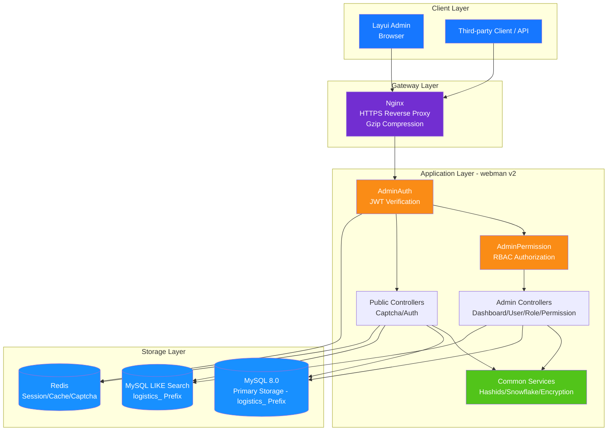

> Copyright (c) 2026 erik <erik@erik.xyz> — https://erik.xyz
>
> [中文](01-system-architecture.md) | [English](01-system-architecture.en.md)

# System Architecture (Topology)

```mermaid
flowchart TB
    subgraph clients["Client Layer"]
        adminui["Layui Admin<br/>Browser"]
        apiclient["Third-party Client / API"]
    end

    subgraph gateway["Gateway Layer"]
        nginx["Nginx<br/>HTTPS Reverse Proxy<br/>Gzip Compression"]
    end

    subgraph app["Application Layer - webman v2"]
        auth["AdminAuth<br/>JWT Verification"]
        perm["AdminPermission<br/>RBAC Authorization"]
        admin["Admin Controllers<br/>Dashboard/User/Role/Permission"]
        public["Public Controllers<br/>Captcha/Auth"]
        common["Common Services<br/>Hashids/Snowflake/Encryption"]
    end

    subgraph storage["Storage Layer"]
        mysql[("MySQL 8.0<br/>Primary Storage - logistics_ Prefix")]
        es[("MySQL LIKE Search<br/>logistics_ Prefix")]
        redis[("Redis<br/>Session/Cache/Captcha")]
    end

    adminui --> nginx
    apiclient --> nginx
    nginx --> auth
    auth --> perm
    perm --> admin
    auth --> public
    admin --> common
    public --> common
    admin --> mysql
    public --> mysql
    admin --> es
    public --> es
    auth --> redis
    public --> redis

    style adminui fill:#1677FF,color:#fff
    style apiclient fill:#1677FF,color:#fff
    style nginx fill:#722ED1,color:#fff
    style auth fill:#FA8C16,color:#fff
    style perm fill:#FA8C16,color:#fff
    style common fill:#52C41A,color:#fff
    style mysql fill:#1890FF,color:#fff
    style es fill:#1890FF,color:#fff
    style redis fill:#1890FF,color:#fff
```
