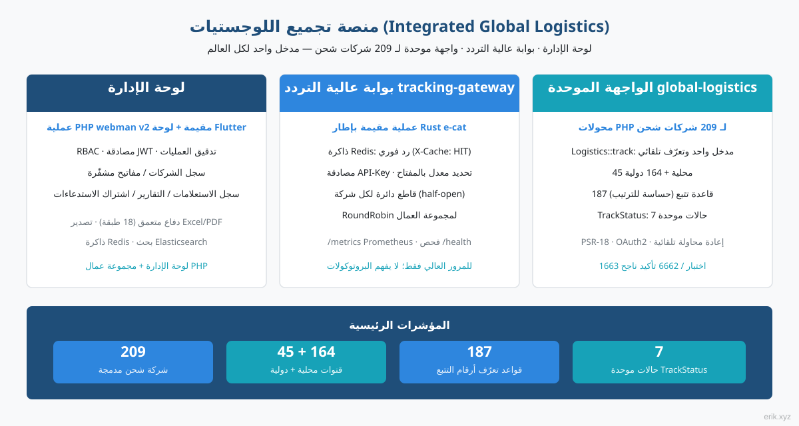
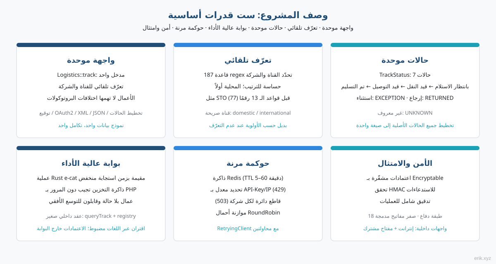
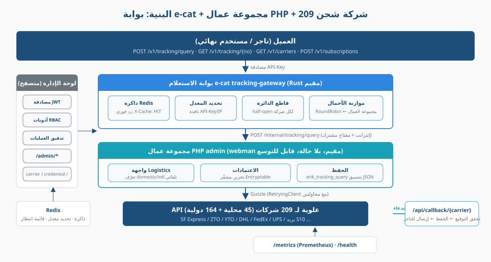
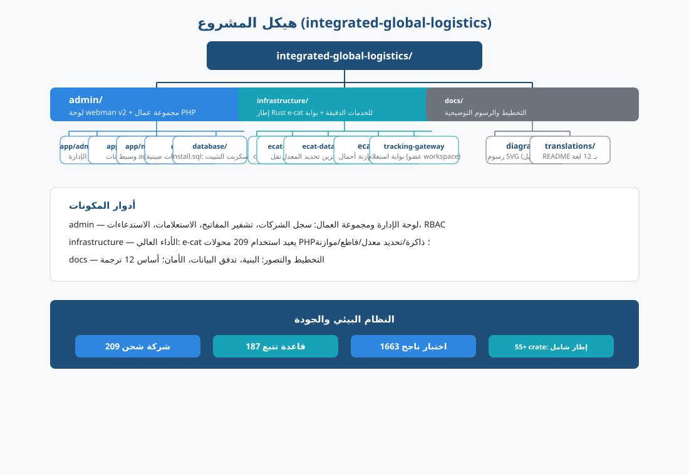
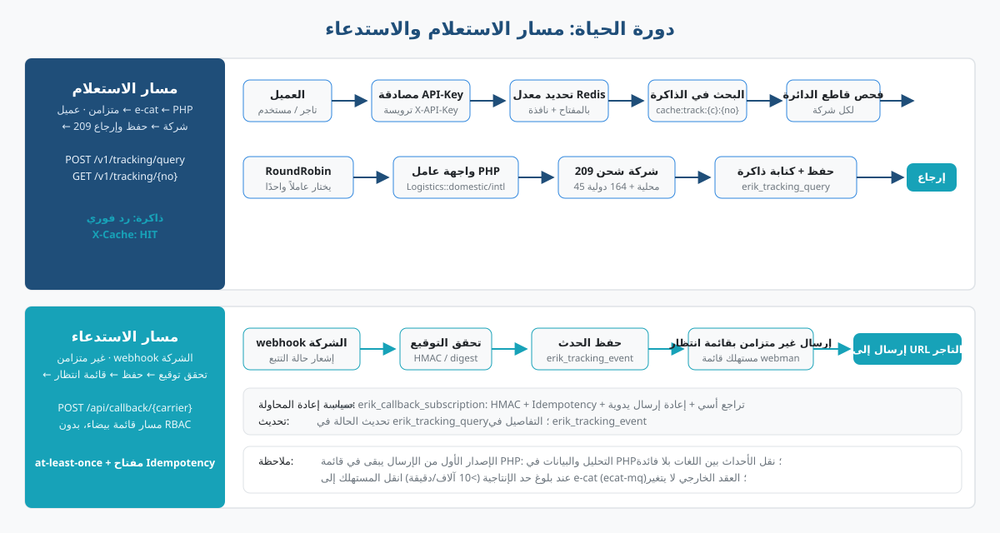
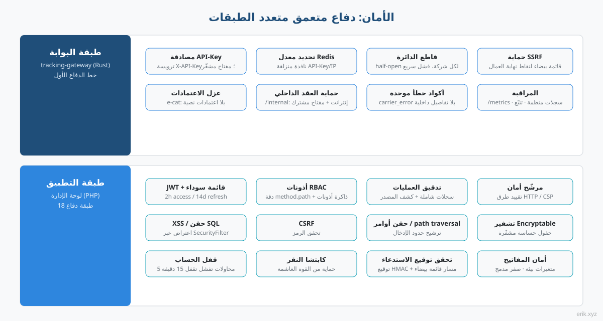

# منصة تجميع اللوجستيات (Integrated Global Logistics)

منصة شاملة للاستعلام عن تتبع الشحنات عالميًا: **لوحة الإدارة admin** (PHP webman + Flutter) تتولى جانب الإدارة ومجموعة عمال الاستعلام، **البوابة عالية التردد e-cat** (عملية مقيمة بلغة Rust) تتحمل حركة الاستعلامات، و**الواجهة الموحدة global-logistics** (محولات PHP لـ 209 شركات شحن) تستعلم عن العالم كله عبر مدخل واحد.

> اللغات: [[English]](docs/translations/en/README.md) · [[한국어]](docs/translations/ko/README.md) · [[Русский]](docs/translations/ru/README.md) · [[Deutsch]](docs/translations/de/README.md) · [[Français]](docs/translations/fr/README.md) · [[Español]](docs/translations/es/README.md) · [[Português]](docs/translations/pt/README.md) · [[हिन्दी]](docs/translations/hi/README.md) · [[العربية]](docs/translations/ar/README.md) · [[বাংলা]](docs/translations/bn/README.md) · [[Bahasa Indonesia]](docs/translations/id/README.md) · [[日本語]](docs/translations/ja/README.md)（[انتقل إلى الترجمات](#الترجمات)）

## مقدمة المشروع



تجمّع المنصة تتبع **209** شركات شحن وبريد من حول العالم في منصة واحدة: يرسل التاجر والمستخدم النهائي رقم تتبع واحدًا فقط، وتتعرف المنصة تلقائيًا على القناة (محلية/دولية) والشركة — دون القلق بشأن اختلافات البروتوكولات (التوقيع، OAuth2، XML/JSON، تخطيط الحالات).

تتكون المنصة من ثلاثة مكونات تعمل معًا:

- **admin** (لوحة الإدارة، PHP webman v2 + Flutter) — جانب الإدارة ومجموعة عمال PHP: سجل الشركات، إدارة المفاتيح المشفّرة، سجل الاستعلامات، التقارير الإحصائية، إعداد اشتراكات الاستدعاء؛ نظام RBAC / JWT / تدقيق عمليات مكتمل؛
- **tracking-gateway** (البوابة عالية التردد، إطار Rust e-cat) — المدخل الأول لواجهة الاستعلام الخارجية: ذاكرة Redis، تحديد المعدل، قاطع دائرة لكل شركة، موازنة أحمال العمال؛ للتردد العالي فقط ولا يفهم بروتوكولات الشركات؛
- **global-logistics** (الواجهة الموحدة، حزمة PHP) — محولات 209 شركات (45 محلية + 164 دولية)، 187 قاعدة تعرّف تلقائي لأرقام التتبع، 7 دلالات حالات موحدة في `TrackStatus`.

## وصف المشروع



- **مدخل واحد**: `Logistics::track($trackingNo)` يتعرف تلقائيًا على القناة المحلية/الدولية والشركة؛ لا تتعامل طبقة الأعمال إلا مع شكل واحد؛
- **التعرّف التلقائي**: 187 قاعدة regex حساسة للترتيب، مع أولوية للقنوات المحلية؛ وعند تعذّر التعرّف يمكن الاستدعاء الصريح `domestic()` / `international()`؛
- **حالات موحدة**: تُخطَّط الحالات الأصلية المتنوعة إلى تعداد `TrackStatus` الموحد (بانتظار الاستلام / قيد النقل / قيد التوصيل / تم التسليم / استثناء / إرجاع / غير معروف)؛
- **تغطية عالمية**: الشحن السريع الأربعة DHL وFedEx وUPS وUSPS وأنظمة S10 للبريد الوطني (أربع مناطق: أوروبا، أمريكا اللاتينية والكاريبي، أفريقيا والشرق الأوسط، آسيا والمحيط الهادئ)؛
- **صفر مفاتيح مدمجة**: تُحقن جميع المفاتيح عبر الإعدادات، وتُخزَّن مشفّرة في قاعدة البيانات عبر Encryptable؛ الكود والمفاتيح منفصلان تمامًا.

## بنية المشروع



مسار الاستعلام: **العميل ← بوابة استعلام e-cat ← مجموعة عمال PHP ← 209 شركات شحن**.

تتولى بوابة e-cat (Rust) مصادقة API-Key للواجهة الخارجية، والرد من ذاكرة Redis، وتحديد المعدل، وقاطع الدائرة لكل شركة، وموازنة أحمال RoundRobin؛ الرد من الذاكرة ورفض تحديد المعدل والفشل السريع لقاطع الدائرة كلها تحدث في جانب e-cat، ولا يستقبل عامل PHP إلا حركة الاستعلامات الفعلية — والتوسع الأفقي مجرد إضافة عمال.

**تقسيم العمل بإعادة استخدام محولات PHP الـ 209 عبر e-cat**: المحولات الـ 209 مكتوبة بـ PHP (`src/Carriers/Domestic` 45 + `International` 164)؛ وإعادة كتابتها بـ Rust مشروع شهور تفقد معه فوائد التحديثات المستمرة للحزمة الأصلية؛ لا يحتاج e-cat إلى فهم بروتوكولات الشركات، بل يعتمد فقط على عقد داخلي مستقر (`/internal/tracking/query` + مزامنة سجل `/internal/carriers`). لا تُسلَّم الاعتمادات إلى e-cat أبدًا — حدود الأمان واضحة.

لوحة الإدارة (متصفح) ← `/admin/*`: JWT + أذونات RBAC + تدقيق عمليات، تغطي carrier / carrier-credential / tracking-query / callback-subscription / statistics.

## هيكل المشروع



```
integrated-global-logistics/
├── admin/                          # PHP webman v2 管理后台 + worker 池
│   ├── app/
│   │   ├── admin/controller/       # 管理端控制器（carrier、tracking、统计等）
│   │   ├── api/                    # API v1（验证码 / 登录 / 刷新令牌）
│   │   ├── common/                 # Hashids / Snowflake / 加密脱敏服务
│   │   ├── middleware/             # 安全过滤 / 限流 / JWT / RBAC / 审计
│   │   └── model/                  # 数据模型（erik_ 前缀，snowflake 主键）
│   ├── apps/
│   │   ├── flutter/                # Flutter Web 管理后台（PC 风格）
│   │   └── harmonyos/              # HarmonyOS 原生客户端
│   ├── config/                     # 配置（含中文注释）
│   ├── database/
│   │   └── install.sql             # SQL 安装脚本（含权限种子数据）
│   └── docs/                       # API / 架构 / 设计 / 安全文档（12 语言）
├── infrastructure/                 # Rust e-cat 微服务框架 + 查询网关
│   ├── ecat/                       # 聚合 crate（App 骨架）
│   ├── ecat-transport-http/        # axum HTTP 传输
│   ├── ecat-data-redis/            # 轨迹缓存 + 限流存储
│   ├── ecat-client/                # RoundRobin 负载均衡
│   └── tracking-gateway/           # 对外查询网关（workspace 新成员）
└── docs/                           # 平台规划与图示
    ├── diagrams/                   # SVG 架构图（本 README 引用）
    ├── translations/               # 12 语言 README
    └── logistics-aggregation-platform-plan.md  # 实施规划
```

## دورة الحياة



**مسار الاستعلام (متزامن)**: عميل ← مصادقة API-Key ← تحديد معدل Redis ← بحث في الذاكرة (رد فوري عند الإصابة، `X-Cache: HIT`) ← فحص قاطع الدائرة (503 فشل سريع عند OPEN) ← اختيار عامل بـ RoundRobin ← واجهة `Logistics` لعامل PHP (RetryingClient داخل الحزمة يضيف محاولتين) ← 209 شركات شحن ← حفظ في `erik_tracking_query` + كتابة الذاكرة ← إرجاع JSON موحد.

**مسار الاستدعاء (غير متزامن)**: webhook الشركة ← مسار قائمة بيضاء `/api/callback/{carrier}` + تحقق التوقيع ← حفظ في `erik_tracking_event` + تحديث سجل الاستعلام ← الكتابة في قائمة webman ← مستهلكون غير متزامنين يدفعون إلى عنوان استدعاء التاجر وفق اشتراكه (توقيع HMAC + مفتاح Idempotency + إعادة محاولة بتراجع أسي + مدخل إعادة إرسال يدوي).

> يبقى دفع الاستدعاءات في النسخة الأولى على قائمة PHP — التحليل والبيانات في جانب PHP، ولا فائدة من نقل الأحداث بين اللغات؛ إذا أصبح إنتاج الدفع عنق الزجاجة (عشرات الآلاف في الدقيقة أو أكثر)، انقل المستهلك إلى e-cat (ecat-mq + وسيط retry) دون تغيير العقد الخارجي.

## الحماية الأمنية



دفاع متعمق متعدد الطبقات، أبرز النقاط:

- **طبقة البوابة** (tracking-gateway): مصادقة API-Key، تحديد معدل Redis (بالمفتاح / IP)، قاطع دائرة لكل شركة، حماية SSRF (حل القائمة البيضاء لنقاط نهاية العمال)؛ `/internal` يستمع للإنترانت فقط + ترويسة مفتاح مشترك؛ عزل الاعتمادات — لا يحتفظ e-cat باعتمادات نصية؛
- **طبقة التطبيق** (admin): JWT + قائمة سوداء (access 2h / refresh 14d)، أذونات RBAC بدقة method.path، تدقيق عمليات شامل؛ يصد `SecurityFilter` XSS / حقن SQL / CSRF / حقن الأوامر / اجتياز المسارات؛ البيانات الحساسة تُخزَّن مشفّرة بـ `Encryptable` + إخفاء عند التصدير؛ قفل 15 دقيقة بعد 5 محاولات فاشلة + كابتشا النقر؛
- **أمان الاستدعاءات**: مسار قائمة بيضاء + تحقق توقيع HMAC، تسليم at-least-once + مفتاح Idempotency لمنع التكرار؛
- **دلالات خطأ موحدة**: تحديد معدل 429، قاطع دائرة 503، خطأ شركة `carrier_error` — دون كشف التفاصيل الداخلية للعميل.

## بدء سريع

**لوحة الإدارة admin** (PHP webman):

```bash
cd admin
composer install
php start.php start
```

بعد التشغيل افتح معالج التثبيت في المتصفح لإكمال تهيئة قاعدة البيانات وإنشاء المدير: `http://localhost:8787/install` (المنفذ الافتراضي 8787، قابل للتعديل في `config/server.php`).

**بوابة استعلام infrastructure** (Rust e-cat):

```bash
cd infrastructure
cargo build
```

للنشر التفصيلي انظر [admin/README.md](admin/README.md) (Docker Compose يدير 5 خدمات: Nginx / PHP / MySQL / Redis / Elasticsearch) ووثيقة خطة التنفيذ.

## الوثائق

- [admin/docs/API.md](admin/docs/API.md) — مرجع API (تنسيق استجابة موحد، أكواد الخطأ، مسار المصادقة، سياسات تحديد المعدل، سلسلة الوسائط)
- [admin/docs/ARCHITECTURE.md](admin/docs/ARCHITECTURE.md) — تصميم البنية
- [admin/docs/DESIGN.md](admin/docs/DESIGN.md) — وثيقة التصميم
- [admin/docs/SECURITY.md](admin/docs/SECURITY.md) — بنية الأمان
- [docs/logistics-aggregation-platform-plan.md](docs/logistics-aggregation-platform-plan.md) — خطة تنفيذ المنصة (البنية، تدفق البيانات، تصميم قاعدة البيانات، عقود API، المراحل)
- [admin/README.md](admin/README.md) — الوصف الكامل للوحة الإدارة (تقنيات، معايير قاعدة البيانات، النشر، CI/CD)

## الترجمات

- [English](/docs/translations/en/README.md)
- [한국어](/docs/translations/ko/README.md)
- [Русский](/docs/translations/ru/README.md)
- [Deutsch](/docs/translations/de/README.md)
- [Français](/docs/translations/fr/README.md)
- [Español](/docs/translations/es/README.md)
- [Português](/docs/translations/pt/README.md)
- [हिन्दी](/docs/translations/hi/README.md)
- [العربية](/docs/translations/ar/README.md)
- [বাংলা](/docs/translations/bn/README.md)
- [Bahasa Indonesia](/docs/translations/id/README.md)
- [日本語](/docs/translations/ja/README.md)

## المشروع مفتوح المصدر يستحق الدعم

| WeChat | Alipay |
|:---:|:---:|
|  |  |

### دعم مادي عبر التحويل الدولي (حوالة عابرة للحدود)

**معلومات المستفيد**

- اسم المستفيد: WANG KEXUN
- رقم حساب المستفيد: 881015918251

**البنك المستلم**

- رمز ZA Bank SWIFT: AABLHKHHXXX
- اسم البنك: ZA Bank Limited
- رمز البنك: 387
- عنوان البنك: Core F, Cyberport 3, 100 Cyberport Road, Hong Kong

**البنك الوسيط للحوالة العابرة للحدود (إن لزم)**

> هذه معلومات البنك الوسيط (الممرر) للحوالة العابرة للحدود، وليست البنك المستلم. اسأل بنكك المُحوِّل عما إذا كان يتطلب إبلاغ معلومات البنك الوسيط.

- **للحوالات بالدولار الهونغ كونغي واليوان والدولار الأمريكي**، البنك الوسيط هو Citibank:
  - اسم البنك: Citibank N.A. Hong Kong
  - رمز SWIFT: CITIHKHXXXX
  - رمز البنك: 006
  - اسم الفرع: Hong Kong Branch
  - رمز الفرع: 391
  - عنوان البنك: Citibank Tower, Citibank Plaza, 3 Garden Road, Central, Hong Kong
- **للحوالات بعملات أخرى**، البنك الوسيط هو BNY Mellon:
  - اسم البنك: THE BANK OF NEW YORK MELLON
  - رمز SWIFT: IRVTUS3NXXX
  - عنوان البنك: THE BANK OF NEW YORK MELLON, 240 GREENWICH STREET, NEW YORK, United States

---

## الترخيص

MIT

Copyright (c) 2026 erik <erik@erik.xyz> — https://erik.xyz

<!-- TRANSLATE-READY -->
