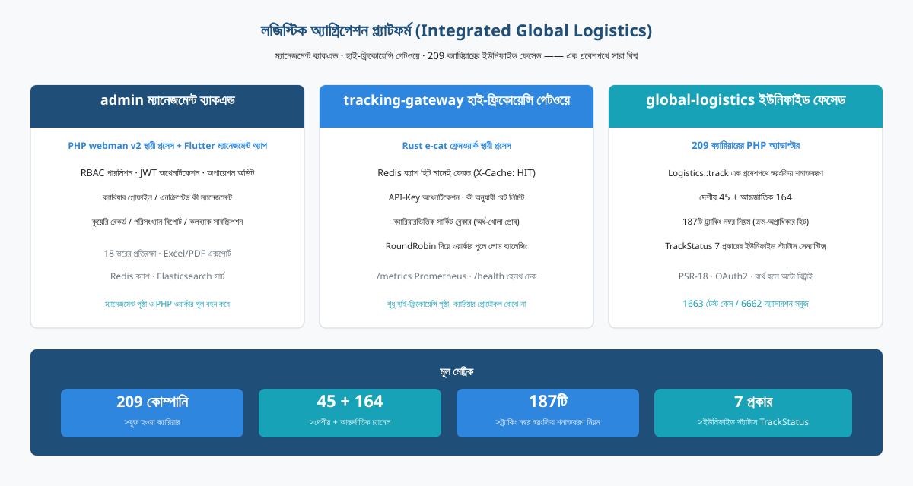
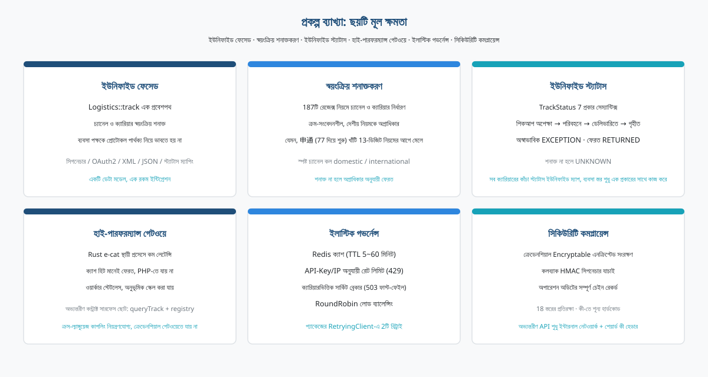
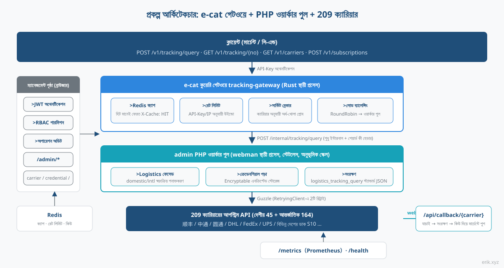
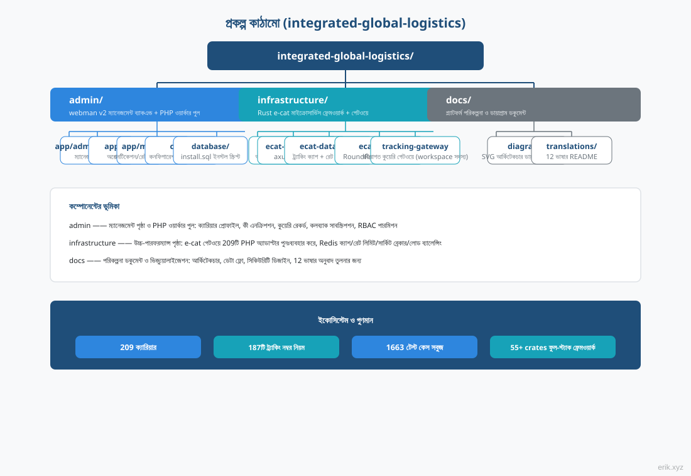
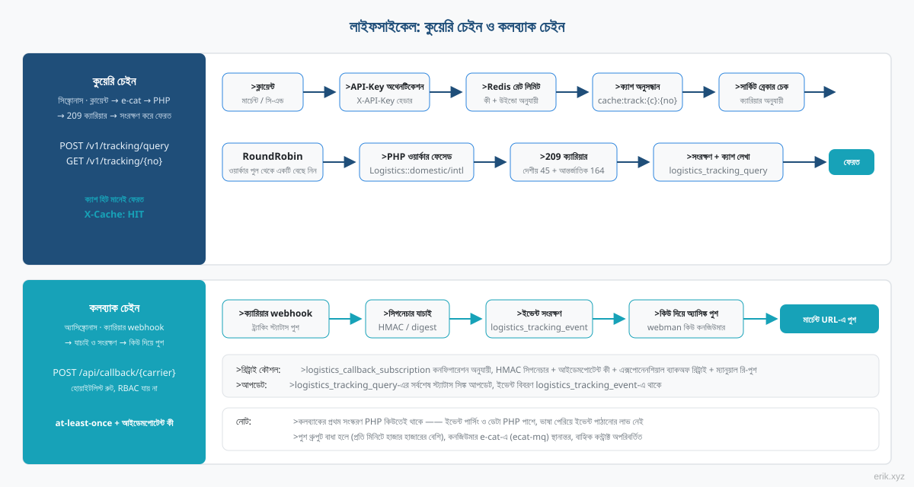
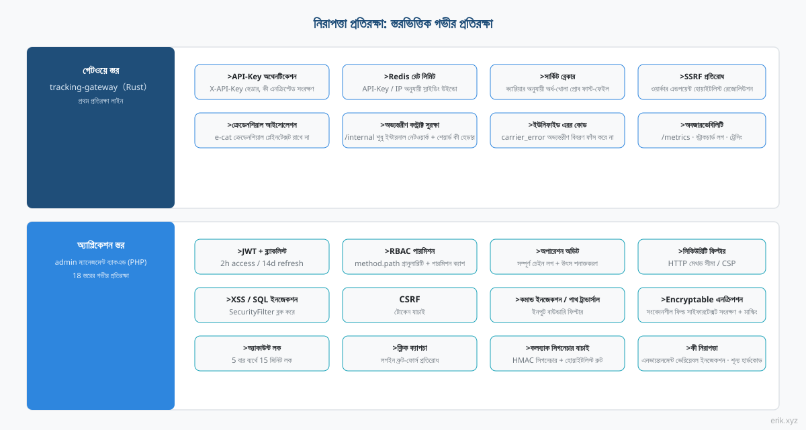

# লজিস্টিক অ্যাগ্রিগেশন প্ল্যাটফর্ম (Integrated Global Logistics)


বিশ্বব্যাপী লজিস্টিক ট্র্যাকিং কুয়েরির এক-স্টপ প্ল্যাটফর্ম：**admin ম্যানেজমেন্ট ব্যাকএন্ড** (PHP webman + Flutter) ব্যবস্থাপনা পৃষ্ঠা ও কুয়েরি ওয়ার্কার পুল বহন করে, **e-cat উচ্চ-ফ্রিকোয়েন্সি গেটওয়ে** (Rust স্থায়ী প্রসেস) কুয়েরি ট্রাফিক সামলায়, আর **global-logistics ইউনিফাইড ফেসেড** (২০৯টি ক্যারিয়ারের PHP অ্যাডাপ্টার) একটি প্রবেশপথে সারা বিশ্বে খোঁজ করে।

> ভাষা সমর্থিত：[[English / ইংরেজি]](/docs/translations/en/README.md) · [[한국어 / কোরিয়ান]](/docs/translations/ko/README.md) · [[Русский / রুশ]](/docs/translations/ru/README.md) · [[Deutsch / জার্মান]](/docs/translations/de/README.md) · [[Français / ফরাসি]](/docs/translations/fr/README.md) · [[Español / স্প্যানিশ]](/docs/translations/es/README.md) · [[Português / পর্তুগিজ]](/docs/translations/pt/README.md) · [[हिन्दी / হিন্দি]](/docs/translations/hi/README.md) · [[العربية / আরবি]](/docs/translations/ar/README.md) · [[বাংলা]](/docs/translations/bn/README.md) · [[Bahasa Indonesia / ইন্দোনেশীয়]](/docs/translations/id/README.md) · [[日本語 / জাপানি]](/docs/translations/ja/README.md)（[অনুবাদে যান](#translationsঅন্যান্য-ভাষা)）

## প্রকল্প পরিচিতি



লজিস্টিক অ্যাগ্রিগেশন প্ল্যাটফর্ম বিশ্বের **২০৯টি** কুরিয়ার / ডাক ক্যারিয়ারের ট্র্যাকিং কুয়েরি এক প্ল্যাটফর্মে একীভূত করে：মার্চেন্ট ও সি-এন্ড ব্যবহারকারী শুধু একটি ট্র্যাকিং নম্বর দেয়, প্ল্যাটফর্ম নিজে থেকে দেশীয় / আন্তর্জাতিক চ্যানেল ও ক্যারিয়ার শনাক্ত করে, প্রতিটি কোম্পানির প্রোটোকল পার্থক্য (সিগনেচার, OAuth2, XML/JSON, স্ট্যাটাস ম্যাপিং) নিয়ে ভাবতে হয় না।

প্ল্যাটফর্মটি তিনটি উপাদানের সহযোগিতায় গঠিত：

- **admin ম্যানেজমেন্ট ব্যাকএন্ড** (PHP webman v2 + Flutter) —— ব্যবস্থাপনা পৃষ্ঠা ও PHP ওয়ার্কার পুল：ক্যারিয়ার প্রোফাইল, এনক্রিপ্টেড কী ব্যবস্থাপনা, কুয়েরি রেকর্ড, পরিসংখ্যান রিপোর্ট, কলব্যাক সাবস্ক্রিপশন কনফিগারেশন, RBAC / JWT / অপারেশন অডিট ব্যবস্থা সম্পূর্ণ；
- **tracking-gateway উচ্চ-ফ্রিকোয়েন্সি গেটওয়ে** (Rust e-cat ফ্রেমওয়ার্ক) —— বাহ্যিক কুয়েরি API-এর প্রথম প্রবেশপথ：Redis ক্যাশ, রেট লিমিটিং, ক্যারিয়ারভিত্তিক সার্কিট ব্রেকার, ওয়ার্কার লোড ব্যালেন্সিং, শুধু উচ্চ-ফ্রিকোয়েন্সি পৃষ্ঠা করে, ক্যারিয়ার প্রোটোকল বোঝে না；
- **global-logistics ইউনিফাইড ফেসেড** (PHP প্যাকেজ) —— ২০৯টি ক্যারিয়ার অ্যাডাপ্টার (দেশীয় ৪৫ + আন্তর্জাতিক ১৬৪), ১৮৭টি ট্র্যাকিং নম্বর স্বয়ংক্রিয় শনাক্তকরণ নিয়ম, `TrackStatus` ৭ প্রকারের ইউনিফাইড স্ট্যাটাস সেম্যান্টিক্স।

**বর্তমান অগ্রগতি**: M1 প্রশাসন প্যানেল (ক্যারিয়ার / ক্রেডেনশিয়াল / কোয়েরি রেকর্ড / সাবস্ক্রিপশন CRUD), M2 কোয়েরি গেটওয়ে (সম্পূর্ণ বাহ্যিক API চেইন), M3 কলব্যাক সাবস্ক্রিপশন, M4 মনিটরিং ও পরিসংখ্যান, M5 বাহ্যিক OpenAPI ডকুমেন্টেশন এবং M6 পাঁচটি ক্লায়েন্ট SDK সব সম্পন্ন — ক্লায়েন্ট → e-cat → worker → ক্যারিয়ার ট্র্যাকিং কোয়েরি চেইন প্রদর্শনযোগ্য, এবং পাঁচটি নির্ভরতা-শূন্য SDK (Python / PHP / Node.js / Go / Rust) কপি-এন্ড-ইউজ প্রস্তুত।

## প্রকল্প ব্যাখ্যা



- **এক প্রবেশপথ**：`Logistics::track($trackingNo)` স্বয়ংক্রিয়ভাবে দেশীয় / আন্তর্জাতিক চ্যানেল ও ক্যারিয়ার শনাক্ত করে, ব্যবসা স্তর শুধু এক রকমের আকার নিয়ে কাজ করে；
- **স্বয়ংক্রিয় শনাক্তকরণ**：১৮৭টি ট্র্যাকিং নম্বর রেজেক্স নিয়ম ক্রম-সংবেদনশীল, দেশীয় চ্যানেলকে অগ্রাধিকার দেয়；শনাক্ত না হলে স্পষ্টভাবে `domestic()` / `international()` কল করা যায়；
- **ইউনিফাইড স্ট্যাটাস**：সব কোম্পানির বিবিধ কাঁচা স্ট্যাটাস ইউনিফাইড `TrackStatus` এনামে ম্যাপ হয় (পিকআপ অপেক্ষা / পরিবহনে / ডেলিভারিতে / ডেলিভারি সম্পন্ন / অস্বাভাবিক / ফেরত / শনাক্ত করা যায়নি)；
- **বৈশ্বিক কভারেজ**：DHL、FedEx、UPS、USPS চারটি বড় কুরিয়ার ও বিভিন্ন দেশের ডাক S10 সিস্টেম (ইউরোপ, লাতিন আমেরিকা-ক্যারিবিয়ান, আফ্রিকা-মধ্যপ্রাচ্য, এশিয়া-প্যাসিফিক চার অঞ্চল)；
- **বাহ্যিক API**: e-cat কোয়েরি গেটওয়ে API-Key প্রমাণীকরণ, Redis ক্যাশ হিট (`X-Cache: HIT`), রেট লিমিট 429, প্রতি-ক্যারিয়ার সার্কিট ব্রেকার 503, RoundRobin worker লোড ব্যালেন্সিং প্রদান করে; পাঁচটি নির্ভরতা-শূন্য SDK (Python / PHP / Node.js / Go / Rust) কপি-এন্ড-ইউজ প্রস্তুত;
- **শূন্য হার্ডকোডেড কী**：সব ক্যারিয়ারের কী কনফিগারেশনের মাধ্যমে ইনজেক্ট হয়, ডেটাবেস স্তরে Encryptable সাইফারটেক্সটে সংরক্ষিত, কোড ও কী সম্পূর্ণ আলাদা।

## প্রকল্প আর্কিটেকচার



কুয়েরি চেইন：**ক্লায়েন্ট → e-cat কুয়েরি গেটওয়ে → PHP ওয়ার্কার পুল → ২০৯টি ক্যারিয়ার**।

e-cat গেটওয়ে (Rust) বাহ্যিক API-র API-Key অথেনটিকেশন, Redis ক্যাশ হিট, রেট লিমিটিং, ক্যারিয়ারভিত্তিক সার্কিট ব্রেকার ও RoundRobin লোড ব্যালেন্সিং পরিচালনা করে；ক্যাশ হিট, রেট লিমিট প্রত্যাখ্যান, সার্কিট ব্রেকার ফাস্ট-ফেইল সব e-cat পাশে সম্পন্ন হয়, PHP ওয়ার্কার শুধু বাস্তব কুয়েরি ট্রাফিক নেয়, অনুভূমিক স্কেলিংয়ে শুধু ওয়ার্কার যোগ করতে হয়।

**e-cat-এর ২০৯টি PHP অ্যাডাপ্টার পুনঃব্যবহারের বিভাজন পরিকল্পনা**：২০৯টি অ্যাডাপ্টার PHP-তে (`src/Carriers/Domestic` ৪৫টি + `International` ১৬৪টি), Rust-এ পুনর্লিখন মাসখানেকের প্রকল্প এবং আপস্ট্রিম প্যাকেজের ক্রমাগত আপডেট সুবিধা হারায়；e-cat-কে ক্যারিয়ার প্রোটোকল বোঝার দরকার নেই, শুধু একটি স্থিতিশীল অভ্যন্তরীণ কন্ট্রাক্টের উপর নির্ভর করে (`/internal/tracking/query` + `/internal/carriers` রেজিস্ট্রি সিঙ্ক)। ক্রেডেনশিয়াল কখনো e-cat-এ নামানো হয় না, সিকিউরিটি বাউন্ডারি স্পষ্ট।

ব্যবস্থাপনা পৃষ্ঠা (ব্রাউজার) → `/admin/*`：JWT + RBAC পারমিশন + অপারেশন অডিট, কভার করে carrier / carrier-credential / tracking-query / callback-subscription / statistics।

## প্রকল্প কাঠামো



```
integrated-global-logistics/
├── admin/                          # PHP webman v2 管理后台 + worker 池
│   ├── app/
│   │   ├── admin/controller/       # 管理端控制器（carrier、tracking、统计等）
│   │   ├── api/                    # API v1（验证码 / 登录 / 刷新令牌）
│   │   ├── common/                 # Hashids / Snowflake / 加密脱敏服务
│   │   ├── middleware/             # 安全过滤 / 限流 / JWT / RBAC / 审计
│   │   └── model/                  # 数据模型（logistics_ 前缀，snowflake 主键）
│   ├── apps/
│   │   ├── flutter/                # Flutter Web 管理后台（PC 风格）
│   │   └── harmonyos/              # HarmonyOS 原生客户端
│   ├── config/                     # 配置（含中文注释）
│   ├── database/
│   │   └── install.sql             # SQL 安装脚本（含权限种子数据）
│   └── docs/                       # API / 架构 / 设计 / 安全文档（12 语言）
├── infrastructure/                 # Rust e-cat 微服务框架 + 查询网关
│   ├── ecat/                       # 聚合 crate（App 骨架）
│   ├── ecat-transport-http/        # axum HTTP 传输
│   ├── ecat-data-redis/            # 轨迹缓存 + 限流存储
│   ├── ecat-client/                # RoundRobin 负载均衡
│   └── tracking-gateway/           # 对外查询网关（workspace 新成员）
├── sdk/                            # 对外 API 客户端 SDK（Python / PHP / Node.js / Go / Rust）
└── docs/                           # 平台规划与图示
    ├── diagrams/                   # SVG 架构图（本 README 引用）
    ├── translations/               # 12 语言 README
    └── logistics-aggregation-platform-plan.md  # 实施规划
```

## লাইফসাইকেল



**কুয়েরি চেইন (সিঙ্ক্রোনাস)**：ক্লায়েন্ট → API-Key অথেনটিকেশন → Redis রেট লিমিট → ক্যাশ অনুসন্ধান (হিট মানেই ফেরত, `X-Cache: HIT`) → সার্কিট ব্রেকার চেক (OPEN হলে ৫০৩ ফাস্ট-ফেইল) → RoundRobin-এ ওয়ার্কার নির্বাচন → PHP ওয়ার্কারের `Logistics` ফেসেড (প্যাকেজের RetryingClient-এ ২টি রিট্রাই) → ২০৯টি ক্যারিয়ার → `logistics_tracking_query`-তে সংরক্ষণ + ক্যাশ লেখা → স্ট্যান্ডার্ড JSON ফেরত।

**কলব্যাক চেইন (অ্যাসিঙ্ক্রোনাস)**：ক্যারিয়ার ওয়েবহুক → `/api/callback/{carrier}` হোয়াইটলিস্ট রুট + সিগনেচার যাচাই → `logistics_tracking_event`-তে সংরক্ষণ + কুয়েরি রেকর্ড আপডেট → webman কিউতে লেখা → অ্যাসিঙ্ক্রোনাস কনজিউমার সাবস্ক্রিপশন কনফিগারেশন অনুযায়ী মার্চেন্ট কলব্যাক URL-এ পুশ (HMAC সিগনেচার + আইডেমপোটেন্ট কী + এক্সপোনেনশিয়াল ব্যাকঅফ রিট্রাই + ম্যানুয়াল রি-পুশ প্রবেশপথ)।

> কলব্যাক পুশের প্রথম সংস্করণ PHP কিউতেই থাকে —— ইভেন্ট পার্সিং ও ডেটা সব PHP পাশে, ভাষা পেরিয়ে ইভেন্ট পাঠানোর লাভ নেই；পুশ থ্রুপুট বাধা হয়ে গেলে (প্রতি মিনিটে হাজার হাজারের বেশি), কনজিউমার e-cat-এ (ecat-mq + retry মিডলওয়্যার) স্থানান্তর করবেন, বাহ্যিক কন্ট্রাক্ট অপরিবর্তিত।

## নিরাপত্তা প্রতিরক্ষা



স্তরভিত্তিক গভীর প্রতিরক্ষা, মূল বিষয়গুলো：

- **গেটওয়ে স্তর** (tracking-gateway)：API-Key অথেনটিকেশন, Redis রেট লিমিট (কী / IP অনুযায়ী), ক্যারিয়ারভিত্তিক সার্কিট ব্রেকার, SSRF প্রতিরোধ (ওয়ার্কার এন্ডপয়েন্ট হোয়াইটলিস্ট রেজোলিউশন)；`/internal` শুধু অভ্যন্তরীণ নেটওয়ার্ক + শেয়ার্ড কী হেডার；ক্রেডেনশিয়াল আইসোলেশন —— e-cat ক্রেডেনশিয়ালের প্লেইনটেক্সট রাখে না；
- **অ্যাপ্লিকেশন স্তর** (admin)：JWT + ব্ল্যাকলিস্ট (২ ঘণ্টা access / ১৪ দিন refresh), RBAC method.path গ্রানুলারিটি পারমিশন, অপারেশন অডিটের সম্পূর্ণ চেইন রেকর্ড；`SecurityFilter` XSS / SQL ইনজেকশন / CSRF / কমান্ড ইনজেকশন / পাথ ট্রাভার্সাল ব্লক করে；সংবেদনশীল ডেটা `Encryptable` এনক্রিপ্টেড সংরক্ষণ + মাস্কড এক্সপোর্ট；লগইন ৫ বার ব্যর্থে ১৫ মিনিট লক + ক্লিক ক্যাপচা；
- **কলব্যাক নিরাপত্তা**：হোয়াইটলিস্ট রুট + HMAC সিগনেচার যাচাই, at-least-once ডেলিভারি + আইডেমপোটেন্ট কী দিয়ে ডুপ্লিকেট পুশ প্রতিরোধ；
- **ইউনিফাইড এরর সেম্যান্টিক্স**：রেট লিমিট ৪২৯、সার্কিট ব্রেকার ৫০৩、ক্যারিয়ার এরর `carrier_error`, ক্লায়েন্টকে অভ্যন্তরীণ বিবরণ ফাঁস করে না।

## দ্রুত শুরু

**admin ম্যানেজমেন্ট ব্যাকএন্ড** (PHP webman)：

```bash
cd admin
composer install
php start.php start
```

স্টার্টের পর ব্রাউজারে ইনস্টলেশন উইজার্ডে গিয়ে ডেটাবেস ইনিশিয়ালাইজেশন ও অ্যাডমিন তৈরি সম্পন্ন করুন：`http://localhost:8787/install`（ডিফল্ট পোর্ট 8787, `config/server.php`-তে পরিবর্তন করা যায়）。

**infrastructure কুয়েরি গেটওয়ে** (Rust e-cat)：

```bash
cd infrastructure
cargo build
```

**SDK কল** (পাঁচটি নির্ভরতা-শূন্য ক্লায়েন্ট, কপি-এন্ড-ইউজ):

```python
from tracking_client import TrackingClient
client = TrackingClient("demo-api-key", "http://127.0.0.1:8080")
result = client.query_tracking("LX123456789CN")
```

```bash
curl -H "X-API-Key: demo-api-key" http://127.0.0.1:8080/v1/tracking/query \
  -H "Content-Type: application/json" -d '{"tracking_no": "LX123456789CN"}'
```

প্রতিটি ভাষায় ব্যবহার ও উদাহরণের জন্য [sdk/README.md](../../../sdk/README.md) দেখুন।

বিস্তারিত ডিপ্লয়ের জন্য দেখুন [admin/README.md](../../../admin/README.md)（Docker Compose-এ ৫টি সার্ভিস সাজানো：Nginx / PHP / MySQL / Redis / Elasticsearch）এবং ইমপ্লিমেন্টেশন প্ল্যান ডকুমেন্ট।

## ডকুমেন্টেশন

- [admin/docs/API.md](../../../admin/docs/API.md) —— API রেফারেন্স (ইউনিফাইড রেসপন্স ফরম্যাট, এরর কোড, অথেনটিকেশন ফ্লো, রেট লিমিট পলিসি, মিডলওয়্যার চেইন)
- [admin/docs/ARCHITECTURE.md](../../../admin/docs/ARCHITECTURE.md) —— আর্কিটেকচার ডিজাইন
- [admin/docs/DESIGN.md](../../../admin/docs/DESIGN.md) —— ডিজাইন ডকুমেন্ট
- [admin/docs/SECURITY.md](../../../admin/docs/SECURITY.md) —— সিকিউরিটি আর্কিটেকচার
- [docs/logistics-aggregation-platform-plan.md](../../../docs/logistics-aggregation-platform-plan.md) —— প্ল্যাটফর্ম ইমপ্লিমেন্টেশন প্ল্যান (আর্কিটেকচার, ডেটা ফ্লো, ডেটাবেস ডিজাইন, API কন্ট্রাক্ট, মাইলস্টোন)
- [admin/README.md](../../../admin/README.md) —— অ্যাডমিন ব্যাকএন্ডের সম্পূর্ণ ব্যাখ্যা (টেক স্ট্যাক, ডেটাবেস নিয়ম, ডিপ্লয়, CI/CD)
- [sdk/README.md](../../../sdk/README.md) —— বাহ্যিক API ক্লায়েন্ট SDK (Python / PHP / Node.js / Go / Rust, পাঁচটি জিরো-ডিপেন্ডেন্সি, কপি করে চালান)

## Translations（অন্যান্য ভাষা）

- [English](/docs/translations/en/README.md)
- [한국어](/docs/translations/ko/README.md)
- [Русский](/docs/translations/ru/README.md)
- [Deutsch](/docs/translations/de/README.md)
- [Français](/docs/translations/fr/README.md)
- [Español](/docs/translations/es/README.md)
- [Português](/docs/translations/pt/README.md)
- [हिन्दी](/docs/translations/hi/README.md)
- [العربية](/docs/translations/ar/README.md)
- [বাংলা](/docs/translations/bn/README.md)
- [Bahasa Indonesia](/docs/translations/id/README.md)
- [日本語](/docs/translations/ja/README.md)

## ওপেন সোর্স সহজ নয়, সমর্থন স্বাগতম

| WeChat (উইচ্যাট) | Alipay (আলিপে) |
|:---:|:---:|
|  |  |

### বৈশ্বিক ট্রান্সফার ডোনেশন (আন্তর্জাতিক রেমিট্যান্স)

**প্রাপকের তথ্য**

- প্রাপকের নাম：WANG KEXUN
- প্রাপকের অ্যাকাউন্ট নম্বর：881015918251

**প্রাপক ব্যাংক**

- ZA Bank SWIFT Code：AABLHKHHXXX
- ব্যাংকের নাম：ZA Bank Limited
- ব্যাংক নম্বর：387
- ব্যাংকের ঠিকানা：Core F, Cyberport 3, 100 Cyberport Road, Hong Kong

**আন্তর্জাতিক রেমিট্যান্সের এজেন্ট ব্যাংক (প্রয়োজন হলে)**

> এটি আন্তর্জাতিক রেমিট্যান্সের এজেন্ট ব্যাংক (মধ্যস্থ ব্যাংক) তথ্য, প্রাপক ব্যাংকের তথ্য নয়। রেমিট্যান্স ব্যাংককে জিজ্ঞাসা করুন এজেন্ট ব্যাংক তথ্য প্রদান প্রয়োজন কিনা।

- **হংকং ডলার, আরএমবি ও মার্কিন ডলার পাঠালে**，এজেন্ট ব্যাংক Citibank：
  - ব্যাংকের নাম：Citibank N.A. Hong Kong
  - SWIFT Code：CITIHKHXXXX
  - ব্যাংক নম্বর：006
  - শাখার নাম：Hong Kong Branch
  - শাখা নম্বর：391
  - ব্যাংকের ঠিকানা：Citibank Tower, Citibank Plaza, 3 Garden Road, Central, Hong Kong
- **অন্যান্য মুদ্রা পাঠালে**，এজেন্ট ব্যাংক BNY Mellon：
  - ব্যাংকের নাম：THE BANK OF NEW YORK MELLON
  - SWIFT Code：IRVTUS3NXXX
  - ব্যাংকের ঠিকানা：THE BANK OF NEW YORK MELLON, 240 GREENWICH STREET, NEW YORK, United States

### ক্রিপ্টো দান (Crypto Donation)

এই প্রকল্পটি আপনার কাজে লাগলে, দান করতে QR কোড স্ক্যান করুন, ধন্যবাদ!

| <br>**BNB Smart Chain (BEP20)**<br>`0x355d429f97511897ccb4e271ec888205f9ab6629` | <br>**Tron (TRC20)**<br>`TEdDHWLajt1XvqtPDWmQctdrJaC3pzZZzz` |
| <br>**Ethereum (ERC20)**<br>`0x355d429f97511897ccb4e271ec888205f9ab6629` | <br>**Aptos**<br>`0x836e3780edfc3f7b2372b39e2a1a3a5d7adfaccd96c726f21cfde1b50dd68030` |
| <br>**Plasma**<br>`0x355d429f97511897ccb4e271ec888205f9ab6629` | <br>**Polygon POS**<br>`0x355d429f97511897ccb4e271ec888205f9ab6629` |
| <br>**Solana**<br>`2hfhboHdmdrYsY25XfQSsEWxq5ip4EQsR7f4AzSRMUyr` | <br>**The Open Network (TON)**<br>`UQB9kFQohzmXUir9QSSZq01iwl9aQZIDdBpNmDklljRtCoGK` |
| <br>**Arbitrum One**<br>`0x355d429f97511897ccb4e271ec888205f9ab6629` | <br>**AVAX C-Chain**<br>`0x355d429f97511897ccb4e271ec888205f9ab6629` |

---

## License

MIT

Copyright (c) 2026 erik <erik@erik.xyz> — https://erik.xyz

<!-- TRANSLATE-READY -->
