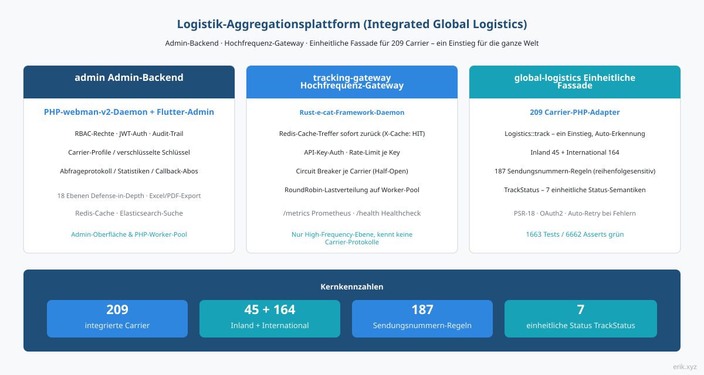
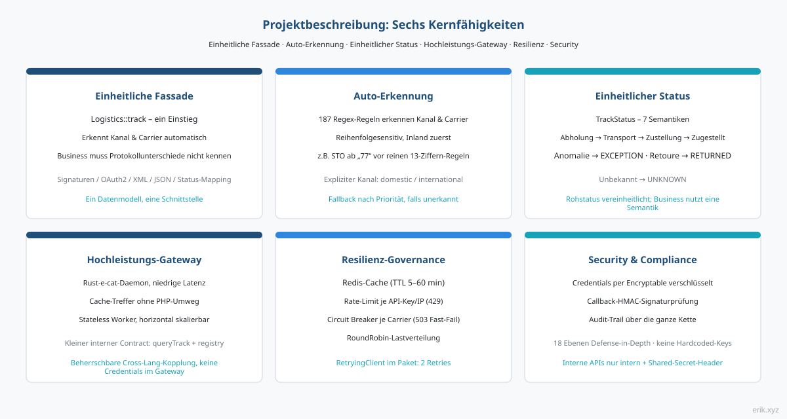
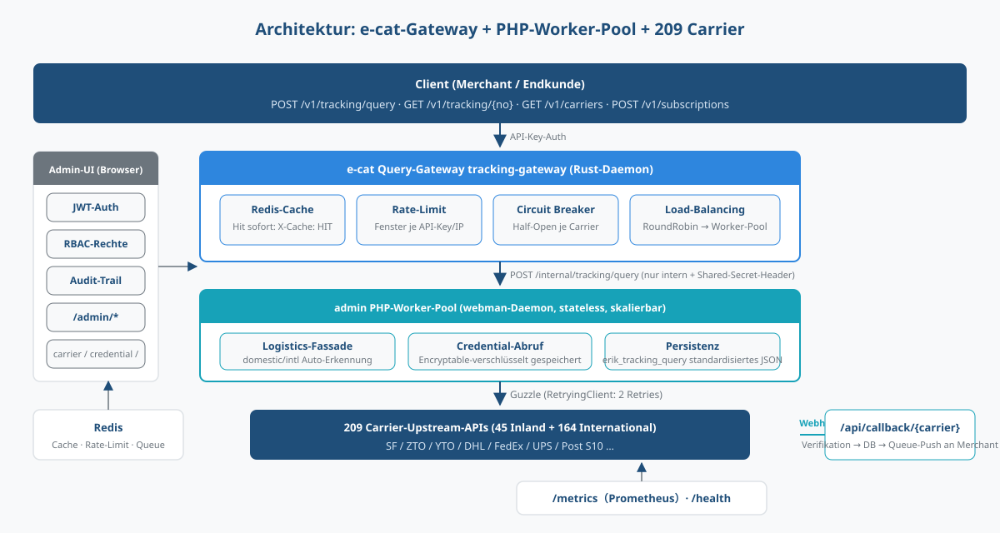
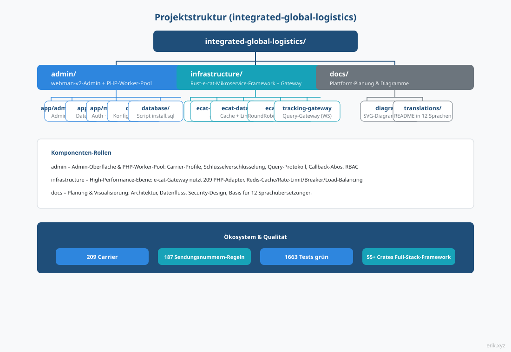
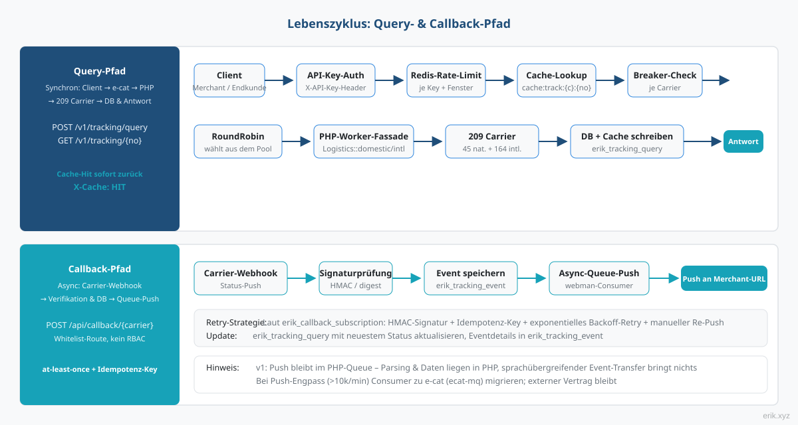
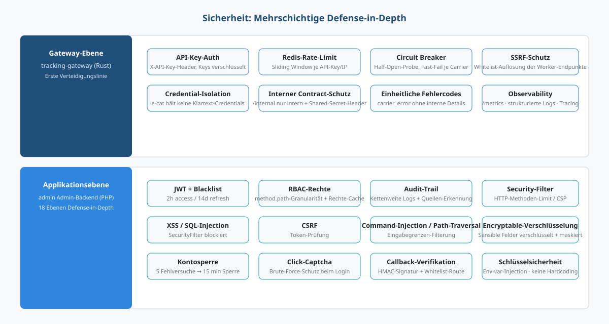

# Logistik-Aggregationsplattform (Integrated Global Logistics)

Eine All-in-one-Plattform für die weltweite Sendungsverfolgung: Das **admin Admin-Backend** (PHP webman + Flutter) trägt die Verwaltungsoberfläche und den Query-Worker-Pool, das **e-cat Hochfrequenz-Gateway** (Rust-Daemon) bewältigt den Abfrage-Traffic, und die **global-logistics Einheitsfassade** (PHP-Adapter für 209 Carrier) fragt mit einem einzigen Einstieg die ganze Welt ab.

> Sprachen: [English](/docs/translations/en/README.md) · [한국어](/docs/translations/ko/README.md) · [Русский](/docs/translations/ru/README.md) · [Deutsch](/docs/translations/de/README.md) · [Français](/docs/translations/fr/README.md) · [Español](/docs/translations/es/README.md) · [Português](/docs/translations/pt/README.md) · [हिन्दी](/docs/translations/hi/README.md) · [العربية](/docs/translations/ar/README.md) · [বাংলা](/docs/translations/bn/README.md) · [Bahasa Indonesia](/docs/translations/id/README.md) · [日本語](/docs/translations/ja/README.md)

## Projektvorstellung



Die Logistik-Aggregationsplattform bündelt die Sendungsverfolgung von **209** Kurier- und Post-Carriern weltweit in einer Plattform: Händler und Endkunden geben nur eine Sendungsnummer ein, die Plattform erkennt automatisch Inlands- / Auslands-Kanal und Carrier – ohne sich um die unterschiedlichen Protokolle der Anbieter kümmern zu müssen (Signatur, OAuth2, XML/JSON, Status-Mapping).

Die Plattform besteht aus drei zusammenarbeitenden Komponenten:

- **admin Admin-Backend** (PHP webman v2 + Flutter) – Verwaltungsoberfläche und PHP-Worker-Pool: Carrier-Profile, verschlüsseltes Schlüsselmanagement, Abfrageprotokoll, Statistik-Berichte, Callback-Abo-Konfiguration, vollständiges RBAC- / JWT- / Audit-Trail-System;
- **tracking-gateway Hochfrequenz-Gateway** (Rust e-cat Framework) – erste Anlaufstelle der externen Query-API: Redis-Cache, Rate-Limit, Circuit Breaker je Carrier, Worker-Load-Balancing; nur für die Hochfrequenz-Ebene, versteht keine Carrier-Protokolle;
- **global-logistics Einheitsfassade** (PHP-Paket) – 209 Carrier-Adapter (45 Inland + 164 International), 187 Auto-Erkennungsregeln für Sendungsnummern, `TrackStatus` mit 7 einheitlichen Status-Semantiken.

## Projektbeschreibung



- **Ein Einstieg**: `Logistics::track($trackingNo)` erkennt automatisch Inlands- / Auslands-Kanal und Carrier; die Geschäftsschicht trifft nur auf eine Form;
- **Automatische Erkennung**: 187 Regex-Regeln für Sendungsnummern, reihenfolgesensitiv, Inlands-Kanal hat Vorrang; nicht erkennbare Fälle können explizit `domestic()` / `international()` aufrufen;
- **Einheitlicher Status**: Die unterschiedlichen Rohstatus der Carrier werden auf die einheitliche `TrackStatus`-Enum abgebildet (Abholung erwartet / in Transport / in Zustellung / zugestellt / Ausnahme / Retoure / nicht erkennbar);
- **Weltweite Abdeckung**: DHL, FedEx, UPS, USPS – die vier großen Kurierdienste – sowie die S10-Systeme der nationalen Posten (vier Regionen: Europa, Lateinamerika & Karibik, Afrika & Naher Osten, Asien-Pazifik);
- **Keine hartcodierten Schlüssel**: Alle Schlüssel werden per Konfiguration injiziert; in der Datenbankschicht werden sie mit Encryptable verschlüsselt gespeichert – Code und Schlüssel sind vollständig getrennt.

## Architektur



Abfragekette: **Client → e-cat Query-Gateway → PHP-Worker-Pool → 209 Carrier**.

Das e-cat-Gateway (Rust) übernimmt die API-Key-Authentifizierung der externen API, Redis-Cache-Treffer, Rate-Limit, Circuit Breaker je Carrier und RoundRobin-Load-Balancing; Cache-Treffer, abgelehnte Rate-Limits und schnelle Breaker-Failover passieren auf der e-cat-Seite, der PHP-Worker übernimmt nur den echten Abfrage-Traffic. Horizontale Skalierung heißt schlicht: mehr Worker hinzufügen.

**Arbeitsteilung – e-cat nutzt die 209 PHP-Adapter**: Die 209 Adapter sind PHP (`src/Carriers/Domestic` 45 + `International` 164); eine Neuimplementierung in Rust wäre ein Projekt von mehreren Monaten und würde die kontinuierlichen Updates der Upstream-Pakete verlieren. e-cat muss die Carrier-Protokolle nicht verstehen; es verlässt sich nur auf einen stabilen internen Vertrag (`/internal/tracking/query` + Synchronisation des `/internal/carriers`-Registers). Credentials gelangen nie zu e-cat – klare Sicherheitsgrenze.

Verwaltungsoberfläche (Browser) → `/admin/*`: JWT + RBAC-Berechtigungen + Audit-Trail, abgedeckte Bereiche: carrier / carrier-credential / tracking-query / callback-subscription / statistics.

## Projektstruktur



```
integrated-global-logistics/
├── admin/                          # PHP webman v2 管理后台 + worker 池
│   ├── app/
│   │   ├── admin/controller/       # 管理端控制器（carrier、tracking、统计等）
│   │   ├── api/                    # API v1（验证码 / 登录 / 刷新令牌）
│   │   ├── common/                 # Hashids / Snowflake / 加密脱敏服务
│   │   ├── middleware/             # 安全过滤 / 限流 / JWT / RBAC / 审计
│   │   └── model/                  # 数据模型（erik_ 前缀，snowflake 主键）
│   ├── apps/
│   │   ├── flutter/                # Flutter Web 管理后台（PC 风格）
│   │   └── harmonyos/              # HarmonyOS 原生客户端
│   ├── config/                     # 配置（含中文注释）
│   ├── database/
│   │   └── install.sql             # SQL 安装脚本（含权限种子数据）
│   └── docs/                       # API / 架构 / 设计 / 安全文档（12 语言）
├── infrastructure/                 # Rust e-cat 微服务框架 + 查询网关
│   ├── ecat/                       # 聚合 crate（App 骨架）
│   ├── ecat-transport-http/        # axum HTTP 传输
│   ├── ecat-data-redis/            # 轨迹缓存 + 限流存储
│   ├── ecat-client/                # RoundRobin 负载均衡
│   └── tracking-gateway/           # 对外查询网关（workspace 新成员）
└── docs/                           # 平台规划与图示
    ├── diagrams/                   # SVG 架构图（本 README 引用）
    ├── translations/               # 12 语言 README
    └── logistics-aggregation-platform-plan.md  # 实施规划
```

## Lebenszyklus



**Abfragekette (synchron)**: Client → API-Key-Authentifizierung → Redis-Rate-Limit → Cache-Lookup (Treffer sofort zurück, `X-Cache: HIT`) → Breaker-Check (OPEN → 503 Fast-Fail) → RoundRobin-Workerauswahl → `Logistics`-Fassade des PHP-Workers (RetryingClient im Paket mit 2 Wiederholungen) → 209 Carrier → `erik_tracking_query` schreiben + Cache befüllen → standardisierte JSON-Antwort.

**Callback-Kette (asynchron)**: Carrier-Webhook → Whitelist-Route `/api/callback/{carrier}` + Signaturprüfung → `erik_tracking_event` schreiben + Abfrage-Eintrag aktualisieren → in die webman-Queue → asynchroner Consumer pusht laut Abo-Konfiguration an die Merchant-Callback-URL (HMAC-Signatur + Idempotenz-Key + exponentielles Backoff-Retry + manueller Re-Push).

> Der Callback-Push bleibt in der ersten Version in der PHP-Queue – Event-Parsing und Daten liegen auf der PHP-Seite, ein sprachübergreifender Event-Transfer bringt keinen Nutzen; erst wenn der Push-Durchsatz zum Engpass wird (ab Zehntausenden pro Minute), wird der Consumer zu e-cat migriert (ecat-mq + Retry-Middleware) – der externe Vertrag bleibt unverändert.

## Sicherheit



Gestaffelte Defense-in-Depth, die Kernpunkte:

- **Gateway-Ebene** (tracking-gateway): API-Key-Authentifizierung, Redis-Rate-Limit (je Key / IP), Circuit Breaker je Carrier, SSRF-Schutz (Whitelist-Auflösung der Worker-Endpunkte); `/internal` lauscht nur im Intranet + Shared-Secret-Header; Credential-Isolation – e-cat hält keine Klartext-Credentials;
- **Anwendungsebene** (admin): JWT + Blacklist (2h access / 14d refresh), RBAC-Berechtigungen in method.path-Granularität, Audit-Trail über die gesamte Kette; `SecurityFilter` blockiert XSS / SQL-Injection / CSRF / Command-Injection / Path-Traversal; sensible Daten per `Encryptable` verschlüsselt + maskierter Export; nach 5 Fehlversuchen 15 Minuten gesperrt + Click-Captcha;
- **Callback-Sicherheit**: Whitelist-Route + HMAC-Signaturprüfung, at-least-once-Zustellung + Idempotenz-Key gegen doppelte Pushs;
- **Einheitliche Fehlersemantik**: Rate-Limit 429, Breaker 503, Carrier-Fehler `carrier_error` – keine internen Details an den Client.

## Schnellstart

**admin Admin-Backend** (PHP webman):

```bash
cd admin
composer install
php start.php start
```

Nach dem Start im Browser den Installationsassistenten öffnen, um die Datenbank zu initialisieren und den Administrator anzulegen: `http://localhost:8787/install` (Standardport 8787, änderbar in `config/server.php`).

**infrastructure Query-Gateway** (Rust e-cat):

```bash
cd infrastructure
cargo build
```

Detaillierte Bereitstellung: [admin/README.md](admin/README.md) (Docker Compose orchestriert 5 Dienste: Nginx / PHP / MySQL / Redis / Elasticsearch) sowie das Umsetzungsplanungsdokument.

## Dokumentation

- [admin/docs/API.md](admin/docs/API.md) – API-Referenz (einheitliches Antwortformat, Fehlercodes, Authentifizierungsfluss, Rate-Limit-Strategien, Middleware-Kette)
- [admin/docs/ARCHITECTURE.md](admin/docs/ARCHITECTURE.md) – Architekturentwurf
- [admin/docs/DESIGN.md](admin/docs/DESIGN.md) – Designdokument
- [admin/docs/SECURITY.md](admin/docs/SECURITY.md) – Sicherheitsarchitektur
- [docs/logistics-aggregation-platform-plan.md](docs/logistics-aggregation-platform-plan.md) – Umsetzungsplan der Plattform (Architektur, Datenfluss, Datenbankdesign, API-Verträge, Meilensteine)
- [admin/README.md](admin/README.md) – vollständige Beschreibung des Admin-Backends (Tech-Stack, Datenbankkonventionen, Bereitstellung, CI/CD)

## Übersetzungen (andere Sprachen)

Diese README ist in 12 Sprachen verfügbar:

- [English](/docs/translations/en/README.md)
- [한국어](/docs/translations/ko/README.md)
- [Русский](/docs/translations/ru/README.md)
- [Deutsch](/docs/translations/de/README.md)
- [Français](/docs/translations/fr/README.md)
- [Español](/docs/translations/es/README.md)
- [Português](/docs/translations/pt/README.md)
- [हिन्दी](/docs/translations/hi/README.md)
- [العربية](/docs/translations/ar/README.md)
- [বাংলা](/docs/translations/bn/README.md)
- [Bahasa Indonesia](/docs/translations/id/README.md)
- [日本語](/docs/translations/ja/README.md)

## Open Source ist harte Arbeit – bitte unterstützen

| WeChat | Alipay |
|:---:|:---:|
|  |  |

### Spenden per internationaler Überweisung

**Empfängerinformationen**

- Empfängername: WANG KEXUN
- Kontonummer: 881015918251

**Empfängerbank**

- ZA Bank SWIFT-Code: AABLHKHHXXX
- Bankname: ZA Bank Limited
- Bankleitzahl: 387
- Bankadresse: Core F, Cyberport 3, 100 Cyberport Road, Hong Kong

**Durchführende Bank für die Überweisung (falls erforderlich)**

> Dies sind Angaben zur durchführenden Bank (Zwischenbank) für die internationale Überweisung, nicht zur Empfängerbank. Fragen Sie Ihre Bank, ob Angaben zur durchführenden Bank erforderlich sind.

- **Bei Überweisungen in Hongkong-Dollar, Renminbi und US-Dollar** ist die durchführende Bank Citibank:
  - Bankname: Citibank N.A. Hong Kong
  - SWIFT-Code: CITIHKHXXXX
  - Bankleitzahl: 006
  - Filialname: Hong Kong Branch
  - Filialnummer: 391
  - Bankadresse: Citibank Tower, Citibank Plaza, 3 Garden Road, Central, Hong Kong
- **Bei Überweisungen in anderen Währungen** ist die durchführende Bank BNY Mellon:
  - Bankname: THE BANK OF NEW YORK MELLON
  - SWIFT-Code: IRVTUS3NXXX
  - Bankadresse: THE BANK OF NEW YORK MELLON, 240 GREENWICH STREET, NEW YORK, United States

---

## License

MIT

Copyright (c) 2026 erik <erik@erik.xyz> — https://erik.xyz

<!-- TRANSLATE-READY -->
