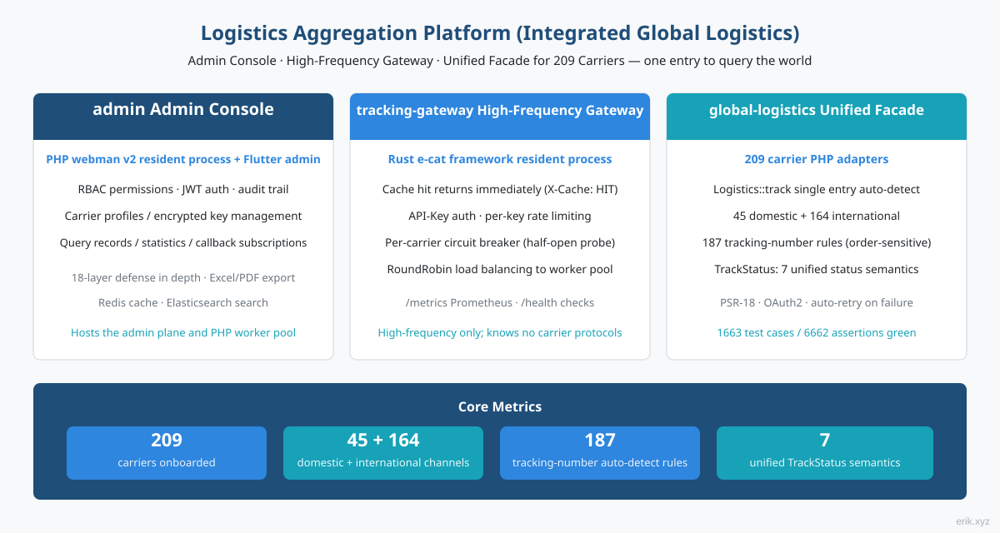
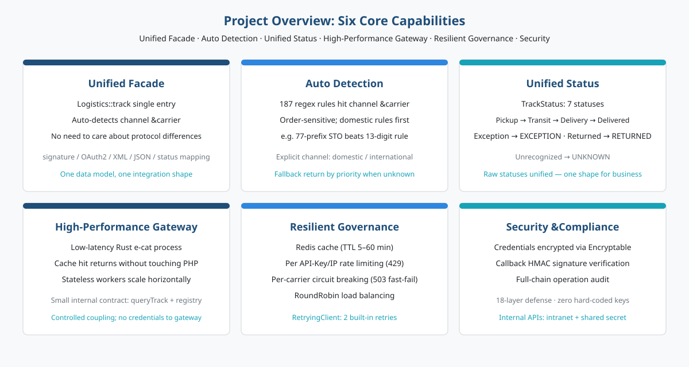
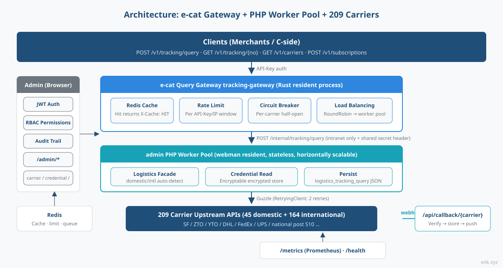
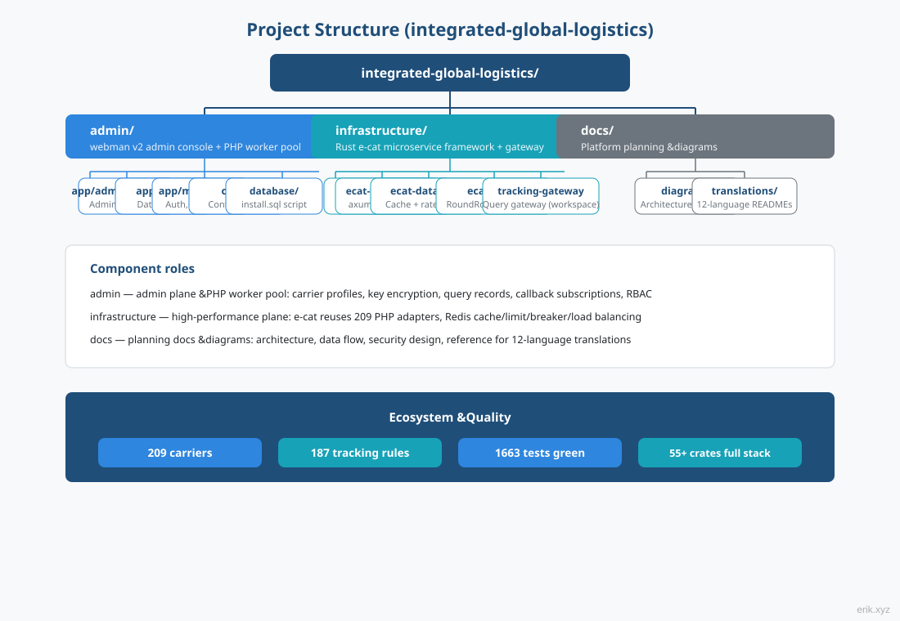
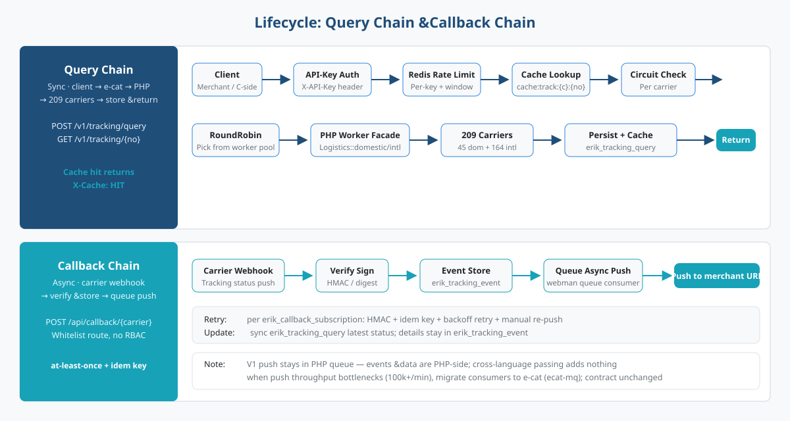
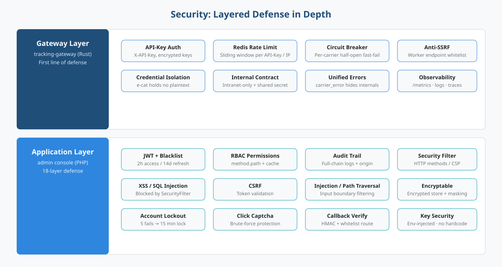

# Logistics Aggregation Platform (Integrated Global Logistics)

One-stop platform for global logistics tracking: the **admin management console** (PHP webman + Flutter) hosts the management plane and the query worker pool, the **e-cat high-frequency gateway** (long-running Rust process) carries the query traffic, and the **global-logistics unified facade** (PHP adapters for 209 carriers) lets you query the whole world through a single entry.

> Languages: [English](/docs/translations/en/README.md) · [한국어](/docs/translations/ko/README.md) · [Русский](/docs/translations/ru/README.md) · [Deutsch](/docs/translations/de/README.md) · [Français](/docs/translations/fr/README.md) · [Español](/docs/translations/es/README.md) · [Português](/docs/translations/pt/README.md) · [हिन्दी](/docs/translations/hi/README.md) · [العربية](/docs/translations/ar/README.md) · [বাংলা](/docs/translations/bn/README.md) · [Bahasa Indonesia](/docs/translations/id/README.md) · [日本語](/docs/translations/ja/README.md) ([Jump to translations](#translations-other-languages))

## Project Introduction



The logistics aggregation platform unifies tracking queries from **209** courier / postal carriers worldwide into one platform: merchants and C-side clients pass in only a tracking number, and the platform automatically identifies the domestic / international channel and the carrier — no need to care about each carrier's protocol differences (signature, OAuth2, XML/JSON, status mapping).

The platform is composed of three components working together:

- **admin management console** (PHP webman v2 + Flutter) — management plane and PHP worker pool: carrier profiles, encrypted key management, query records, statistics reports, callback subscription configuration, complete RBAC / JWT / operation audit system;
- **tracking-gateway high-frequency gateway** (Rust e-cat framework) — the first entry of the external query API: Redis cache, rate limiting, per-carrier circuit breaking, worker load balancing; it only handles the high-frequency plane and knows nothing about carrier protocols;
- **global-logistics unified facade** (PHP package) — adapters for 209 carriers (45 domestic + 164 international), 187 tracking-number auto-detection rules, 7 unified status semantics of `TrackStatus`.

## Project Description



- **One entry**: `Logistics::track($trackingNo)` automatically identifies the domestic / international channel and carrier; the business layer only deals with one shape;
- **Auto detection**: 187 tracking-number regex rules are order-sensitive and prioritize domestic channels; for unrecognized scenarios, `domestic()` / `international()` can be called explicitly;
- **Unified status**: each carrier's varied raw statuses are mapped to a unified `TrackStatus` enum (pending pickup / in transit / out for delivery / delivered / exception / returned / unrecognized);
- **Global coverage**: the four major couriers DHL, FedEx, UPS, USPS and the national postal S10 systems of various countries (Europe, Latin America & Caribbean, Africa & Middle East, Asia-Pacific);
- **Zero hard-coded keys**: all keys are injected via configuration, and the database layer stores them as Encryptable ciphertext — code and keys are fully separated.

## Project Architecture



Query chain: **client → e-cat query gateway → PHP worker pool → 209 carriers**.

The e-cat gateway (Rust) handles API-Key authentication, Redis cache hits, rate limiting, per-carrier circuit breaking and RoundRobin load balancing for the external API; cache hits, rate-limit rejections and circuit-breaker fast-fails all happen on the e-cat side, and PHP workers only carry real query traffic — horizontal scaling is just adding workers.

**The plan of e-cat reusing 209 PHP adapters**: the 209 adapters are PHP (`src/Carriers/Domestic` 45 + `International` 164); rewriting them in Rust would be months of work and would lose the benefit of continuous upstream package updates. e-cat does not need to understand carrier protocols — it depends only on a stable internal contract (`/internal/tracking/query` + `/internal/carriers` registry sync). Credentials are never delivered to e-cat, keeping a clear security boundary.

Management plane (browser) → `/admin/*`: JWT + RBAC permissions + operation audit, covering carrier / carrier-credential / tracking-query / callback-subscription / statistics.

## Project Structure



```
integrated-global-logistics/
├── admin/                          # PHP webman v2 管理后台 + worker 池
│   ├── app/
│   │   ├── admin/controller/       # 管理端控制器（carrier、tracking、统计等）
│   │   ├── api/                    # API v1（验证码 / 登录 / 刷新令牌）
│   │   ├── common/                 # Hashids / Snowflake / 加密脱敏服务
│   │   ├── middleware/             # 安全过滤 / 限流 / JWT / RBAC / 审计
│   │   └── model/                  # 数据模型（logistics_ 前缀，snowflake 主键）
│   ├── apps/
│   │   ├── flutter/                # Flutter Web 管理后台（PC 风格）
│   │   └── harmonyos/              # HarmonyOS 原生客户端
│   ├── config/                     # 配置（含中文注释）
│   ├── database/
│   │   └── install.sql             # SQL 安装脚本（含权限种子数据）
│   └── docs/                       # API / 架构 / 设计 / 安全文档（12 语言）
├── infrastructure/                 # Rust e-cat 微服务框架 + 查询网关
│   ├── ecat/                       # 聚合 crate（App 骨架）
│   ├── ecat-transport-http/        # axum HTTP 传输
│   ├── ecat-data-redis/            # 轨迹缓存 + 限流存储
│   ├── ecat-client/                # RoundRobin 负载均衡
│   └── tracking-gateway/           # 对外查询网关（workspace 新成员）
└── docs/                           # 平台规划与图示
    ├── diagrams/                   # SVG 架构图（本 README 引用）
    ├── translations/               # 12 语言 README
    └── logistics-aggregation-platform-plan.md  # 实施规划
```

## Lifecycle



**Query chain (synchronous)**: client → API-Key auth → Redis rate limiting → cache lookup (return on hit, `X-Cache: HIT`) → circuit-breaker check (503 fast-fail on OPEN) → RoundRobin worker selection → the `Logistics` facade in the PHP worker (the in-package RetryingClient has 2 built-in retries) → 209 carriers → persist to `logistics_tracking_query` + write cache → return standardized JSON.

**Callback chain (asynchronous)**: carrier webhook → `/api/callback/{carrier}` whitelist route + signature verification → persist to `logistics_tracking_event` + update the query record → write to the webman queue → async consumers push to the merchant callback URL per subscription config (HMAC signature + idempotency key + exponential backoff retry + manual re-push entry).

> In the first release, callback push stays in the PHP queue — event parsing and data are both on the PHP side, and there is no benefit in passing events across languages; if push throughput becomes a bottleneck (above tens of thousands per minute), migrate the consumer to e-cat (ecat-mq + retry middleware) without changing the external contract.

## Security



Layered defense in depth, key points:

- **Gateway layer** (tracking-gateway): API-Key authentication, Redis rate limiting (by key / IP), per-carrier circuit breaking, SSRF protection (whitelist resolution of worker endpoints); `/internal` listens only on the internal network + shared secret header; credential isolation — e-cat holds no plaintext credentials;
- **Application layer** (admin): JWT + blacklist (2h access / 14d refresh), RBAC method.path-granularity permissions, full-chain operation audit; `SecurityFilter` blocks XSS / SQL injection / CSRF / command injection / path traversal; sensitive data stored encrypted with `Encryptable` + masked export; login locked for 15 minutes after 5 failures + click captcha;
- **Callback security**: whitelist route + HMAC signature verification, at-least-once delivery + idempotency key to prevent duplicate pushes;
- **Unified error semantics**: rate limit 429, circuit break 503, carrier error `carrier_error` — no internal details leaked to clients.

## Quick Start

**admin management console** (PHP webman):

```bash
cd admin
composer install
php start.php start
```

After startup, open the installation wizard in your browser to complete database initialization and admin creation: `http://localhost:8787/install` (default port 8787, changeable in `config/server.php`).

**infrastructure query gateway** (Rust e-cat):

```bash
cd infrastructure
cargo build
```

For detailed deployment, see [admin/README.md](admin/README.md) (Docker Compose orchestrates 5 services: Nginx / PHP / MySQL / Redis / Elasticsearch) and the implementation plan document.

## Documentation

- [admin/docs/API.md](admin/docs/API.md) — API reference (unified response format, error codes, authentication flow, rate-limit policies, middleware chain)
- [admin/docs/ARCHITECTURE.md](admin/docs/ARCHITECTURE.md) — architecture design
- [admin/docs/DESIGN.md](admin/docs/DESIGN.md) — design document
- [admin/docs/SECURITY.md](admin/docs/SECURITY.md) — security architecture
- [docs/logistics-aggregation-platform-plan.md](docs/logistics-aggregation-platform-plan.md) — platform implementation plan (architecture, data flow, database design, API contracts, milestones)
- [admin/README.md](admin/README.md) — full admin console documentation (tech stack, database conventions, deployment, CI/CD)

## Translations (other languages)

- [English](/docs/translations/en/README.md)
- [한국어](/docs/translations/ko/README.md)
- [Русский](/docs/translations/ru/README.md)
- [Deutsch](/docs/translations/de/README.md)
- [Français](/docs/translations/fr/README.md)
- [Español](/docs/translations/es/README.md)
- [Português](/docs/translations/pt/README.md)
- [हिन्दी](/docs/translations/hi/README.md)
- [العربية](/docs/translations/ar/README.md)
- [বাংলা](/docs/translations/bn/README.md)
- [Bahasa Indonesia](/docs/translations/id/README.md)
- [日本語](/docs/translations/ja/README.md)

## Open Source Is Not Easy — Support Welcome

| WeChat | Alipay |
|:---:|:---:|
|  |  |

### Global Transfer Tip (Cross-border Remittance)

**Payee information**

- Payee name: WANG KEXUN
- Payee account number: 881015918251

**Receiving bank**

- ZA Bank SWIFT Code: AABLHKHHXXX
- Bank name: ZA Bank Limited
- Bank code: 387
- Bank address: Core F, Cyberport 3, 100 Cyberport Road, Hong Kong

**Cross-border remittance agent bank (if required)**

> This is the agent (intermediary) bank for cross-border remittance, not the receiving bank. Please check with your remitting bank whether the agent bank information is required.

- **For HKD, CNY and USD remittances**, the agent bank is Citibank:
  - Bank name: Citibank N.A. Hong Kong
  - SWIFT Code: CITIHKHXXXX
  - Bank code: 006
  - Branch name: Hong Kong Branch
  - Branch code: 391
  - Bank address: Citibank Tower, Citibank Plaza, 3 Garden Road, Central, Hong Kong
- **For other currencies**, the agent bank is BNY Mellon:
  - Bank name: THE BANK OF NEW YORK MELLON
  - SWIFT Code: IRVTUS3NXXX
  - Bank address: THE BANK OF NEW YORK MELLON, 240 GREENWICH STREET, NEW YORK, United States

---

## License

MIT

Copyright (c) 2026 erik <erik@erik.xyz> — https://erik.xyz

<!-- TRANSLATE-READY -->
