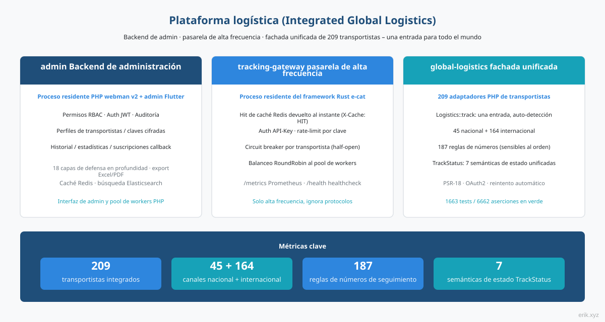
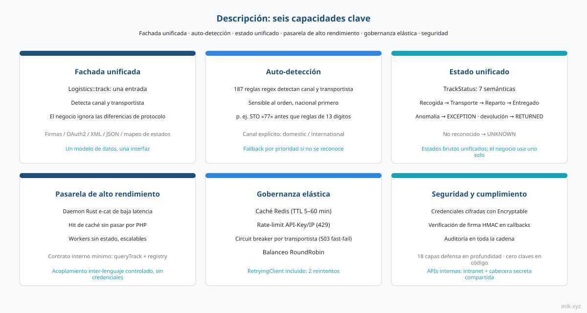
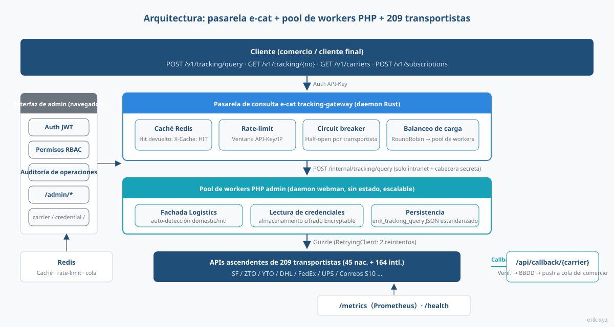
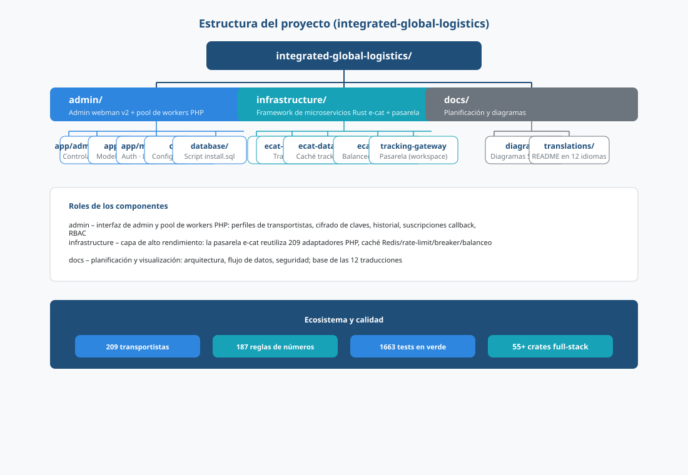
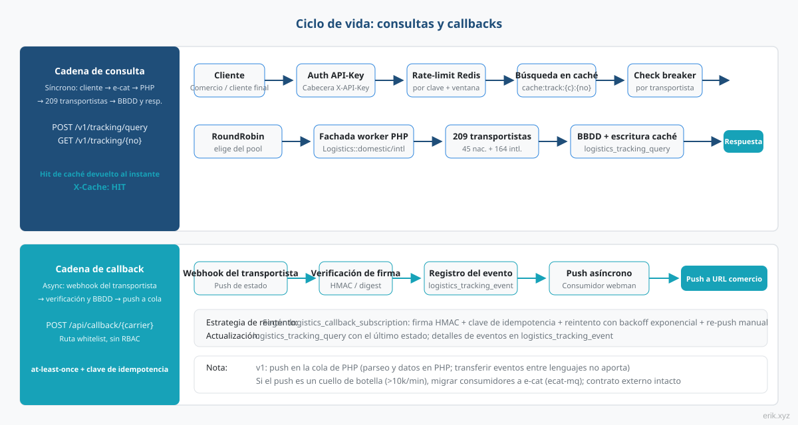
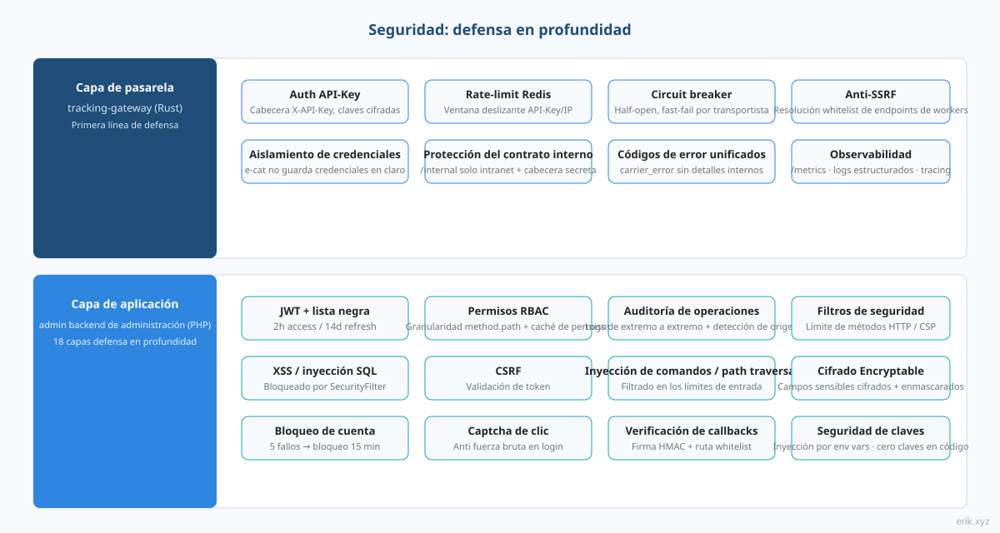

# Plataforma logística (Integrated Global Logistics)

Plataforma integral para la consulta del seguimiento logístico mundial: el **backend de administración admin** (PHP webman + Flutter) sostiene la interfaz de gestión y el pool de workers de consulta, la **pasarela de alta frecuencia e-cat** (proceso residente Rust) absorbe el tráfico de consultas, y la **fachada unificada global-logistics** (adaptadores PHP de 209 transportistas) consulta todo el mundo desde una sola entrada.

> Idiomas: [English](/docs/translations/en/README.md) · [한국어](/docs/translations/ko/README.md) · [Русский](/docs/translations/ru/README.md) · [Deutsch](/docs/translations/de/README.md) · [Français](/docs/translations/fr/README.md) · [Español](/docs/translations/es/README.md) · [Português](/docs/translations/pt/README.md) · [हिन्दी](/docs/translations/hi/README.md) · [العربية](/docs/translations/ar/README.md) · [বাংলা](/docs/translations/bn/README.md) · [Bahasa Indonesia](/docs/translations/id/README.md) · [日本語](/docs/translations/ja/README.md)

## Presentación



La plataforma logística unifica el seguimiento de **209** transportistas de mensajería / correos de todo el mundo en una sola plataforma: comercios y usuarios finales introducen solo un número de seguimiento; la plataforma identifica automáticamente el canal nacional / internacional y el transportista, sin tener que ocuparse de las diferencias de protocolo de cada proveedor (firma, OAuth2, XML/JSON, mapeo de estados).

La plataforma se compone de tres componentes que cooperan:

- **admin Backend de administración** (PHP webman v2 + Flutter) – interfaz de gestión y pool de workers PHP: perfiles de transportistas, gestión de claves cifradas, historial de consultas, informes estadísticos, configuración de suscripciones callback, sistema completo de RBAC / JWT / auditoría de operaciones;
- **tracking-gateway pasarela de alta frecuencia** (framework Rust e-cat) – primera puerta de entrada de la API de consulta externa: caché Redis, rate-limit, circuit breaker por transportista, balanceo de carga de workers; solo la capa de alta frecuencia, no entiende los protocolos de los transportistas;
- **global-logistics fachada unificada** (paquete PHP) – 209 adaptadores de transportistas (45 nacional + 164 internacional), 187 reglas de identificación automática de números, `TrackStatus` con 7 semánticas de estado unificadas.

**Progreso actual**: M1 panel de administración (CRUD de transportista / credencial / registro de consulta / suscripción), M2 puerta de enlace de consultas (cadena completa de API externa), M3 suscripciones de devolución de llamada, M4 monitoreo y estadísticas, M5 documentación OpenAPI externa y M6 cinco SDK de cliente están todos completos — la cadena de consulta de seguimiento cliente → e-cat → worker → transportista es demostrable, y los cinco SDK sin dependencias (Python / PHP / Node.js / Go / Rust) están listos para copiar y usar.

## Descripción del proyecto



- **Una sola entrada**: `Logistics::track($trackingNo)` identifica automáticamente el canal nacional / internacional y el transportista; la capa de negocio solo trabaja con una forma;
- **Identificación automática**: 187 reglas regex sensibles al orden, prioridad al canal nacional; los casos no identificables pueden llamar explícitamente a `domestic()` / `international()`;
- **Estado unificado**: los dispares estados brutos de cada proveedor se mapean al enum unificado `TrackStatus` (pendiente de recogida / en transporte / en reparto / entregado / excepción / devuelto / no reconocido);
- **Cobertura mundial**: los cuatro grandes mensajeros DHL, FedEx, UPS, USPS y los sistemas S10 de los correos nacionales (cuatro regiones: Europa, Latinoamérica y el Caribe, África y Oriente Medio, Asia-Pacífico);
- **API externa**: la puerta de enlace e-cat ofrece autenticación API-Key, aciertos de caché Redis (`X-Cache: HIT`), límite de velocidad 429, disyuntor por transportista 503, balanceo RoundRobin de workers; cinco SDK sin dependencias (Python / PHP / Node.js / Go / Rust) listos para copiar y usar;
- **Cero claves en código**: todas las claves se inyectan por configuración; en la capa de base de datos se almacenan cifradas con Encryptable – código y claves totalmente separados.

## Arquitectura



Cadena de consulta: **Cliente → pasarela de consulta e-cat → pool de workers PHP → 209 transportistas**.

La pasarela e-cat (Rust) gestiona la autenticación API-Key de la API externa, los hits de caché Redis, el rate-limit, el circuit breaker por transportista y el balanceo RoundRobin; los hits de caché, los rechazos de rate-limit y los fallos rápidos del breaker ocurren en el lado de e-cat, el worker PHP solo atiende el tráfico de consulta real. Para escalar horizontalmente basta con añadir workers.

**División de trabajo – e-cat reutiliza los 209 adaptadores PHP**: los 209 adaptadores están en PHP (`src/Carriers/Domestic` 45 + `International` 164); reescribirlos en Rust sería un proyecto de varios meses y haría perder las actualizaciones continuas de los paquetes upstream. e-cat no necesita entender los protocolos de los transportistas; solo depende de un contrato interno estable (`/internal/tracking/query` + sincronización del registro `/internal/carriers`). Las credenciales nunca bajan a e-cat – frontera de seguridad clara.

Interfaz de gestión (navegador) → `/admin/*`: JWT + permisos RBAC + auditoría de operaciones, cubre carrier / carrier-credential / tracking-query / callback-subscription / statistics.

## Estructura del proyecto



```
integrated-global-logistics/
├── admin/                          # PHP webman v2 管理后台 + worker 池
│   ├── app/
│   │   ├── admin/controller/       # 管理端控制器（carrier、tracking、统计等）
│   │   ├── api/                    # API v1（验证码 / 登录 / 刷新令牌）
│   │   ├── common/                 # Hashids / Snowflake / 加密脱敏服务
│   │   ├── middleware/             # 安全过滤 / 限流 / JWT / RBAC / 审计
│   │   └── model/                  # 数据模型（logistics_ 前缀，snowflake 主键）
│   ├── apps/
│   │   ├── flutter/                # Flutter Web 管理后台（PC 风格）
│   │   └── harmonyos/              # HarmonyOS 原生客户端
│   ├── config/                     # 配置（含中文注释）
│   ├── database/
│   │   └── install.sql             # SQL 安装脚本（含权限种子数据）
│   └── docs/                       # API / 架构 / 设计 / 安全文档（12 语言）
├── infrastructure/                 # Rust e-cat 微服务框架 + 查询网关
│   ├── ecat/                       # 聚合 crate（App 骨架）
│   ├── ecat-transport-http/        # axum HTTP 传输
│   ├── ecat-data-redis/            # 轨迹缓存 + 限流存储
│   ├── ecat-client/                # RoundRobin 负载均衡
│   └── tracking-gateway/           # 对外查询网关（workspace 新成员）
├── sdk/                            # 对外 API 客户端 SDK（Python / PHP / Node.js / Go / Rust）
└── docs/                           # 平台规划与图示
    ├── diagrams/                   # SVG 架构图（本 README 引用）
    ├── translations/               # 12 语言 README
    └── logistics-aggregation-platform-plan.md  # 实施规划
```

## Ciclo de vida



**Cadena de consulta (síncrona)**: cliente → autenticación API-Key → rate-limit Redis → búsqueda en caché (hit devuelto al instante, `X-Cache: HIT`) → comprobación del breaker (OPEN → fallo rápido 503) → selección RoundRobin del worker → fachada `Logistics` del worker PHP (RetryingClient integrado con 2 reintentos) → 209 transportistas → escritura en `logistics_tracking_query` + llenado de caché → respuesta JSON estandarizada.

**Cadena de callback (asíncrona)**: webhook del transportista → ruta whitelist `/api/callback/{carrier}` + verificación de firma → escritura en `logistics_tracking_event` + actualización del registro de consulta → cola de webman → consumidor asíncrono empuja a la URL de callback del comercio según la configuración de suscripción (firma HMAC + clave de idempotencia + reintento con backoff exponencial + re-push manual).

> El push de callback permanece en v1 en la cola de PHP – el parseo de eventos y los datos están en el lado PHP, transferir eventos entre lenguajes no aporta nada; si el rendimiento del push se convierte en un cuello de botella (decenas de miles por minuto), se migra el consumidor a e-cat (ecat-mq + middleware retry) – el contrato externo permanece intacto.

## Seguridad



Defensa en profundidad por capas, puntos clave:

- **Capa de pasarela** (tracking-gateway): autenticación API-Key, rate-limit Redis (por clave / IP), circuit breaker por transportista, anti-SSRF (resolución whitelist de los endpoints de workers); `/internal` solo escucha en intranet + cabecera de secreto compartido; aislamiento de credenciales – e-cat no guarda credenciales en claro;
- **Capa de aplicación** (admin): JWT + lista negra (2h access / 14d refresh), permisos RBAC con granularidad method.path, auditoría de operaciones en toda la cadena; `SecurityFilter` bloquea XSS / inyección SQL / CSRF / inyección de comandos / path traversal; datos sensibles cifrados con `Encryptable` + exportación enmascarada; bloqueo de 15 minutos tras 5 intentos fallidos + captcha de clic;
- **Seguridad de callbacks**: ruta whitelist + verificación de firma HMAC, entrega at-least-once + clave de idempotencia contra pushs duplicados;
- **Semántica de error unificada**: rate-limit 429, breaker 503, error de transportista `carrier_error` – sin detalles internos al cliente.

## Inicio rápido

**admin Backend de administración** (PHP webman):

```bash
cd admin
composer install
php start.php start
```

Tras el arranque, abra el asistente de instalación en el navegador para inicializar la base de datos y crear el administrador: `http://localhost:8787/install` (puerto por defecto 8787, modificable en `config/server.php`).

**infrastructure Pasarela de consultas** (Rust e-cat):

```bash
cd infrastructure
cargo build
```

**Llamada SDK** (cinco clientes sin dependencias, listos para copiar y usar):

```python
from tracking_client import TrackingClient
client = TrackingClient("demo-api-key", "http://127.0.0.1:8080")
result = client.query_tracking("LX123456789CN")
```

```bash
curl -H "X-API-Key: demo-api-key" http://127.0.0.1:8080/v1/tracking/query \
  -H "Content-Type: application/json" -d '{"tracking_no": "LX123456789CN"}'
```

Consulte [sdk/README.md](sdk/README.md) para el uso y ejemplos en cada idioma.

Despliegue detallado: [admin/README.md](admin/README.md) (Docker Compose orquesta 5 servicios: Nginx / PHP / MySQL / Redis / Elasticsearch) y el documento de plan de implementación.

## Documentación

- [admin/docs/API.md](admin/docs/API.md) – referencia de API (formato de respuesta unificado, códigos de error, flujo de autenticación, estrategias de rate-limit, cadena de middlewares)
- [admin/docs/ARCHITECTURE.md](admin/docs/ARCHITECTURE.md) – diseño de arquitectura
- [admin/docs/DESIGN.md](admin/docs/DESIGN.md) – documento de diseño
- [admin/docs/SECURITY.md](admin/docs/SECURITY.md) – arquitectura de seguridad
- [docs/logistics-aggregation-platform-plan.md](docs/logistics-aggregation-platform-plan.md) – plan de implementación de la plataforma (arquitectura, flujo de datos, diseño de base de datos, contratos API, hitos)
- [admin/README.md](admin/README.md) – descripción completa del backend de administración (stack técnico, convenciones de base de datos, despliegue, CI/CD)
- [sdk/README.md](sdk/README.md) – SDK de cliente de la API externa (Python / PHP / Node.js / Go / Rust, cinco sin dependencias, copiar y usar)

## Traducciones (otros idiomas)

Este README está disponible en 12 idiomas:

- [English](/docs/translations/en/README.md)
- [한국어](/docs/translations/ko/README.md)
- [Русский](/docs/translations/ru/README.md)
- [Deutsch](/docs/translations/de/README.md)
- [Français](/docs/translations/fr/README.md)
- [Español](/docs/translations/es/README.md)
- [Português](/docs/translations/pt/README.md)
- [हिन्दी](/docs/translations/hi/README.md)
- [العربية](/docs/translations/ar/README.md)
- [বাংলা](/docs/translations/bn/README.md)
- [Bahasa Indonesia](/docs/translations/id/README.md)
- [日本語](/docs/translations/ja/README.md)

## El open source cuesta – apóyalo

| WeChat | Alipay |
|:---:|:---:|
|  |  |

### Donaciones por transferencia internacional (remesa)

**Información del beneficiario**

- Nombre del beneficiario: WANG KEXUN
- Número de cuenta: 881015918251

**Banco del beneficiario**

- Código SWIFT de ZA Bank: AABLHKHHXXX
- Nombre del banco: ZA Bank Limited
- Número de banco: 387
- Dirección del banco: Core F, Cyberport 3, 100 Cyberport Road, Hong Kong

**Banco intermediario para la transferencia (si es necesario)**

> Esta es la información del banco intermediario (banco corresponsal) para la transferencia internacional, no la del banco del beneficiario. Consulte a su banco si es necesario aportar la información del banco intermediario.

- **Para transferencias en dólares de Hong Kong, renminbi y dólares estadounidenses**, el banco intermediario es Citibank:
  - Nombre del banco: Citibank N.A. Hong Kong
  - Código SWIFT: CITIHKHXXXX
  - Número de banco: 006
  - Nombre de la sucursal: Hong Kong Branch
  - Número de sucursal: 391
  - Dirección del banco: Citibank Tower, Citibank Plaza, 3 Garden Road, Central, Hong Kong
- **Para transferencias en otras divisas**, el banco intermediario es BNY Mellon:
  - Nombre del banco: THE BANK OF NEW YORK MELLON
  - Código SWIFT: IRVTUS3NXXX
  - Dirección del banco: THE BANK OF NEW YORK MELLON, 240 GREENWICH STREET, NEW YORK, United States

### Donación en criptomonedas (Crypto Donation)

Si este proyecto te resulta útil, escanea el código QR para donar, ¡gracias!

| <br>**BNB Smart Chain (BEP20)**<br>`0x355d429f97511897ccb4e271ec888205f9ab6629` | <br>**Tron (TRC20)**<br>`TEdDHWLajt1XvqtPDWmQctdrJaC3pzZZzz` |
| <br>**Ethereum (ERC20)**<br>`0x355d429f97511897ccb4e271ec888205f9ab6629` | <br>**Aptos**<br>`0x836e3780edfc3f7b2372b39e2a1a3a5d7adfaccd96c726f21cfde1b50dd68030` |
| <br>**Plasma**<br>`0x355d429f97511897ccb4e271ec888205f9ab6629` | <br>**Polygon POS**<br>`0x355d429f97511897ccb4e271ec888205f9ab6629` |
| <br>**Solana**<br>`2hfhboHdmdrYsY25XfQSsEWxq5ip4EQsR7f4AzSRMUyr` | <br>**The Open Network (TON)**<br>`UQB9kFQohzmXUir9QSSZq01iwl9aQZIDdBpNmDklljRtCoGK` |
| <br>**Arbitrum One**<br>`0x355d429f97511897ccb4e271ec888205f9ab6629` | <br>**AVAX C-Chain**<br>`0x355d429f97511897ccb4e271ec888205f9ab6629` |

---

## License

MIT

Copyright (c) 2026 erik <erik@erik.xyz> — https://erik.xyz

<!-- TRANSLATE-READY -->
