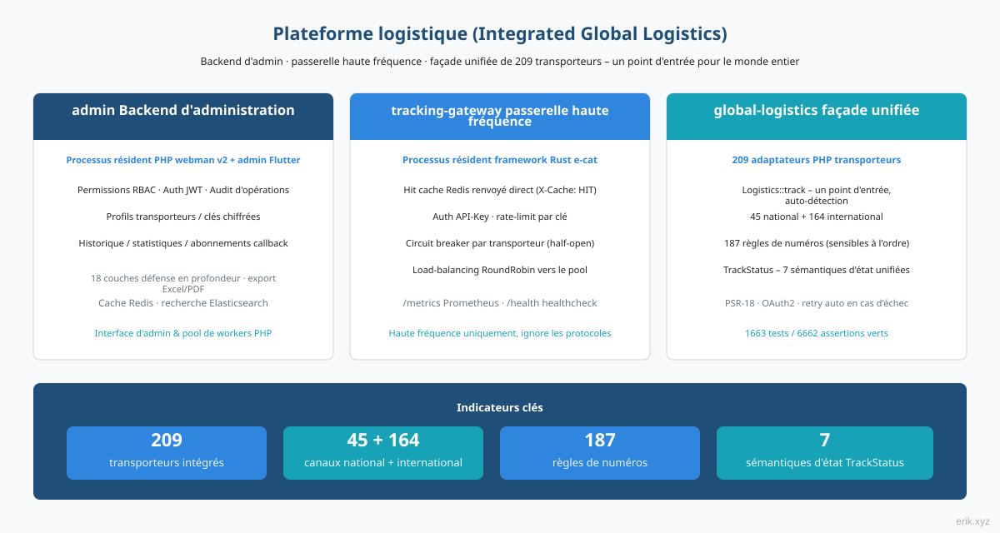
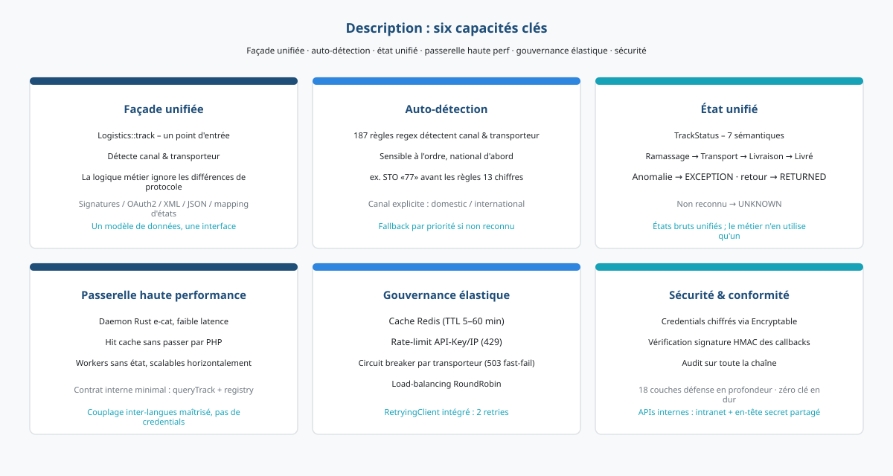
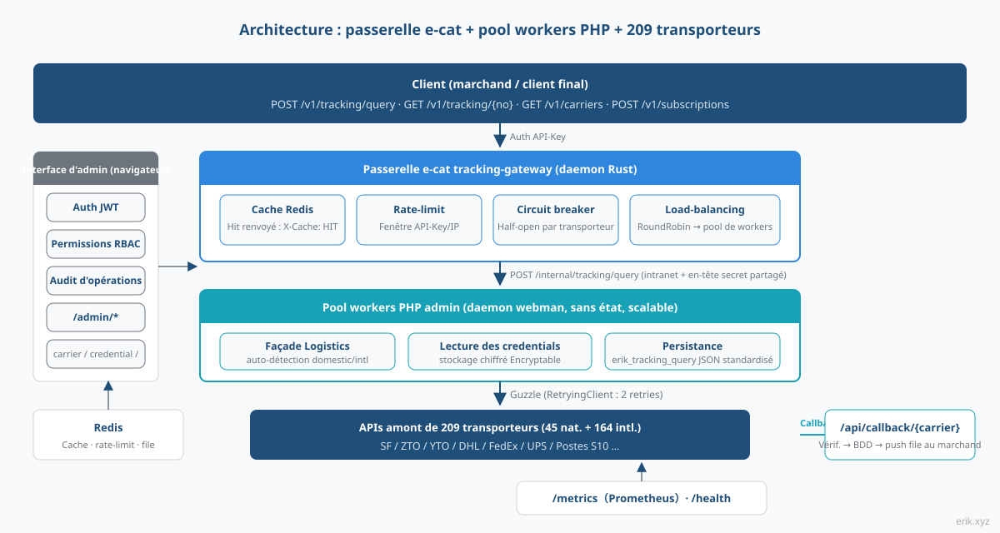
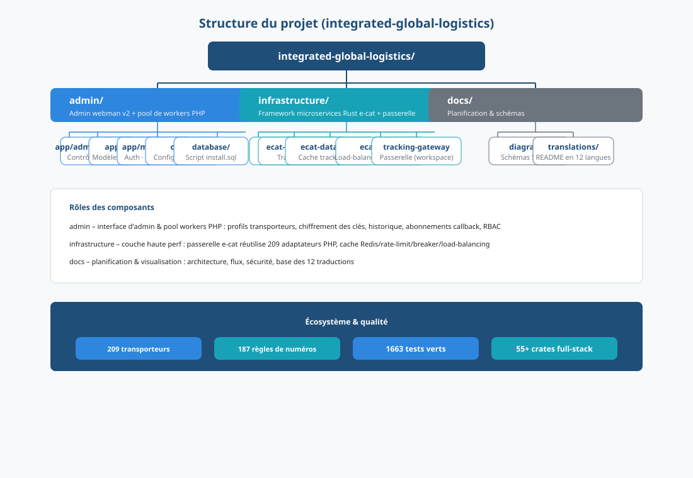
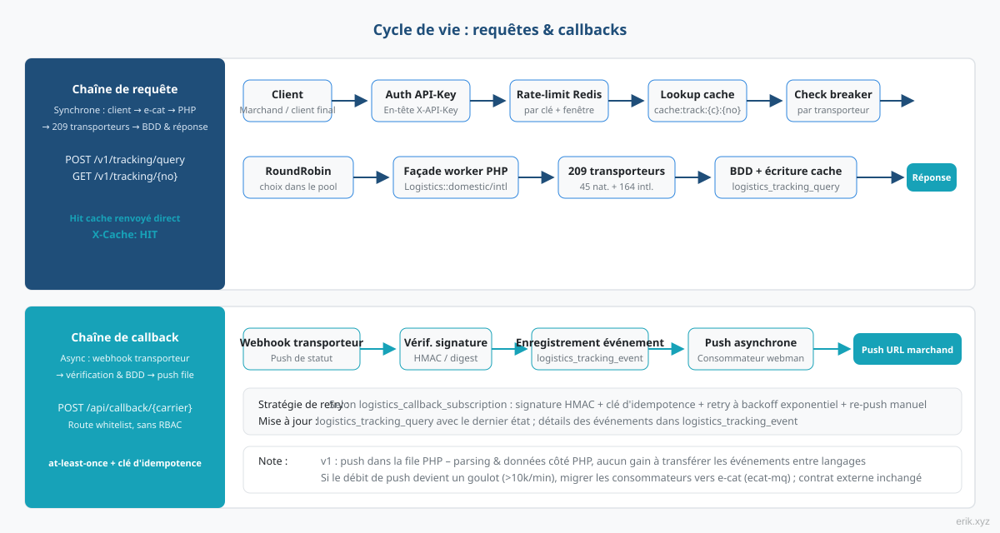
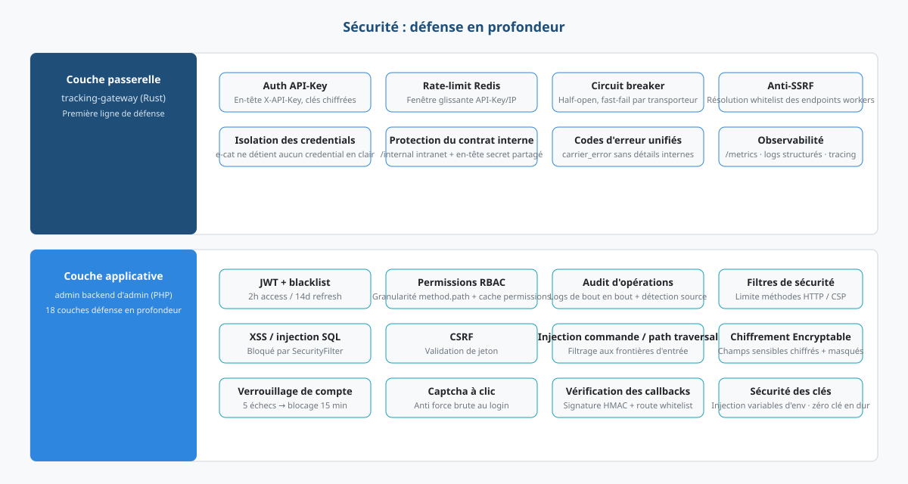

# Plateforme logistique (Integrated Global Logistics)


Plateforme tout-en-un pour le suivi logistique mondial : le **backend d'admin** (PHP webman + Flutter) porte l'interface de gestion et le pool de workers de requêtes, la **passerelle haute fréquence e-cat** (processus résident Rust) encaisse le trafic de requêtes, et la **façade unifiée global-logistics** (adaptateurs PHP de 209 transporteurs) interroge le monde entier via un seul point d'entrée.

> Langues : [English](/docs/translations/en/README.md) · [한국어](/docs/translations/ko/README.md) · [Русский](/docs/translations/ru/README.md) · [Deutsch](/docs/translations/de/README.md) · [Français](/docs/translations/fr/README.md) · [Español](/docs/translations/es/README.md) · [Português](/docs/translations/pt/README.md) · [हिन्दी](/docs/translations/hi/README.md) · [العربية](/docs/translations/ar/README.md) · [বাংলা](/docs/translations/bn/README.md) · [Bahasa Indonesia](/docs/translations/id/README.md) · [日本語](/docs/translations/ja/README.md)

## Présentation



La plateforme logistique regroupe le suivi de **209** transporteurs express / postaux du monde entier en une seule plateforme : commerçants et clients finaux ne saisissent qu'un numéro de suivi ; la plateforme identifie automatiquement le canal national / international et le transporteur, sans se soucier des différences de protocole de chaque acteur (signature, OAuth2, XML/JSON, mapping d'états).

La plateforme repose sur trois composants qui coopèrent :

- **admin Backend d'administration** (PHP webman v2 + Flutter) – interface de gestion et pool de workers PHP : profils de transporteurs, gestion des clés chiffrées, historique des requêtes, rapports statistiques, configuration des abonnements callback, système RBAC / JWT / audit d'opérations complet ;
- **tracking-gateway passerelle haute fréquence** (framework Rust e-cat) – première porte d'entrée de l'API de requêtes externe : cache Redis, rate-limit, circuit breaker par transporteur, load-balancing des workers ; ne fait que la partie haute fréquence, ignore les protocoles des transporteurs ;
- **global-logistics façade unifiée** (paquet PHP) – 209 adaptateurs de transporteurs (45 national + 164 international), 187 règles d'identification automatique des numéros, `TrackStatus` avec 7 sémantiques d'état unifiées.

**Progression actuelle** : M1–M13 tous terminés — M1 console d'administration (CRUD transporteur / identifiant / enregistrement de requête / abonnement), M2 passerelle de requête (chaîne d'API externe complète), M3 abonnements de rappel, M4 surveillance et statistiques, M5 documentation OpenAPI externe, M6 cinq SDK clients, M7 portail client (inscription / application / forfait / commande), M8 paiements (Stripe / PayPal), M9 crypto-monnaie (USDT TRC20 / BEP20 / ERC20), M10 configuration des moyens de paiement, M11 middleware de sécurité de passerelle, M12 plan CDN (Cloudflare + en-têtes de cache), M13 gestion des fournisseurs CDN. La chaîne de requête de suivi client → e-cat → worker → transporteur est démontrable, et les cinq SDK sans dépendance sont prêts à copier et utiliser.

## Description du projet



- **Un point d'entrée** : `Logistics::track($trackingNo)` identifie automatiquement le canal national / international et le transporteur ; la couche métier n'a qu'une seule forme à gérer ;
- **Identification automatique** : 187 règles regex sensibles à l'ordre, le canal national prioritaire ; les cas non identifiés peuvent appeler explicitement `domestic()` / `international()` ;
- **État unifié** : les états bruts très variés des transporteurs sont mappés sur l'enum unifiée `TrackStatus` (en attente de ramassage / en transport / en livraison / livré / anomalie / retour / non reconnu) ;
- **Couverture mondiale** : les quatre grands express DHL, FedEx, UPS, USPS et les systèmes S10 des postes nationales (quatre régions : Europe, Amérique latine & Caraïbes, Afrique & Moyen-Orient, Asie-Pacifique) ;
- **API externe** : la passerelle e-cat fournit l'authentification API-Key, les hits de cache Redis (`X-Cache: HIT`), la limitation de débit 429, le circuit breaker par transporteur 503, l'équilibrage RoundRobin des workers ; cinq SDK sans dépendance (Python / PHP / Node.js / Go / Rust) prêts à copier et utiliser ;
- **Portail client & facturation**（M7–M10）：inscription / connexion client (JWT client isolé de l'admin), gestion d'applications avec X-API-Key auto-défini, API forfaits / commandes ; paiements Stripe / PayPal + crypto USDT TRC20 / BEP20 / ERC20, moyens de paiement Stripe (Apple Pay / Google Pay / Klarna / SEPA etc.) configurables sans code ;
- **Accélération CDN**（M12/M13）：plan gratuit Cloudflare — HTTPS complet + cache périphérie pour les statiques, fournisseurs CDN / domaines / clés configurables dans le panneau (clés chiffrées) ;
- **Zéro clé en dur** : toutes les clés sont injectées par configuration ; au niveau base de données, elles sont stockées chiffrées via Encryptable – code et clés totalement séparés.

## Architecture



Chaîne de requête : **Client → passerelle de requête e-cat → pool de workers PHP → 209 transporteurs**.

La passerelle e-cat (Rust) gère l'authentification API-Key de l'API externe, les hits du cache Redis, le rate-limit, le circuit breaker par transporteur et le load-balancing RoundRobin ; hits de cache, refus de rate-limit et échecs rapides du breaker se font côté e-cat, le worker PHP ne prend que le trafic de requêtes réel. Pour l'extension horizontale, il suffit d'ajouter des workers.

**Répartition des rôles – e-cat réutilise les 209 adaptateurs PHP** : les 209 adaptateurs sont en PHP (`src/Carriers/Domestic` 45 + `International` 164) ; une réécriture en Rust serait un chantier de plusieurs mois et ferait perdre les mises à jour continues des paquets amont. e-cat n'a pas besoin de comprendre les protocoles des transporteurs ; il ne dépend que d'un contrat interne stable (`/internal/tracking/query` + synchronisation du registre `/internal/carriers`). Les credentials ne descendent jamais vers e-cat – frontière de sécurité claire.

Interface de gestion (navigateur) → `/admin/*` : JWT + permissions RBAC + audit d'opérations, couvre carrier / carrier-credential / tracking-query / callback-subscription / statistics / client / client-app / plan / order / cdn-provider.

## Structure du projet



```
integrated-global-logistics/
├── admin/                          # PHP webman v2 管理后台 + worker 池
│   ├── app/
│   │   ├── admin/controller/       # 管理端控制器（carrier、tracking、统计等）
│   │   ├── api/                    # API v1（验证码 / 登录 / 刷新令牌）
│   │   ├── common/                 # Hashids / Snowflake / 加密脱敏服务
│   │   ├── middleware/             # 安全过滤 / 限流 / JWT / RBAC / 审计
│   │   └── model/                  # 数据模型（logistics_ 前缀，snowflake 主键）
│   ├── apps/
│   │   ├── flutter/                # Flutter Web 管理后台（PC 风格）
│   │   └── harmonyos/              # HarmonyOS 原生客户端
│   ├── config/                     # 配置（含中文注释）
│   ├── database/
│   │   └── install.sql             # SQL 安装脚本（含权限种子数据）
│   └── docs/                       # API / 架构 / 设计 / 安全文档（12 语言）
├── infrastructure/                 # Rust e-cat 微服务框架 + 查询网关
│   ├── ecat/                       # 聚合 crate（App 骨架）
│   ├── ecat-transport-http/        # axum HTTP 传输
│   ├── ecat-data-redis/            # 轨迹缓存 + 限流存储
│   ├── ecat-client/                # RoundRobin 负载均衡
│   └── tracking-gateway/           # 对外查询网关（workspace 新成员）
├── sdk/                            # 对外 API 客户端 SDK（Python / PHP / Node.js / Go / Rust）
└── docs/                           # 平台规划与图示
    ├── diagrams/                   # SVG 架构图（本 README 引用）
    ├── translations/               # 12 语言 README
    └── logistics-aggregation-platform-plan.md  # 实施规划
```

## Cycle de vie



**Chaîne de requête (synchrone)** : client → authentification API-Key → rate-limit Redis → recherche cache (hit renvoyé immédiatement, `X-Cache: HIT`) → contrôle du breaker (OPEN → échec rapide 503) → sélection RoundRobin du worker → façade `Logistics` du worker PHP (RetryingClient intégré avec 2 retries) → 209 transporteurs → écriture `logistics_tracking_query` + remplissage du cache → réponse JSON standardisée.

**Chaîne de callback (asynchrone)** : webhook du transporteur → route whitelist `/api/callback/{carrier}` + vérification de signature → écriture `logistics_tracking_event` + mise à jour de l'enregistrement de requête → file webman → consommateur asynchrone pousse vers l'URL de callback du commerçant selon la configuration d'abonnement (signature HMAC + clé d'idempotence + retry à backoff exponentiel + entrée de re-push manuel).

> Le push de callback reste en v1 dans la file PHP – le parsing des événements et les données sont côté PHP, transférer les événements entre langages n'apporte rien ; si le débit de push devient un goulot d'étranglement (au-delà de dizaines de milliers par minute), on migre le consommateur vers e-cat (ecat-mq + middleware retry) – le contrat externe reste inchangé.

## Sécurité



Défense en profondeur par couches, points clés :

- **Couche passerelle** (tracking-gateway) : authentification API-Key, rate-limit Redis (par key / IP), circuit breaker par transporteur, anti-SSRF (résolution whitelist des endpoints workers) ; `/internal` n'écoute qu'en intranet + en-tête secret partagé ; isolation des credentials – e-cat ne détient aucun credential en clair ;
- **Couche applicative** (admin) : JWT + blacklist (2h access / 14d refresh), permissions RBAC à la granularité method.path, audit d'opérations sur toute la chaîne ; `SecurityFilter` bloque XSS / injection SQL / CSRF / injection de commandes / path traversal ; données sensibles chiffrées via `Encryptable` + export masqué ; verrouillage 15 minutes après 5 échecs de connexion + captcha à clic ;
- **Sécurité des callbacks** : route whitelist + vérification de signature HMAC, livraison at-least-once + clé d'idempotence contre les pushs en double ;
- **Sémantique d'erreur unifiée** : rate-limit 429, breaker 503, erreur transporteur `carrier_error` – aucun détail interne divulgué au client.
- **Sécurité des paiements** (M8/M10) : vérification des webhooks Stripe / PayPal (HMAC-SHA256 / verify-webhook-signature), confirmation automatique des commandes + repli manuel admin ; clés de paiement chiffrées via `Encryptable` dans `logistics_system_config` ;
- **Vérification des paiements crypto** (M9) : USDT TRC20 vérifié automatiquement via l'API Tronscan ; BEP20 / ERC20 confirmés manuellement ;
- **Sécurité des clés client** (M7) : X-API-Key défini par le client (≥16 caractères), stocké en sha256 — le texte clair n'est renvoyé qu'une fois à la création ; JWT client (token_type=client) isolés des JWT admin ;
- **Détection d'attaques au niveau passerelle**（M11）：`ecat-security` SecurityBodyLayer intégré à la passerelle (détecteurs d'injection / protocole / sérialisation de données / fichiers / fuite de données sensibles) ; les charges d'attaque sont bloquées au niveau passerelle, le paquet de sécurité applicative en secours ;
- **Sécurité CDN**（M12）：plan gratuit Cloudflare — HTTPS complet + WAF double couche (règles gérées en périphérie + détection applicative passerelle) ; origine Tunnel sans exposition publique ; callbacks via sous-domaine DNS direct pour ne pas perdre de commandes en cas de panne CDN ; limitation de débit par X-API-Key, indépendante des IP de périphérie CDN ; endpoints authentifiés toujours no-store contre le mélange de cache entre utilisateurs ;
- **Gestion des identifiants CDN**（M13）：access_key / access_secret des fournisseurs CDN chiffrés via `Encryptable` dans la table `logistics_cdn_provider`, configurés sur `/admin/cdn/provider` ;

## Fonctionnalités


- **Requêtes de suivi agrégées : un numéro de suivi pour le monde entier — 187 règles de motifs détectent automatiquement le canal national/international et le transporteur, 209 adaptateurs unifient la sortie en 7 états standard `TrackStatus` ;**
- **Intégration multi-transporteurs : 45 adaptateurs nationaux + 164 internationaux, couverture complète DHL / FedEx / UPS / USPS et postes nationales S10, identifiants chiffrés, zéro clé en dur ;**
- **RBAC du panneau : JWT + liste noire + permissions granulaires method.path + traçabilité complète, filtre de sécurité bloque XSS / injection SQL / CSRF / injection de commandes ;**
- **Boucle de paiement fermée : Stripe / PayPal plus USDT TRC20 / BEP20 / ERC20, vérification de signature webhook confirme les commandes automatiquement, moyens de paiement via configuration ;**
- **Portail client et offres : API inscription / connexion / gestion d'applications / offres / commandes, X-API-Key défini par le client, JWT client isolé de l'admin ;**
- **Protection de la passerelle : authentification API-Key, limitation de débit Redis (429), circuit breaker par transporteur (503), protection SSRF, payloads d'attaque bloqués dès la passerelle ;**
- **Livraison sécurisée par CDN : HTTPS complet avec Cloudflare gratuit + double WAF + cache périphérique, origine Tunnel sans exposition publique ;**
- **SDK multilingues : cinq SDK sans dépendance pour Python / PHP / Node.js / Go / Rust, copier-coller et exécuter.**

## Installation en un clic

Recommandé : déploiement Docker Compose en une commande — démarre 5 services (Nginx / PHP / MySQL / Redis / Elasticsearch) avec health checks et persistance des données :

```bash
bash install.sh
```

Après avoir cloné le dépôt :

```bash
cd integrated-global-logistics   # entrer dans la racine du projet
bash install.sh                  # port 80 par défaut, remplaçable par NGINX_PORT=8080
```

Le script vérifie l'environnement Docker, démarre tous les services et interroge les health checks (120 s max) ; puis ouvrez `http://localhost/install` pour terminer l'assistant (initialisation de la base de données + création de l'admin). Voir [admin/README.md](../../admin/README.md) pour le déploiement détaillé.

## Démarrage rapide

**admin Backend d'administration** (PHP webman) :

```bash
cd admin
composer install
php start.php start
```

Après le démarrage, ouvrir l'assistant d'installation dans le navigateur pour initialiser la base de données et créer l'administrateur : `http://localhost:8787/install` (port par défaut 8787, modifiable dans `config/server.php`).

**infrastructure Passerelle de requêtes** (Rust e-cat) :

```bash
cd infrastructure
cargo build
```

**Appel SDK** (cinq clients sans dépendance, prêts à copier et utiliser) :

```python
from tracking_client import TrackingClient
client = TrackingClient("demo-api-key", "http://127.0.0.1:8080")
result = client.query_tracking("LX123456789CN")
```

```bash
curl -H "X-API-Key: demo-api-key" http://127.0.0.1:8080/v1/tracking/query \
  -H "Content-Type: application/json" -d '{"tracking_no": "LX123456789CN"}'
```

Consultez [sdk/README.md](../../../sdk/README.md) pour l'utilisation et les exemples dans chaque langue.

Déploiement détaillé : [admin/README.md](../../../admin/README.md) (Docker Compose orchestre 5 services : Nginx / PHP / MySQL / Redis / Elasticsearch) ainsi que le document de plan d'implémentation.

## Documentation

- [admin/docs/API.md](../../../admin/docs/API.md) – référence API (format de réponse unifié, codes d'erreur, flux d'authentification, stratégies de rate-limit, chaîne de middlewares)
- [admin/docs/ARCHITECTURE.md](../../../admin/docs/ARCHITECTURE.md) – conception d'architecture
- [admin/docs/DESIGN.md](../../../admin/docs/DESIGN.md) – document de conception
- [admin/docs/SECURITY.md](../../../admin/docs/SECURITY.md) – architecture de sécurité
- [docs/logistics-aggregation-platform-plan.md](../../../docs/logistics-aggregation-platform-plan.md) – plan d'implémentation de la plateforme (architecture, flux de données, conception de la base de données, contrats API, jalons)
- [admin/README.md](../../../admin/README.md) – description complète du backend d'admin (stack technique, conventions de base de données, déploiement, CI/CD)
- [sdk/README.md](../../../sdk/README.md) – SDK clients de l'API externe (Python / PHP / Node.js / Go / Rust, cinq sans dépendance, à copier-coller)

## Traductions (autres langues)

Ce README est disponible en 12 langues :

- [English](/docs/translations/en/README.md)
- [한국어](/docs/translations/ko/README.md)
- [Русский](/docs/translations/ru/README.md)
- [Deutsch](/docs/translations/de/README.md)
- [Français](/docs/translations/fr/README.md)
- [Español](/docs/translations/es/README.md)
- [Português](/docs/translations/pt/README.md)
- [हिन्दी](/docs/translations/hi/README.md)
- [العربية](/docs/translations/ar/README.md)
- [বাংলা](/docs/translations/bn/README.md)
- [Bahasa Indonesia](/docs/translations/id/README.md)
- [日本語](/docs/translations/ja/README.md)

## Open source, merci de soutenir

| WeChat | Alipay |
|:---:|:---:|
|  |  |

### Dons par virement international

**Informations du bénéficiaire**

- Nom du bénéficiaire : WANG KEXUN
- Numéro de compte : 881015918251

**Banque du bénéficiaire**

- Code SWIFT ZA Bank : AABLHKHHXXX
- Nom de la banque : ZA Bank Limited
- Code banque : 387
- Adresse de la banque : Core F, Cyberport 3, 100 Cyberport Road, Hong Kong

**Banque intermédiaire pour le virement (si nécessaire)**

> Il s'agit des informations de la banque intermédiaire (banque relais) pour le virement international, et non de la banque du bénéficiaire. Renseignez-vous auprès de votre banque pour savoir si les informations de la banque intermédiaire sont requises.

- **Pour les virements en dollars de Hong Kong, renminbi et dollars US**, la banque intermédiaire est Citibank :
  - Nom de la banque : Citibank N.A. Hong Kong
  - Code SWIFT : CITIHKHXXXX
  - Code banque : 006
  - Nom de l'agence : Hong Kong Branch
  - Code agence : 391
  - Adresse de la banque : Citibank Tower, Citibank Plaza, 3 Garden Road, Central, Hong Kong
- **Pour les virements dans d'autres devises**, la banque intermédiaire est BNY Mellon :
  - Nom de la banque : THE BANK OF NEW YORK MELLON
  - Code SWIFT : IRVTUS3NXXX
  - Adresse de la banque : THE BANK OF NEW YORK MELLON, 240 GREENWICH STREET, NEW YORK, United States

### Don en cryptomonnaie (Crypto Donation)

Si ce projet vous est utile, scannez le code QR pour faire un don, merci !

| <br>**BNB Smart Chain (BEP20)**<br>`0x355d429f97511897ccb4e271ec888205f9ab6629` | <br>**Tron (TRC20)**<br>`TEdDHWLajt1XvqtPDWmQctdrJaC3pzZZzz` |
| <br>**Ethereum (ERC20)**<br>`0x355d429f97511897ccb4e271ec888205f9ab6629` | <br>**Aptos**<br>`0x836e3780edfc3f7b2372b39e2a1a3a5d7adfaccd96c726f21cfde1b50dd68030` |
| <br>**Plasma**<br>`0x355d429f97511897ccb4e271ec888205f9ab6629` | <br>**Polygon POS**<br>`0x355d429f97511897ccb4e271ec888205f9ab6629` |
| <br>**Solana**<br>`2hfhboHdmdrYsY25XfQSsEWxq5ip4EQsR7f4AzSRMUyr` | <br>**The Open Network (TON)**<br>`UQB9kFQohzmXUir9QSSZq01iwl9aQZIDdBpNmDklljRtCoGK` |
| <br>**Arbitrum One**<br>`0x355d429f97511897ccb4e271ec888205f9ab6629` | <br>**AVAX C-Chain**<br>`0x355d429f97511897ccb4e271ec888205f9ab6629` |

---

## License

MIT

Copyright (c) 2026 erik <erik@erik.xyz> — https://erik.xyz

<!-- TRANSLATE-READY -->
