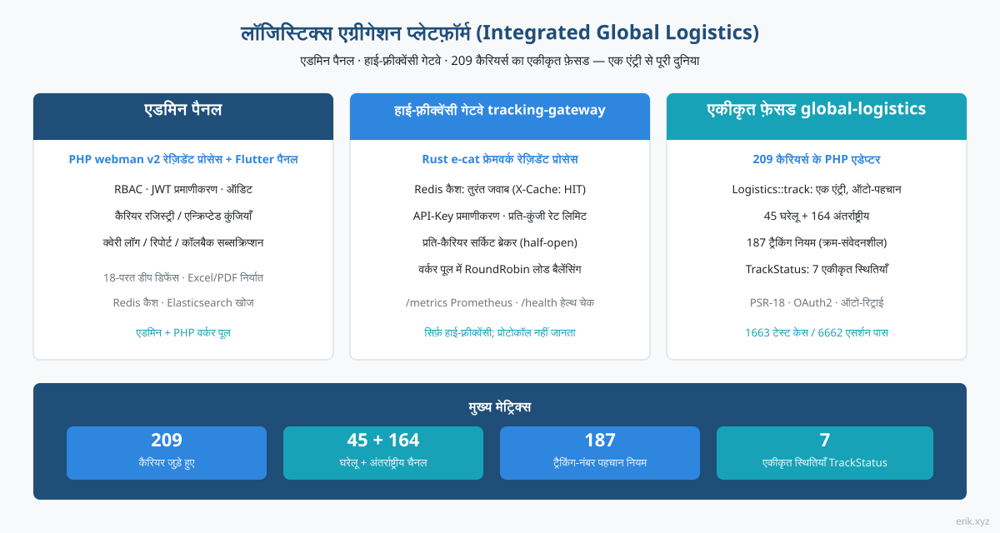
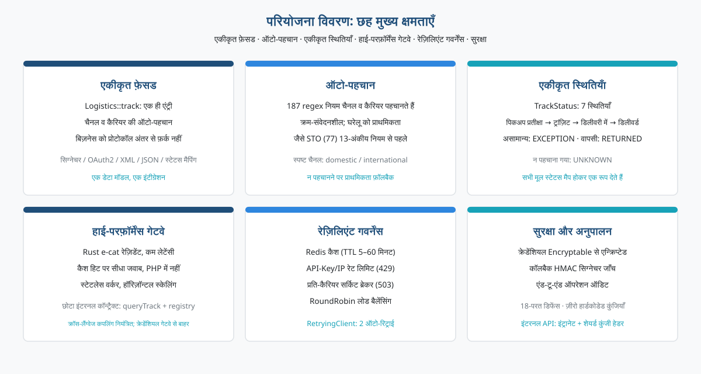
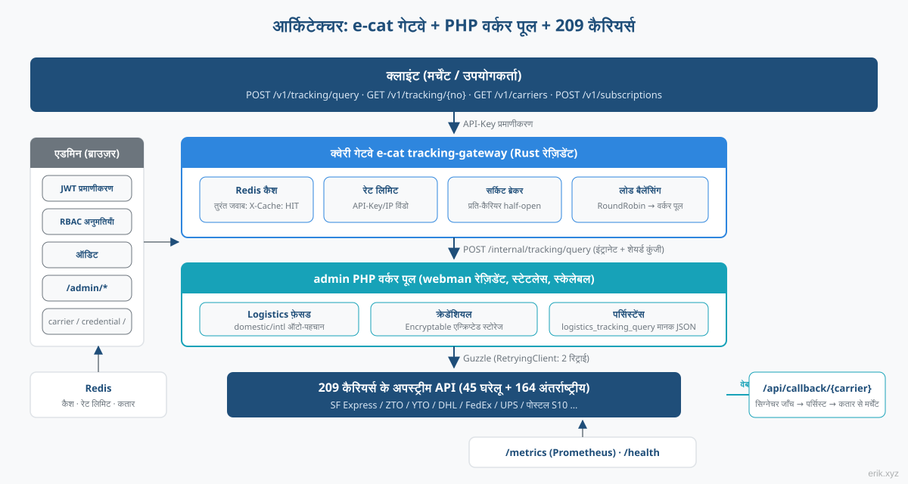
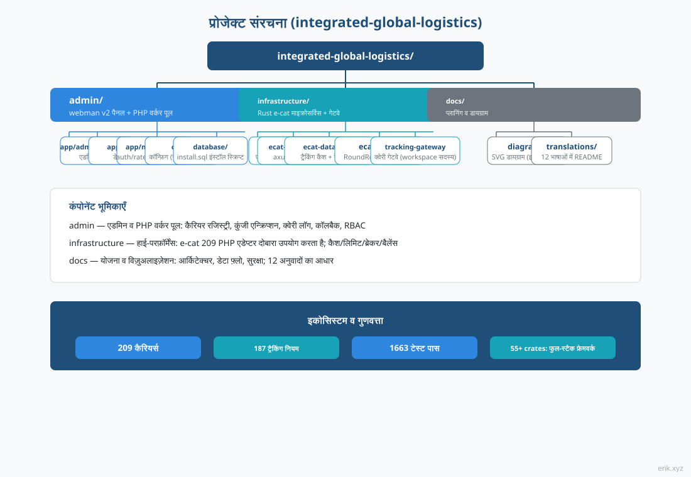
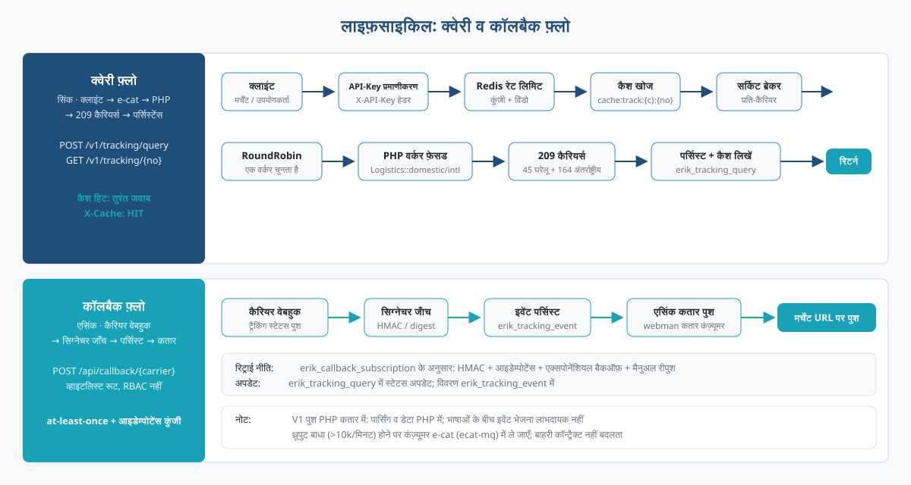
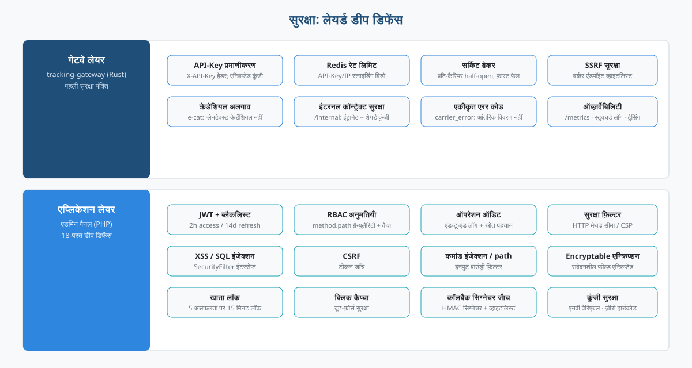

# लॉजिस्टिक्स एग्रीगेशन प्लेटफ़ॉर्म (Integrated Global Logistics)


वैश्विक लॉजिस्टिक्स ट्रैकिंग के लिए वन-स्टॉप प्लेटफ़ॉर्म: **admin प्रशासन पैनल** (PHP webman + Flutter) प्रबंधन और क्वेरी वर्कर पूल संभालता है, **e-cat हाई-फ़्रीक्वेंसी गेटवे** (Rust रेज़िडेंट प्रोसेस) क्वेरी ट्रैफ़िक झेलता है, और **global-logistics यूनिफाइड फ़ेसड** (209 कैरियर्स के PHP एडेप्टर) एक ही एंट्री से पूरी दुनिया में क्वेरी करता है।

> भाषाएँ: [[English]](/docs/translations/en/README.md) · [[한국어]](/docs/translations/ko/README.md) · [[Русский]](/docs/translations/ru/README.md) · [[Deutsch]](/docs/translations/de/README.md) · [[Français]](/docs/translations/fr/README.md) · [[Español]](/docs/translations/es/README.md) · [[Português]](/docs/translations/pt/README.md) · [[हिन्दी]](/docs/translations/hi/README.md) · [[العربية]](/docs/translations/ar/README.md) · [[বাংলা]](/docs/translations/bn/README.md) · [[Bahasa Indonesia]](/docs/translations/id/README.md) · [[日本語]](/docs/translations/ja/README.md)（[अनुवाद देखें](#अनुवाद)）

## परियोजना परिचय



यह प्लेटफ़ॉर्म दुनिया की **209** कूरियर / डाक सेवा कंपनियों की ट्रैकिंग को एक ही प्लेटफ़ॉर्म पर समेटता है: मर्चेंट और C-एंड यूज़र सिर्फ़ एक ट्रैकिंग नंबर देते हैं, और प्लेटफ़ॉर्म अपने आप घरेलू/अंतर्राष्ट्रीय चैनल और कैरियर पहचान लेता है — किसी भी कंपनी के प्रोटोकॉल अंतर (सिग्नेचर, OAuth2, XML/JSON, स्टेटस मैपिंग) की चिंता नहीं करनी पड़ती।

प्लेटफ़ॉर्म तीन घटकों के सहयोग से बना है:

- **admin प्रशासन पैनल** (PHP webman v2 + Flutter) — प्रबंधन और PHP वर्कर पूल: कैरियर रजिस्ट्री, कुंजी एन्क्रिप्शन प्रबंधन, क्वेरी रिकॉर्ड, सांख्यिकी रिपोर्ट, कॉलबैक सब्सक्रिप्शन कॉन्फ़िग; RBAC / JWT / ऑपरेशन ऑडिट सिस्टम पूर्ण;
- **tracking-gateway हाई-फ़्रीक्वेंसी गेटवे** (Rust e-cat फ्रेमवर्क) — बाहरी क्वेरी API की पहली एंट्री: Redis कैश, रेट लिमिटिंग, प्रति-कैरियर सर्किट ब्रेकर, वर्कर लोड बैलेंसिंग; केवल हाई-फ़्रीक्वेंसी हिस्सा, कैरियर प्रोटोकॉल नहीं समझता;
- **global-logistics यूनिफाइड फ़ेसड** (PHP पैकेज) — 209 कैरियर्स के एडेप्टर (घरेलू 45 + अंतर्राष्ट्रीय 164), 187 ट्रैकिंग-नंबर ऑटो-पहचान नियम, `TrackStatus` की 7 यूनिफाइड स्टेटस सेमेंटिक्स।

**वर्तमान प्रगति**: M1–M13 सभी पूर्ण —— M1 प्रशासन पैनल (कैरियर / क्रेडेंशियल / क्वेरी रिकॉर्ड / सब्सक्रिप्शन CRUD), M2 क्वेरी गेटवे (संपूर्ण बाहरी API श्रृंखला), M3 कॉलबैक सब्सक्रिप्शन, M4 मॉनिटरिंग और सांख्यिकी, M5 बाहरी OpenAPI दस्तावेज़, M6 पाँच क्लाइंट SDK, M7 क्लाइंट पोर्टल (पंजीकरण / ऐप / प्लान / ऑर्डर), M8 भुगतान (Stripe / PayPal), M9 क्रिप्टो (USDT TRC20 / BEP20 / ERC20), M10 भुगतान विधि कॉन्फ़िगरेशन, M11 गेटवे सुरक्षा मिडलवेयर, M12 CDN योजना (Cloudflare + कैश हेडर), M13 CDN प्रदाता प्रबंधन. क्लाइंट → e-cat → worker → कैरियर ट्रैकिंग क्वेरी श्रृंखला प्रदर्शन योग्य है, और पाँच शून्य-निर्भरता SDK कॉपी-एंड-यूज़ तैयार हैं।

## परियोजना विवरण



- **एक एंट्री**: `Logistics::track($trackingNo)` अपने आप घरेलू/अंतर्राष्ट्रीय चैनल और कैरियर पहचानता है; बिज़नेस लेयर को सिर्फ़ एक ही रूप से जुड़ना होता है;
- **ऑटो-पहचान**: 187 ट्रैकिंग-नंबर regex नियम क्रम-संवेदनशील हैं और पहले घरेलू चैनल मिलाते हैं; पहचान न होने पर `domestic()` / `international()` स्पष्ट रूप से बुलाया जा सकता है;
- **यूनिफाइड स्टेटस**: हर कंपनी के अलग-अलग मूल स्टेटस यूनिफाइड `TrackStatus` एनम में मैप होते हैं (पिकअप प्रतीक्षा / ट्रांज़िट में / डिलीवरी में / डिलीवर्ड / असामान्य / वापसी / अज्ञात);
- **वैश्विक कवरेज**: DHL, FedEx, UPS, USPS चार प्रमुख कूरियर और विभिन्न देशों के डाक S10 सिस्टम (चार क्षेत्र: यूरोप, लैटिन अमेरिका-कैरिबियन, अफ़्रीका-मध्य पूर्व, एशिया-प्रशांत);
- **बाहरी API**: e-cat क्वेरी गेटवे API-Key प्रमाणीकरण, Redis कैश हिट (`X-Cache: HIT`), दर सीमा 429, प्रति-कैरियर सर्किट ब्रेकर 503, RoundRobin worker लोड संतुलन प्रदान करता है; पाँच शून्य-निर्भरता SDK (Python / PHP / Node.js / Go / Rust) कॉपी-एंड-यूज़ तैयार;
- **क्लाइंट पोर्टल और बिलिंग**（M7–M10）：क्लाइंट पंजीकरण / लॉगिन (client JWT admin से अलग), X-API-Key स्वयं सेट के साथ ऐप प्रबंधन, प्लान / ऑर्डर API; Stripe / PayPal + USDT TRC20 / BEP20 / ERC20 क्रिप्टो भुगतान, Stripe भुगतान विधियाँ (Apple Pay / Google Pay / Klarna / SEPA आदि) कॉन्फ़िगरेशन से तुरंत प्रभावी;
- **CDN त्वरण**（M12/M13）：Cloudflare मुफ़्त प्लान पूर्ण HTTPS + स्टैटिक एसेट्स के लिए एज कैश, CDN प्रदाता / डोमेन / कुंजियाँ प्रशासन पैनल में कॉन्फ़िगर करने योग्य (कुंजियाँ एन्क्रिप्टेड);
- **शून्य हार्डकोडेड कुंजियाँ**: सभी कुंजियाँ कॉन्फ़िगरेशन से इंजेक्ट होती हैं; डेटाबेस लेयर में Encryptable से एन्क्रिप्टेड स्टोर होती हैं; कोड और कुंजियाँ पूरी तरह अलग।

## परियोजना आर्किटेक्चर



क्वेरी चेन: **क्लाइंट → e-cat क्वेरी गेटवे → PHP वर्कर पूल → 209 कैरियर्स**।

e-cat गेटवे (Rust) बाहरी API का API-Key प्रमाणीकरण, Redis कैश हिट, रेट लिमिटिंग, प्रति-कैरियर सर्किट ब्रेकर और RoundRobin लोड बैलेंसिंग संभालता है; कैश हिट, रेट-लिमिट अस्वीकृति और सर्किट-ब्रेकर फ़ास्ट फ़ेल सब e-cat की तरफ़ होते हैं; PHP वर्कर केवल असली क्वेरी ट्रैफ़िक संभालता है — हॉरिज़ॉन्टल स्केलिंग के लिए बस वर्कर जोड़ें।

**209 PHP एडेप्टर का e-cat द्वारा पुनः उपयोग**: 209 एडेप्टर PHP में हैं (`src/Carriers/Domestic` 45 + `International` 164); Rust में दोबारा लिखना महीनों का काम है और अपस्ट्रीम पैकेज के निरंतर अपडेट का लाभ खत्म होगा; e-cat को कैरियर प्रोटोकॉल समझने की ज़रूरत नहीं, यह केवल एक स्थिर इंटरनल कॉन्ट्रैक्ट पर निर्भर करता है (`/internal/tracking/query` + `/internal/carriers` रजिस्ट्री सिंक)। क्रेडेंशियल कभी e-cat तक नहीं जाते — सुरक्षा सीमा स्पष्ट।

प्रबंधन (ब्राउज़र) → `/admin/*`: JWT + RBAC अनुमतियाँ + ऑपरेशन ऑडिट, कवर करता है carrier / carrier-credential / tracking-query / callback-subscription / statistics / client / client-app / plan / order / cdn-provider।

## परियोजना संरचना



```
integrated-global-logistics/
├── admin/                          # PHP webman v2 管理后台 + worker 池
│   ├── app/
│   │   ├── admin/controller/       # 管理端控制器（carrier、tracking、统计等）
│   │   ├── api/                    # API v1（验证码 / 登录 / 刷新令牌）
│   │   ├── common/                 # Hashids / Snowflake / 加密脱敏服务
│   │   ├── middleware/             # 安全过滤 / 限流 / JWT / RBAC / 审计
│   │   └── model/                  # 数据模型（logistics_ 前缀，snowflake 主键）
│   ├── apps/
│   │   ├── flutter/                # Flutter Web 管理后台（PC 风格）
│   │   └── harmonyos/              # HarmonyOS 原生客户端
│   ├── config/                     # 配置（含中文注释）
│   ├── database/
│   │   └── install.sql             # SQL 安装脚本（含权限种子数据）
│   └── docs/                       # API / 架构 / 设计 / 安全文档（12 语言）
├── infrastructure/                 # Rust e-cat 微服务框架 + 查询网关
│   ├── ecat/                       # 聚合 crate（App 骨架）
│   ├── ecat-transport-http/        # axum HTTP 传输
│   ├── ecat-data-redis/            # 轨迹缓存 + 限流存储
│   ├── ecat-client/                # RoundRobin 负载均衡
│   └── tracking-gateway/           # 对外查询网关（workspace 新成员）
├── sdk/                            # 对外 API 客户端 SDK（Python / PHP / Node.js / Go / Rust）
└── docs/                           # 平台规划与图示
    ├── diagrams/                   # SVG 架构图（本 README 引用）
    ├── translations/               # 12 语言 README
    └── logistics-aggregation-platform-plan.md  # 实施规划
```

## जीवनचक्र



**क्वेरी चेन (सिंक्रोनस)**: क्लाइंट → API-Key प्रमाणीकरण → Redis रेट लिमिट → कैश खोज (हिट पर तुरंत जवाब, `X-Cache: HIT`) → सर्किट ब्रेकर जाँच (OPEN होने पर 503 फ़ास्ट फ़ेल) → RoundRobin से वर्कर चयन → PHP वर्कर का `Logistics` फ़ेसड (पैकेज का RetryingClient 2 रिट्राई करता है) → 209 कैरियर्स → `logistics_tracking_query` में सेव + कैश लिखना → मानकीकृत JSON रिटर्न।

**कॉलबैक चेन (एसिंक्रोनस)**: कैरियर webhook → `/api/callback/{carrier}` व्हाइटलिस्ट रूट + सिग्नेचर जाँच → `logistics_tracking_event` में सेव + क्वेरी रिकॉर्ड अपडेट → webman कतार में लिखना → एसिंक कंज़्यूमर सब्सक्रिप्शन कॉन्फ़िग के अनुसार मर्चेंट कॉलबैक URL पर पुश (HMAC सिग्नेचर + आइडेम्पोटेंस कुंजी + एक्सपोनेंशियल बैकऑफ़ रिट्राई + मैनुअल रीपुश एंट्री)।

> कॉलबैक पुश का पहला संस्करण PHP कतार में ही रखा गया है — इवेंट पार्सिंग और डेटा दोनों PHP की तरफ़ हैं; भाषाओं के बीच इवेंट भेजने का कोई लाभ नहीं; अगर पुश थ्रूपुट बाधा बने (हज़ारों/मिनट से अधिक), तो कंज़्यूमर को e-cat (ecat-mq + retry मिडलवेयर) में ले जाएँ — बाहरी कॉन्ट्रैक्ट नहीं बदलता।

## सुरक्षा सुरक्षा उपाय



लेयर्ड डीप डिफेंस, मुख्य बिंदु:

- **गेटवे लेयर** (tracking-gateway): API-Key प्रमाणीकरण, Redis रेट लिमिट (key / IP के अनुसार), प्रति-कैरियर सर्किट ब्रेकर, SSRF सुरक्षा (वर्कर एंडपॉइंट व्हाइटलिस्ट रेज़ोल्यूशन); `/internal` केवल इंट्रानेट + शेयर्ड कुंजी हेडर सुनता है; क्रेडेंशियल अलगाव — e-cat प्लेनटेक्स्ट क्रेडेंशियल नहीं रखता;
- **एप्लिकेशन लेयर** (admin): JWT + ब्लैकलिस्ट (2h access / 14d refresh), RBAC method.path ग्रैन्युलैरिटी अनुमतियाँ, पूरी चेन का ऑपरेशन ऑडिट; `SecurityFilter` XSS / SQL इंजेक्शन / CSRF / कमांड इंजेक्शन / path traversal रोकता है; संवेदनशील डेटा `Encryptable` एन्क्रिप्शन से सेव + एक्सपोर्ट में मास्किंग; लॉगिन 5 बार असफल होने पर 15 मिनट लॉक + क्लिक कैप्चा;
- **कॉलबैक सुरक्षा**: व्हाइटलिस्ट रूट + HMAC सिग्नेचर जाँच, at-least-once डिलीवरी + आइडेम्पोटेंस कुंजी से डुप्लीकेट पुश रोकना;
- **यूनिफाइड एरर सेमेंटिक्स**: रेट लिमिट 429, सर्किट ब्रेकर 503, कैरियर एरर `carrier_error` — क्लाइंट को आंतरिक विवरण नहीं लीक होते।
- **भुगतान सुरक्षा** (M8/M10): Stripe / PayPal वेबहुक सत्यापन (HMAC-SHA256 / verify-webhook-signature), स्वचालित ऑर्डर पुष्टि + admin मैनुअल फ़ॉलबैक; भुगतान कुंजियाँ `Encryptable` से एन्क्रिप्ट कर `logistics_system_config` में संग्रहीत;
- **क्रिप्टो भुगतान सत्यापन** (M9): USDT TRC20 Tronscan API से स्वचालित सत्यापन; BEP20 / ERC20 मैनुअल पुष्टि;
- **क्लाइंट कुंजी सुरक्षा** (M7): X-API-Key क्लाइंट द्वारा सेट (≥16 अक्षर), sha256 रूप में संग्रहीत — प्लेनटेक्स्ट केवल निर्माण के समय एक बार लौटाया जाता है; क्लाइंट JWT (token_type=client) admin JWT से अलग;
- **गेटवे आक्रमण पहचान**（M11）：`ecat-security` SecurityBodyLayer गेटवे में एकीकृत (इंजेक्शन / प्रोटोकॉल / डेटा सीरियलाइज़ेशन / फ़ाइल / संवेदनशील डेटा लीक डिटेक्टर); हमले के पेलोड गेटवे परत पर ही अवरुद्ध, एप्लिकेशन परत सुरक्षा पैकेज बैकस्टॉप के रूप में;
- **CDN सुरक्षा**（M12）：Cloudflare मुफ़्त प्लान पूर्ण HTTPS + द्वि-परत WAF (एज प्रबंधित नियम + गेटवे एप्लिकेशन परत जाँच); Tunnel ओरिजिन सोर्स शून्य एक्सपोज़र; कॉलबैक केवल DNS सबडोमेन सीधा कनेक्शन, CDN विफलता पर ऑर्डर न हारें; दर सीमा X-API-Key से गिनती, CDN एज IP से अप्रभावित; प्रमाणित एंडपॉइंट हमेशा no-store क्रॉस-यूज़र कैश मिक्सिंग रोकते हैं;
- **CDN क्रेडेंशियल प्रबंधन**（M13）：CDN प्रदाता access_key / access_secret `Encryptable` से एन्क्रिप्ट कर `logistics_cdn_provider` तालिका में, `/admin/cdn/provider` पर कॉन्फ़िगरेशन;

## त्वरित शुरुआत

**admin प्रशासन पैनल** (PHP webman):

```bash
cd admin
composer install
php start.php start
```

शुरू होने के बाद ब्राउज़र में इंस्टॉल विज़ार्ड खोलकर डेटाबेस इनिशियलाइज़ेशन और एडमिन निर्माण पूरा करें: `http://localhost:8787/install` (डिफ़ॉल्ट पोर्ट 8787, `config/server.php` में बदला जा सकता है)।

**infrastructure क्वेरी गेटवे** (Rust e-cat):

```bash
cd infrastructure
cargo build
```

**SDK कॉल** (पाँच शून्य-निर्भरता क्लाइंट, कॉपी-एंड-यूज़):

```python
from tracking_client import TrackingClient
client = TrackingClient("demo-api-key", "http://127.0.0.1:8080")
result = client.query_tracking("LX123456789CN")
```

```bash
curl -H "X-API-Key: demo-api-key" http://127.0.0.1:8080/v1/tracking/query \
  -H "Content-Type: application/json" -d '{"tracking_no": "LX123456789CN"}'
```

प्रत्येक भाषा में उपयोग और उदाहरण के लिए [sdk/README.md](../../../sdk/README.md) देखें।

विस्तृत डिप्लॉयमेंट के लिए देखें [admin/README.md](../../../admin/README.md) (Docker Compose 5 सेवाएँ चलाता है: Nginx / PHP / MySQL / Redis / Elasticsearch) और कार्यान्वयन योजना दस्तावेज़।

## दस्तावेज़

- [admin/docs/API.md](../../../admin/docs/API.md) — API संदर्भ (यूनिफाइड रिस्पॉन्स फ़ॉर्मेट, एरर कोड, प्रमाणीकरण फ़्लो, रेट लिमिट नीतियाँ, मिडलवेयर चेन)
- [admin/docs/ARCHITECTURE.md](../../../admin/docs/ARCHITECTURE.md) — आर्किटेक्चर डिज़ाइन
- [admin/docs/DESIGN.md](../../../admin/docs/DESIGN.md) — डिज़ाइन दस्तावेज़
- [admin/docs/SECURITY.md](../../../admin/docs/SECURITY.md) — सुरक्षा आर्किटेक्चर
- [docs/logistics-aggregation-platform-plan.md](../../../docs/logistics-aggregation-platform-plan.md) — प्लेटफ़ॉर्म कार्यान्वयन योजना (आर्किटेक्चर, डेटा फ़्लो, डेटाबेस डिज़ाइन, API कॉन्ट्रैक्ट, माइलस्टोन)
- [admin/README.md](../../../admin/README.md) — प्रशासन पैनल की पूरी जानकारी (टेक स्टैक, डेटाबेस मानक, डिप्लॉयमेंट, CI/CD)
- [sdk/README.md](../../../sdk/README.md) — बाहरी API क्लाइंट SDK (Python / PHP / Node.js / Go / Rust, पाँचों शून्य-निर्भरता, कॉपी करके चलाएँ)

## अनुवाद

- [English](/docs/translations/en/README.md)
- [한국어](/docs/translations/ko/README.md)
- [Русский](/docs/translations/ru/README.md)
- [Deutsch](/docs/translations/de/README.md)
- [Français](/docs/translations/fr/README.md)
- [Español](/docs/translations/es/README.md)
- [Português](/docs/translations/pt/README.md)
- [हिन्दी](/docs/translations/hi/README.md)
- [العربية](/docs/translations/ar/README.md)
- [বাংলা](/docs/translations/bn/README.md)
- [Bahasa Indonesia](/docs/translations/id/README.md)
- [日本語](/docs/translations/ja/README.md)

## ओपन-सोर्स परियोजना का समर्थन करें

| WeChat | Alipay |
|:---:|:---:|
|  |  |

### वैश्विक बैंक ट्रांसफ़र दान (क्रॉस-बॉर्डर रेमिटेंस)

**प्राप्तकर्ता जानकारी**

- प्राप्तकर्ता का नाम: WANG KEXUN
- प्राप्तकर्ता खाता संख्या: 881015918251

**प्राप्तकर्ता बैंक**

- ZA Bank SWIFT Code: AABLHKHHXXX
- बैंक का नाम: ZA Bank Limited
- बैंक कोड: 387
- बैंक का पता: Core F, Cyberport 3, 100 Cyberport Road, Hong Kong

**क्रॉस-बॉर्डर रेमिटेंस मध्यस्थ बैंक (यदि आवश्यक हो)**

> यह क्रॉस-बॉर्डर रेमिटेंस के मध्यस्थ (ट्रांज़िट) बैंक की जानकारी है, प्राप्तकर्ता बैंक की नहीं। अपने रेमिट करने वाले बैंक से पूछें कि क्या मध्यस्थ बैंक की जानकारी देना आवश्यक है।

- **हांगकांग डॉलर, रेनमिन्बी और अमेरिकी डॉलर की रेमिटेंस के लिए**, मध्यस्थ बैंक Citibank है:
  - बैंक का नाम: Citibank N.A. Hong Kong
  - SWIFT Code: CITIHKHXXXX
  - बैंक कोड: 006
  - शाखा का नाम: Hong Kong Branch
  - शाखा कोड: 391
  - बैंक का पता: Citibank Tower, Citibank Plaza, 3 Garden Road, Central, Hong Kong
- **अन्य मुद्राओं की रेमिटेंस के लिए**, मध्यस्थ बैंक BNY Mellon है:
  - बैंक का नाम: THE BANK OF NEW YORK MELLON
  - SWIFT Code: IRVTUS3NXXX
  - बैंक का पता: THE BANK OF NEW YORK MELLON, 240 GREENWICH STREET, NEW YORK, United States

### क्रिप्टो दान (Crypto Donation)

यदि यह प्रोजेक्ट आपके काम आए, तो दान करने के लिए QR कोड स्कैन करें, धन्यवाद!

| <br>**BNB Smart Chain (BEP20)**<br>`0x355d429f97511897ccb4e271ec888205f9ab6629` | <br>**Tron (TRC20)**<br>`TEdDHWLajt1XvqtPDWmQctdrJaC3pzZZzz` |
| <br>**Ethereum (ERC20)**<br>`0x355d429f97511897ccb4e271ec888205f9ab6629` | <br>**Aptos**<br>`0x836e3780edfc3f7b2372b39e2a1a3a5d7adfaccd96c726f21cfde1b50dd68030` |
| <br>**Plasma**<br>`0x355d429f97511897ccb4e271ec888205f9ab6629` | <br>**Polygon POS**<br>`0x355d429f97511897ccb4e271ec888205f9ab6629` |
| <br>**Solana**<br>`2hfhboHdmdrYsY25XfQSsEWxq5ip4EQsR7f4AzSRMUyr` | <br>**The Open Network (TON)**<br>`UQB9kFQohzmXUir9QSSZq01iwl9aQZIDdBpNmDklljRtCoGK` |
| <br>**Arbitrum One**<br>`0x355d429f97511897ccb4e271ec888205f9ab6629` | <br>**AVAX C-Chain**<br>`0x355d429f97511897ccb4e271ec888205f9ab6629` |

---

## लाइसेंस

MIT

Copyright (c) 2026 erik <erik@erik.xyz> — https://erik.xyz

<!-- TRANSLATE-READY -->
