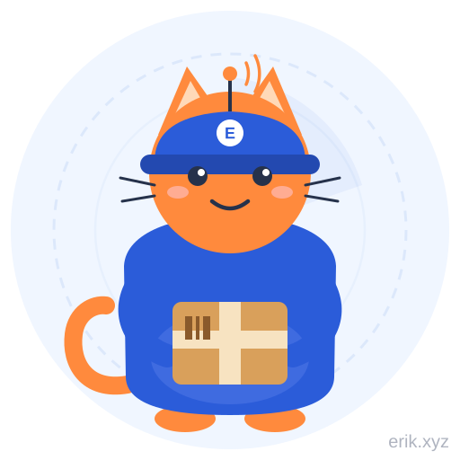
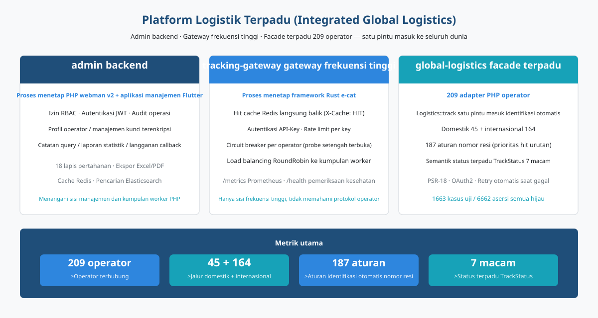
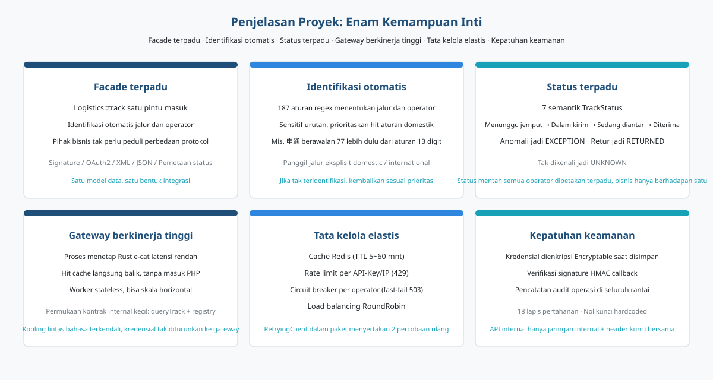
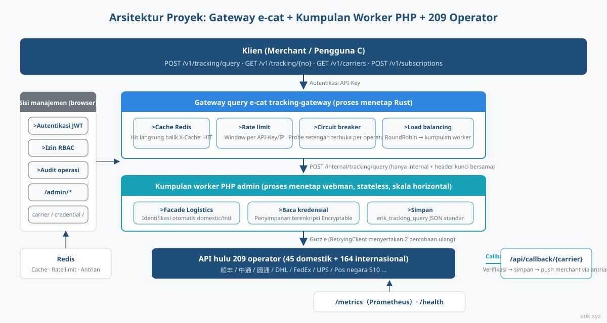
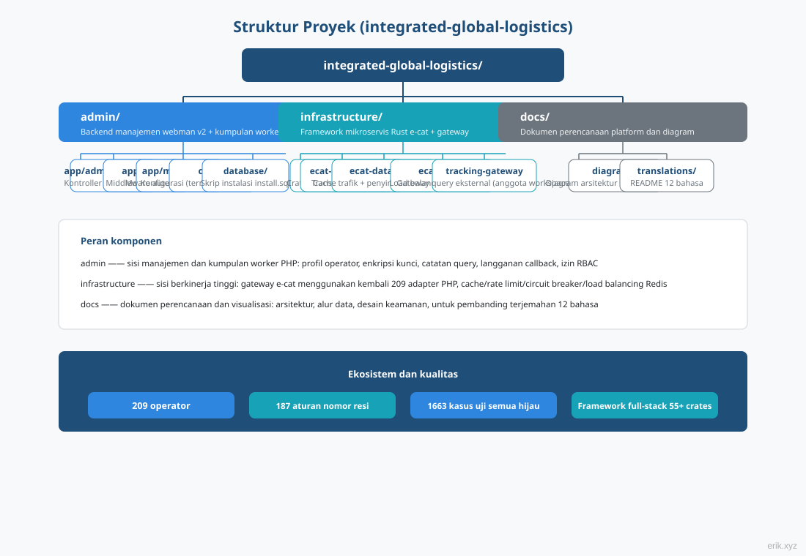
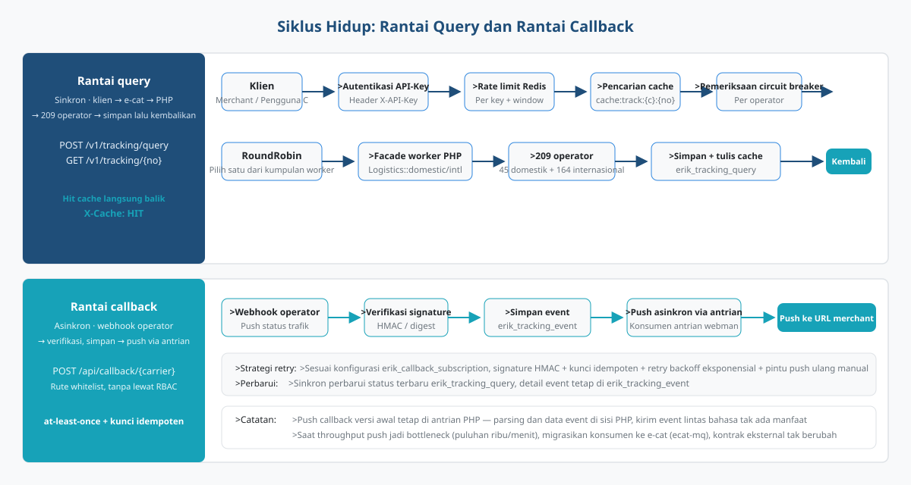
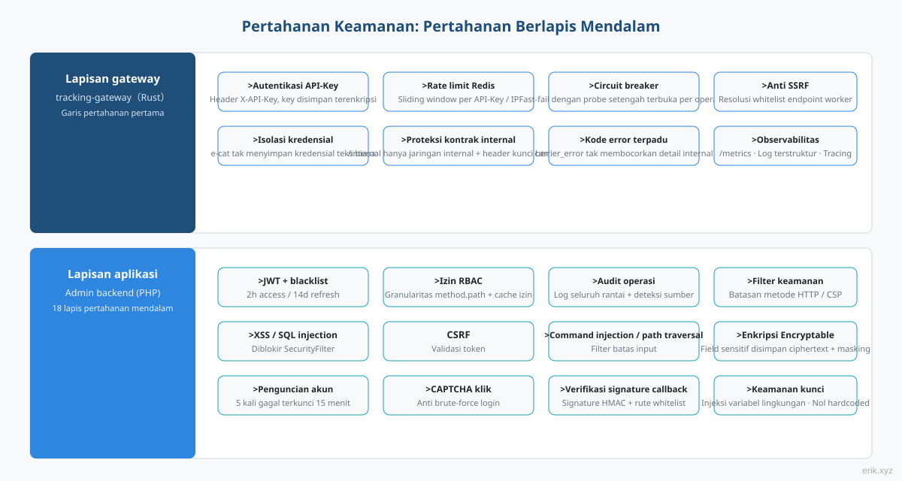
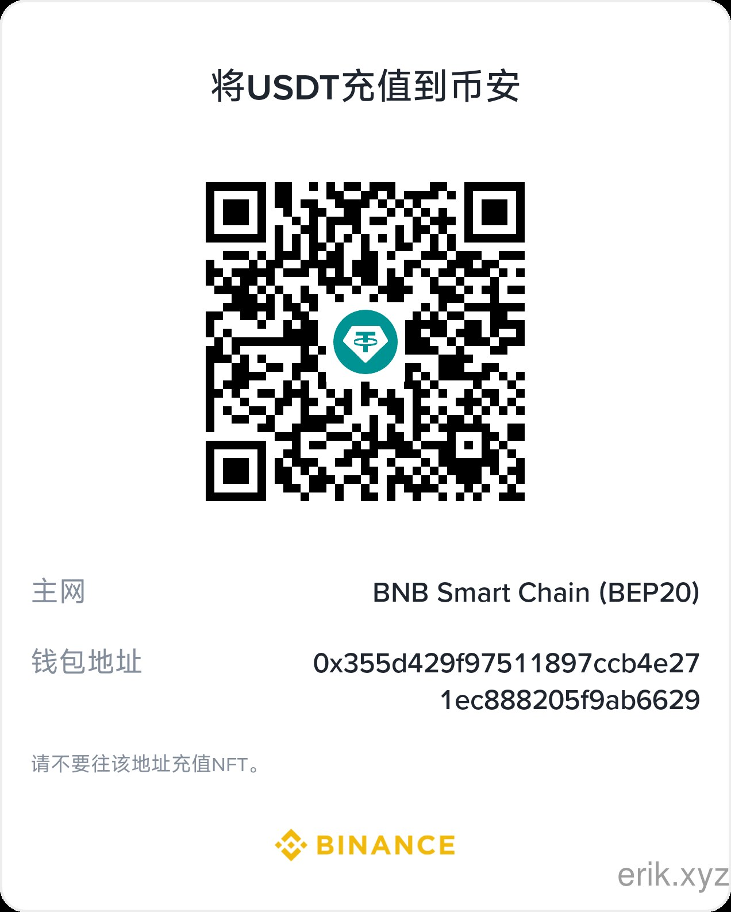
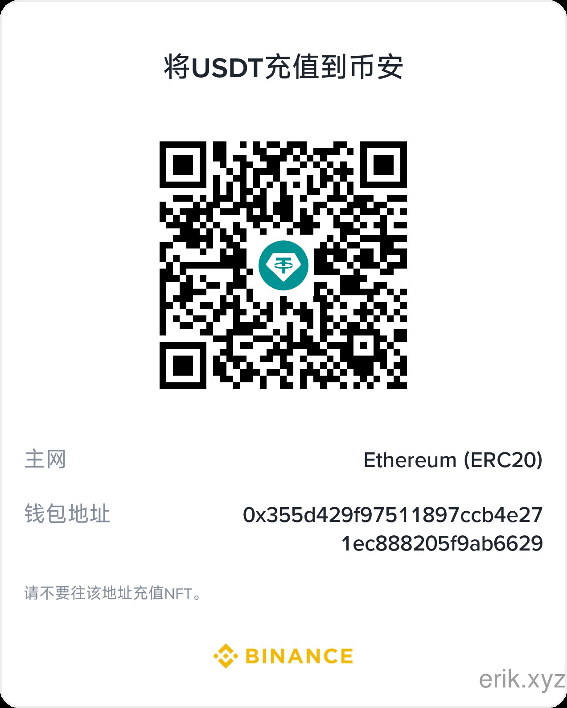
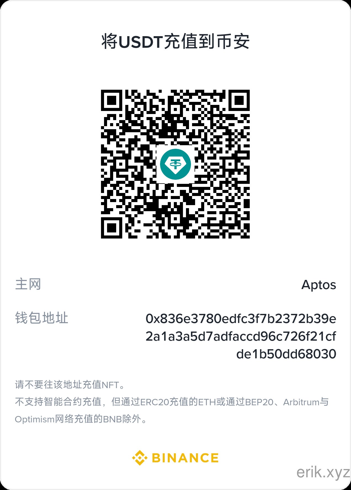

# Platform Logistik Terpadu (Integrated Global Logistics)


Platform satu pintu untuk penelusuran logistik global: **admin backend** (PHP webman + Flutter) menangani sisi manajemen dan kumpulan worker query, **gateway frekuensi tinggi e-cat** (proses menetap Rust) menopang trafik query, dan **facade terpadu global-logistics** (209 adapter PHP operator) menelusuri seluruh dunia lewat satu pintu masuk.

> Bahasa didukung：[[English / Inggris]](/docs/translations/en/README.md) · [[한국어 / Korea]](/docs/translations/ko/README.md) · [[Русский / Rusia]](/docs/translations/ru/README.md) · [[Deutsch / Jerman]](/docs/translations/de/README.md) · [[Français / Prancis]](/docs/translations/fr/README.md) · [[Español / Spanyol]](/docs/translations/es/README.md) · [[Português / Portugis]](/docs/translations/pt/README.md) · [[हिन्दी / Hindi]](/docs/translations/hi/README.md) · [[العربية / Arab]](/docs/translations/ar/README.md) · [[বাংলা / Bengali]](/docs/translations/bn/README.md) · [[Bahasa Indonesia]](/docs/translations/id/README.md) · [[日本語 / Jepang]](/docs/translations/ja/README.md)（[Lompat ke Translations](#translationsbahasa-lain)）

## Pengenalan Proyek



Platform logistik terpadu menyatukan penelusuran **209** operator kurir / pos di seluruh dunia menjadi satu platform: merchant dan pengguna C hanya memasukkan satu nomor resi, platform otomatis mengidentifikasi jalur domestik / internasional dan operatornya, tanpa perlu peduli perbedaan protokol masing-masing (signature, OAuth2, XML/JSON, pemetaan status).

Platform terdiri dari tiga komponen yang bekerja sama:

- **admin backend** (PHP webman v2 + Flutter) —— sisi manajemen dan kumpulan worker PHP: profil operator, manajemen kunci terenkripsi, catatan query, laporan statistik, konfigurasi langganan callback, sistem RBAC / JWT / audit operasi yang lengkap;
- **tracking-gateway gateway frekuensi tinggi** (framework Rust e-cat) —— pintu masuk pertama API query eksternal: cache Redis, rate limiting, circuit breaker per operator, load balancing worker, hanya menangani sisi frekuensi tinggi, tidak memahami protokol operator;
- **global-logistics facade terpadu** (paket PHP) —— 209 adapter operator (domestik 45 + internasional 164), 187 aturan pengenalan otomatis nomor resi, semantik status terpadu `TrackStatus` 7 macam.

**Kemajuan saat ini**: M1–M13 semuanya selesai — M1 panel administrasi (CRUD karier / kredensial / catatan kueri / langganan), M2 gateway kueri (rantai API eksternal lengkap), M3 langganan callback, M4 pemantauan dan statistik, M5 dokumentasi OpenAPI eksternal, M6 lima SDK klien, M7 portal klien (registrasi / aplikasi / paket / pesanan), M8 pembayaran (Stripe / PayPal), M9 kripto (USDT TRC20 / BEP20 / ERC20), M10 konfigurasi metode pembayaran, M11 middleware keamanan gateway, M12 rencana CDN (Cloudflare + header cache), M13 manajemen penyedia CDN. Rantai kueri pelacakan klien → e-cat → worker → karier dapat didemonstrasikan, dan lima SDK tanpa dependensi siap salin-pakai.

## Penjelasan Proyek



- **Satu pintu masuk**：`Logistics::track($trackingNo)` otomatis mengidentifikasi jalur domestik / internasional dan operator; lapisan bisnis hanya berhadapan dengan satu bentuk;
- **Pengenalan otomatis**：187 aturan regex nomor resi sensitif terhadap urutan, mengutamakan jalur domestik; jika tidak teridentifikasi, `domestic()` / `international()` dapat dipanggil secara eksplisit;
- **Status terpadu**：status mentah dari berbagai operator dipetakan ke enum `TrackStatus` yang terpadu (menunggu penjemputan / dalam pengiriman / sedang diantar / sudah diterima / anomali / dikembalikan / tidak dikenali);
- **Cakupan global**：empat kurir besar DHL、FedEx、UPS、USPS dan sistem S10 pos berbagai negara (empat kawasan: Eropa, Amerika Latin-Karibia, Afrika-Timur Tengah, Asia Pasifik);
- **API eksternal**: gateway e-cat menyediakan autentikasi API-Key, cache hit Redis (`X-Cache: HIT`), pembatasan laju 429, pemutus sirkuit per karier 503, penyeimbangan beban worker RoundRobin; lima SDK tanpa dependensi (Python / PHP / Node.js / Go / Rust) siap salin-pakai;
- **Portal klien & penagihan**（M7–M10）：registrasi / login klien (JWT klien terisolasi dari admin), manajemen aplikasi dengan X-API-Key diatur sendiri, API paket / pesanan; pembayaran Stripe / PayPal + kripto USDT TRC20 / BEP20 / ERC20, metode pembayaran Stripe (Apple Pay / Google Pay / Klarna / SEPA dll.) dapat dikonfigurasi tanpa kode;
- **Akselerasi CDN**（M12/M13）：paket gratis Cloudflare HTTPS penuh + cache edge untuk aset statis, penyedia CDN / domain / kunci dapat dikonfigurasi di panel admin (kunci terenkripsi);
- **Nol kunci hardcoded**：semua kunci diinjeksi melalui konfigurasi, lapisan database menyimpan ciphertext dengan Encryptable, kode dan kunci sepenuhnya terpisah.

## Arsitektur Proyek



Rantai query：**klien → gateway query e-cat → kumpulan worker PHP → 209 operator**.

Gateway e-cat (Rust) menangani autentikasi API-Key untuk API eksternal, cache hit Redis, rate limiting, circuit breaker per operator, dan load balancing RoundRobin; cache hit, penolakan rate limit, dan fast-fail circuit breaker semuanya selesai di sisi e-cat, worker PHP hanya menerima trafik query nyata, dan scaling horizontal cukup dengan menambah worker.

**Skema pembagian kerja e-cat yang menggunakan kembali 209 adapter PHP**：209 adapter adalah PHP (`src/Carriers/Domestic` 45 + `International` 164), menulis ulang dalam Rust memakan waktu berbulan-bulan dan kehilangan manfaat pembaruan berkelanjutan dari paket upstream; e-cat tidak perlu memahami protokol operator, hanya bergantung pada kontrak internal yang stabil (`/internal/tracking/query` + sinkronisasi registry `/internal/carriers`). Kredensial tidak pernah diturunkan ke e-cat, batas keamanan jelas.

Sisi manajemen (browser) → `/admin/*`：JWT + izin RBAC + audit operasi, mencakup carrier / carrier-credential / tracking-query / callback-subscription / statistics / client / client-app / plan / order / cdn-provider.

## Struktur Proyek



```
integrated-global-logistics/
├── admin/                          # PHP webman v2 管理后台 + worker 池
│   ├── app/
│   │   ├── admin/controller/       # 管理端控制器（carrier、tracking、统计等）
│   │   ├── api/                    # API v1（验证码 / 登录 / 刷新令牌）
│   │   ├── common/                 # Hashids / Snowflake / 加密脱敏服务
│   │   ├── middleware/             # 安全过滤 / 限流 / JWT / RBAC / 审计
│   │   └── model/                  # 数据模型（logistics_ 前缀，snowflake 主键）
│   ├── apps/
│   │   ├── flutter/                # Flutter Web 管理后台（PC 风格）
│   │   └── harmonyos/              # HarmonyOS 原生客户端
│   ├── config/                     # 配置（含中文注释）
│   ├── database/
│   │   └── install.sql             # SQL 安装脚本（含权限种子数据）
│   └── docs/                       # API / 架构 / 设计 / 安全文档（12 语言）
├── infrastructure/                 # Rust e-cat 微服务框架 + 查询网关
│   ├── ecat/                       # 聚合 crate（App 骨架）
│   ├── ecat-transport-http/        # axum HTTP 传输
│   ├── ecat-data-redis/            # 轨迹缓存 + 限流存储
│   ├── ecat-client/                # RoundRobin 负载均衡
│   └── tracking-gateway/           # 对外查询网关（workspace 新成员）
├── sdk/                            # 对外 API 客户端 SDK（Python / PHP / Node.js / Go / Rust）
└── docs/                           # 平台规划与图示
    ├── diagrams/                   # SVG 架构图（本 README 引用）
    ├── translations/               # 12 语言 README
    └── logistics-aggregation-platform-plan.md  # 实施规划
```

## Siklus Hidup



**Rantai query (sinkron)**：klien → autentikasi API-Key → rate limiting Redis → pencarian cache (hit langsung balik, `X-Cache: HIT`) → pemeriksaan circuit breaker (OPEN maka fast-fail 503) → RoundRobin pilih worker → facade `Logistics` worker PHP (RetryingClient dalam paket menyertakan 2 percobaan ulang) → 209 operator → simpan ke `logistics_tracking_query` + tulis cache → kembalikan JSON standar.

**Rantai callback (asinkron)**：webhook operator → rute whitelist `/api/callback/{carrier}` + verifikasi signature → simpan ke `logistics_tracking_event` + perbarui catatan query → tulis ke antrian webman → konsumen asinkron mengirim ke URL callback merchant sesuai konfigurasi langganan (signature HMAC + kunci idempoten + retry exponential backoff + pintu masuk push ulang manual).

> Push callback versi pertama tetap di antrian PHP —— parsing event dan data semuanya di sisi PHP, mengirim event lintas bahasa tidak memberi manfaat; jika throughput push menjadi bottleneck (puluhan ribu/menit ke atas), migrasikan konsumen ke e-cat (ecat-mq + middleware retry), kontrak eksternal tidak berubah.

## Pertahanan Keamanan



Pertahanan berlapis secara mendalam, poin-poin utamanya:

- **Lapisan gateway** (tracking-gateway)：autentikasi API-Key, rate limiting Redis (per key / IP), circuit breaker per operator, anti-SSRF (resolusi whitelist endpoint worker); `/internal` hanya mendengarkan jaringan internal + header kunci bersama; isolasi kredensial —— e-cat tidak menyimpan kredensial dalam teks biasa;
- **Lapisan aplikasi** (admin)：JWT + blacklist (2 jam access / 14 hari refresh), izin RBAC granularitas method.path, pencatatan audit operasi di seluruh rantai; `SecurityFilter` memblokir XSS / SQL injection / CSRF / command injection / path traversal; data sensitif dienkripsi `Encryptable` saat disimpan + masking saat ekspor; 5 kali gagal login terkunci 15 menit + CAPTCHA klik;
- **Keamanan callback**：rute whitelist + verifikasi signature HMAC, pengiriman at-least-once + kunci idempoten mencegah push ganda;
- **Semantik error terpadu**：rate limit 429、circuit breaker 503、error operator `carrier_error`, tidak membocorkan detail internal ke klien.
- **Keamanan pembayaran** (M8/M10): verifikasi webhook Stripe / PayPal (HMAC-SHA256 / verify-webhook-signature), konfirmasi pesanan otomatis + fallback manual admin; kunci pembayaran dienkripsi `Encryptable` di `logistics_system_config`;
- **Verifikasi pembayaran kripto** (M9): USDT TRC20 diverifikasi otomatis via API Tronscan; BEP20 / ERC20 dikonfirmasi manual;
- **Keamanan kunci klien** (M7): X-API-Key ditetapkan klien (≥16 karakter), disimpan sebagai sha256 — teks biasa hanya dikembalikan sekali saat pembuatan; JWT klien (token_type=client) terisolasi dari JWT admin;
- **Deteksi serangan gateway**（M11）：`ecat-security` SecurityBodyLayer terintegrasi ke gateway (detektor injeksi / protokol / serialisasi data / file / kebocoran data sensitif); muatan serangan diblokir di lapisan gateway, paket keamanan lapisan aplikasi sebagai cadangan;
- **Keamanan CDN**（M12）：paket gratis Cloudflare HTTPS penuh + WAF dua lapis (aturan terkelola di edge + deteksi lapisan aplikasi gateway); origin Tunnel tanpa eksposur sumber; callback via subdomain DNS langsung agar tidak kehilangan pesanan saat CDN down; rate limit dihitung per X-API-Key, tidak terpengaruh IP edge CDN; endpoint terautentikasi selalu no-store mencegah campur aduk cache antar pengguna;
- **Manajemen kredensial CDN**（M13）：access_key / access_secret penyedia CDN dienkripsi `Encryptable` di tabel `logistics_cdn_provider`, dikonfigurasi di `/admin/cdn/provider`;

## Fitur


- **Kueri pelacakan teragregasi: satu nomor resi di seluruh dunia — 187 aturan pola nomor otomatis mengenali kanal domestik/internasional dan kurir, 209 adaptor kurir menyatukan output ke 7 status standar `TrackStatus`;**
- **Integrasi multi-kurir: 45 adaptor domestik + 164 internasional, cakupan penuh DHL / FedEx / UPS / USPS dan pos nasional S10, kredensial terenkripsi, nol kunci hardcoded;**
- **RBAC panel admin: JWT + blacklist + izin granular method.path + jejak audit lengkap, filter keamanan memblokir XSS / SQL injection / CSRF / command injection;**
- **Lingkaran pembayaran tertutup: Stripe / PayPal plus USDT TRC20 / BEP20 / ERC20, verifikasi tanda tangan webhook mengonfirmasi pesanan otomatis, metode pembayaran aktif via konfigurasi;**
- **Portal klien & paket: API registrasi / login / manajemen aplikasi / paket / pesanan, X-API-Key diatur klien sendiri, JWT klien terisolasi dari admin;**
- **Perlindungan gateway API: autentikasi API-Key, rate limit Redis (429), circuit breaker per kurir (503), proteksi SSRF, payload serangan diblokir di lapisan gateway;**
- **Distribusi aman CDN: HTTPS penuh situs Cloudflare gratis + WAF ganda + cache edge, origin Tunnel tanpa eksposur publik;**
- **SDK multibahasa: lima SDK tanpa dependensi untuk Python / PHP / Node.js / Go / Rust, salin dan jalankan.**

## Instalasi Sekali Klik

Direkomendasikan: deploy Docker Compose satu perintah — menjalankan 5 layanan (Nginx / PHP / MySQL / Redis / Elasticsearch) dengan health check dan persistensi data:

```bash
bash install.sh
```

Setelah mengkloning repositori:

```bash
cd integrated-global-logistics   # masuk ke root proyek
bash install.sh                  # port default 80, bisa diganti NGINX_PORT=8080
```

Skrip memeriksa lingkungan Docker, menjalankan semua layanan, dan melakukan polling health check (maks. 120 detik); setelah siap buka `http://localhost/install` untuk menyelesaikan wizard instalasi (inisialisasi database + pembuatan admin). Lihat [admin/README.md](../../admin/README.md) untuk deploy Docker Compose detail.

## Mulai Cepat

**admin backend** (PHP webman)：

```bash
cd admin
composer install
php start.php start
```

Setelah start, akses wizard instalasi di browser untuk menyelesaikan inisialisasi database dan pembuatan admin：`http://localhost:8787/install`（port default 8787, dapat diubah di `config/server.php`）。

**infrastructure gateway query** (Rust e-cat)：

```bash
cd infrastructure
cargo build
```

**Pemanggilan SDK** (lima klien tanpa dependensi, siap salin-pakai):

```python
from tracking_client import TrackingClient
client = TrackingClient("demo-api-key", "http://127.0.0.1:8080")
result = client.query_tracking("LX123456789CN")
```

```bash
curl -H "X-API-Key: demo-api-key" http://127.0.0.1:8080/v1/tracking/query \
  -H "Content-Type: application/json" -d '{"tracking_no": "LX123456789CN"}'
```

Lihat [sdk/README.md](../../../sdk/README.md) untuk penggunaan dan contoh dalam setiap bahasa.

Deploy detail lihat [admin/README.md](../../../admin/README.md)（Docker Compose mengatur 5 layanan: Nginx / PHP / MySQL / Redis / Elasticsearch）dan dokumen rencana implementasi.

## Dokumentasi

- [admin/docs/API.md](../../../admin/docs/API.md) —— Referensi API (format respons terpadu, kode error, alur autentikasi, kebijakan rate limit, rantai middleware)
- [admin/docs/ARCHITECTURE.md](../../../admin/docs/ARCHITECTURE.md) —— Desain arsitektur
- [admin/docs/DESIGN.md](../../../admin/docs/DESIGN.md) —— Dokumen desain
- [admin/docs/SECURITY.md](../../../admin/docs/SECURITY.md) —— Arsitektur keamanan
- [docs/logistics-aggregation-platform-plan.md](../../../docs/logistics-aggregation-platform-plan.md) —— Rencana implementasi platform (arsitektur, alur data, desain database, kontrak API, milestone)
- [admin/README.md](../../../admin/README.md) —— Penjelasan lengkap admin backend (stack teknologi, standar database, deploy, CI/CD)
- [sdk/README.md](../../../sdk/README.md) —— SDK klien API eksternal (Python / PHP / Node.js / Go / Rust, lima tanpa dependensi, salin lalu jalankan)

## Translations（Bahasa Lain）

- [English](/docs/translations/en/README.md)
- [한국어](/docs/translations/ko/README.md)
- [Русский](/docs/translations/ru/README.md)
- [Deutsch](/docs/translations/de/README.md)
- [Français](/docs/translations/fr/README.md)
- [Español](/docs/translations/es/README.md)
- [Português](/docs/translations/pt/README.md)
- [हिन्दी](/docs/translations/hi/README.md)
- [العربية](/docs/translations/ar/README.md)
- [বাংলা](/docs/translations/bn/README.md)
- [Bahasa Indonesia](/docs/translations/id/README.md)
- [日本語](/docs/translations/ja/README.md)

## Open Source Tidak Mudah, Dukungan Anda Disambut

| WeChat | Alipay |
|:---:|:---:|
|  |  |

### Donasi Transfer Global (Remitansi Lintas Negara)

**Informasi Penerima**

- Nama penerima：WANG KEXUN
- Nomor akun penerima：881015918251

**Bank Penerima**

- ZA Bank SWIFT Code：AABLHKHHXXX
- Nama bank：ZA Bank Limited
- Nomor bank：387
- Alamat bank：Core F, Cyberport 3, 100 Cyberport Road, Hong Kong

**Bank Perantara Remitansi Lintas Negara (jika diperlukan)**

> Ini adalah informasi bank perantara (bank perantara transfer) untuk remitansi lintas negara, bukan informasi bank penerima. Silakan tanyakan ke bank pengirim apakah perlu menyediakan informasi bank perantara.

- **Kirim Dolar Hong Kong, RMB, dan Dolar AS**，bank perantara adalah Citibank：
  - Nama bank：Citibank N.A. Hong Kong
  - SWIFT Code：CITIHKHXXXX
  - Nomor bank：006
  - Nama cabang：Hong Kong Branch
  - Nomor cabang：391
  - Alamat bank：Citibank Tower, Citibank Plaza, 3 Garden Road, Central, Hong Kong
- **Kirim mata uang lain**，bank perantara adalah BNY Mellon：
  - Nama bank：THE BANK OF NEW YORK MELLON
  - SWIFT Code：IRVTUS3NXXX
  - Alamat bank：THE BANK OF NEW YORK MELLON, 240 GREENWICH STREET, NEW YORK, United States

### Donasi Kripto (Crypto Donation)

Jika proyek ini membantu Anda, silakan pindai kode QR untuk berdonasi, terima kasih!

| <br>**BNB Smart Chain (BEP20)**<br>`0x355d429f97511897ccb4e271ec888205f9ab6629` | <br>**Tron (TRC20)**<br>`TEdDHWLajt1XvqtPDWmQctdrJaC3pzZZzz` |
| <br>**Ethereum (ERC20)**<br>`0x355d429f97511897ccb4e271ec888205f9ab6629` | <br>**Aptos**<br>`0x836e3780edfc3f7b2372b39e2a1a3a5d7adfaccd96c726f21cfde1b50dd68030` |
| <br>**Plasma**<br>`0x355d429f97511897ccb4e271ec888205f9ab6629` | <br>**Polygon POS**<br>`0x355d429f97511897ccb4e271ec888205f9ab6629` |
| <br>**Solana**<br>`2hfhboHdmdrYsY25XfQSsEWxq5ip4EQsR7f4AzSRMUyr` | <br>**The Open Network (TON)**<br>`UQB9kFQohzmXUir9QSSZq01iwl9aQZIDdBpNmDklljRtCoGK` |
| <br>**Arbitrum One**<br>`0x355d429f97511897ccb4e271ec888205f9ab6629` | <br>**AVAX C-Chain**<br>`0x355d429f97511897ccb4e271ec888205f9ab6629` |

---

## License

MIT

Copyright (c) 2026 erik <erik@erik.xyz> — https://erik.xyz

<!-- TRANSLATE-READY -->
