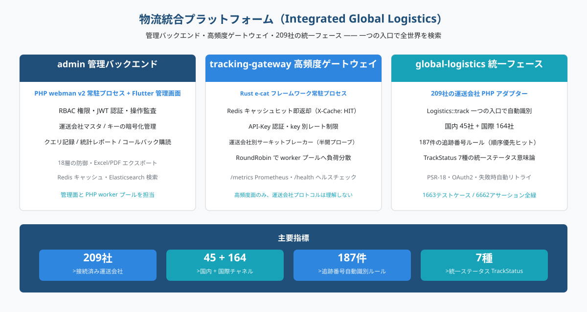
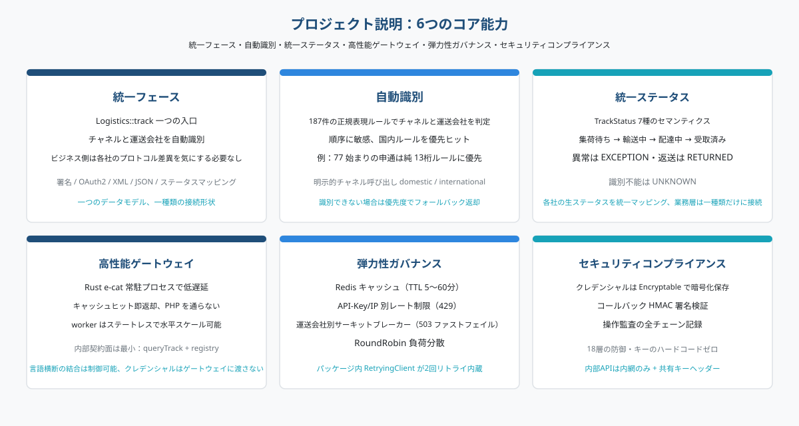
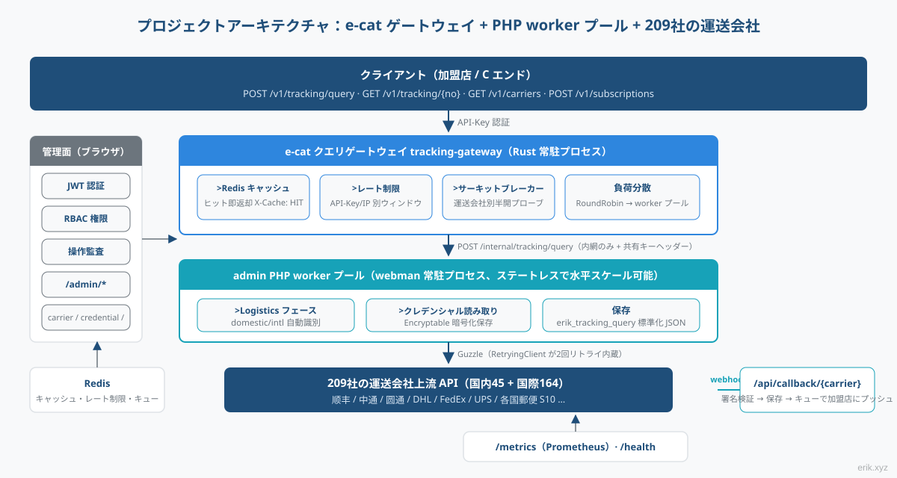
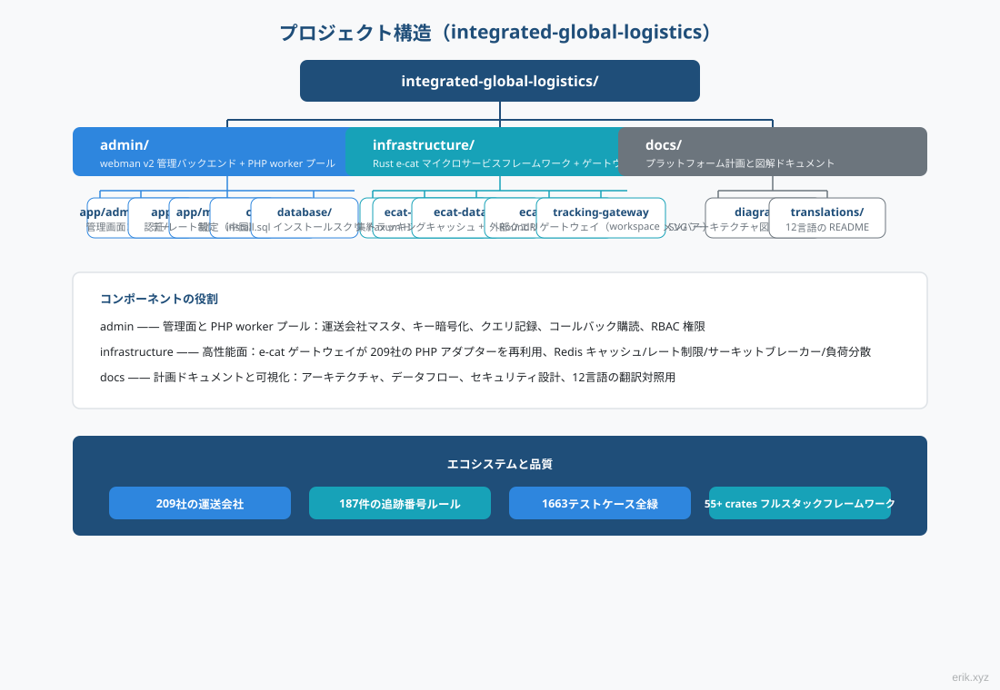
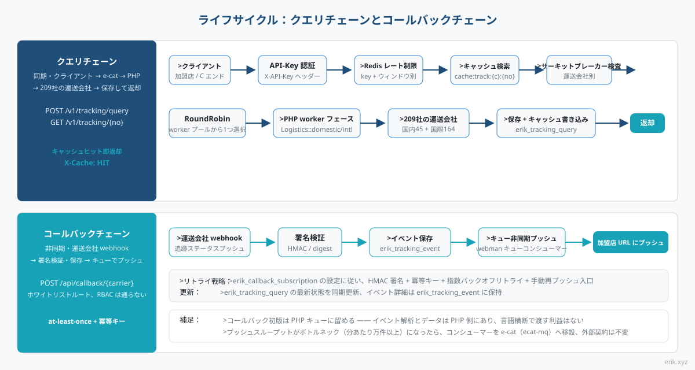
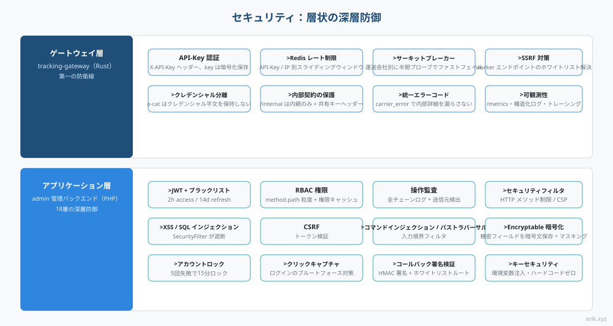

# 物流統合プラットフォーム（Integrated Global Logistics）

世界の物流追跡クエリを一元的に扱うワンストッププラットフォーム：**admin 管理バックエンド**（PHP webman + Flutter）が管理面とクエリ worker プールを担い、**e-cat 高頻度ゲートウェイ**（Rust 常駐プロセス）がクエリトラフィックを支え、**global-logistics 統一ファサード**（209 社の運送会社 PHP アダプター）が一つの入口で全世界を検索します。

> 対応言語：[[English / 英語]](/docs/translations/en/README.md) · [[한국어 / 韓国語]](/docs/translations/ko/README.md) · [[Русский / ロシア語]](/docs/translations/ru/README.md) · [[Deutsch / ドイツ語]](/docs/translations/de/README.md) · [[Français / フランス語]](/docs/translations/fr/README.md) · [[Español / スペイン語]](/docs/translations/es/README.md) · [[Português / ポルトガル語]](/docs/translations/pt/README.md) · [[हिन्दी / ヒンディー語]](/docs/translations/hi/README.md) · [[العربية / アラビア語]](/docs/translations/ar/README.md) · [[বাংলা / ベンガル語]](/docs/translations/bn/README.md) · [[Bahasa Indonesia / インドネシア語]](/docs/translations/id/README.md) · [[日本語]](/docs/translations/ja/README.md)（[翻訳へジャンプ](#translations他の言語)）

## プロジェクト紹介



物流統合プラットフォームは、世界中の **209 社**の宅配便・郵便運送会社の追跡クエリを一つのプラットフォームに統合します：加盟店と C エンドは追跡番号を 1 つ入力するだけで、プラットフォームが国内・国際チャネルと運送会社を自動識別し、各社のプロトコル差異（署名、OAuth2、XML/JSON、ステータスマッピング）を意識する必要はありません。

プラットフォームは 3 つのコンポーネントが連携して構成されます：

- **admin 管理バックエンド**（PHP webman v2 + Flutter）—— 管理面と PHP worker プール：運送会社マスタ、鍵の暗号化管理、クエリ記録、統計レポート、コールバック購読設定、RBAC / JWT / 操作監査体制を完備；
- **tracking-gateway 高頻度ゲートウェイ**（Rust e-cat フレームワーク）—— 外部クエリ API の第一の入口：Redis キャッシュ、レート制限、運送会社別サーキットブレーカー、worker の負荷分散。高頻度面のみを担い、運送会社プロトコルは理解しません；
- **global-logistics 統一ファサード**（PHP パッケージ）—— 209 社の運送会社アダプター（国内 45 + 国際 164）、187 件の追跡番号自動識別ルール、`TrackStatus` 7 種の統一ステータスセマンティクス。

## プロジェクト説明



- **一つの入口**：`Logistics::track($trackingNo)` が国内・国際チャネルと運送会社を自動識別。ビジネス層は一種類の形にだけ対応します；
- **自動識別**：187 件の追跡番号正規表現ルールは順序に敏感で、国内チャネルを優先的にヒット。識別できない場合は `domestic()` / `international()` を明示的に呼び出せます；
- **統一ステータス**：各社まちまちの生のステータスを統一 `TrackStatus` 列挙型（集荷待ち / 輸送中 / 配達中 / 配達完了 / 異常 / 返送 / 識別不可）にマッピング；
- **グローバルカバレッジ**：DHL、FedEx、UPS、USPS の四大宅配便と各国郵便の S10 システム（ヨーロッパ、ラテンアメリカ・カリブ、アフリカ・中東、アジア太平洋の 4 地域）；
- **鍵のハードコードゼロ**：各社の鍵はすべて設定注入を経由し、データベース層では Encryptable 暗号文で保存。コードと鍵は完全に分離されています。

## プロジェクトアーキテクチャ



クエリチェーン：**クライアント → e-cat クエリゲートウェイ → PHP worker プール → 209 社の運送会社**。

e-cat ゲートウェイ（Rust）は外部 API の API-Key 認証、Redis キャッシュヒット、レート制限、運送会社別サーキットブレーカーと RoundRobin 負荷分散を担当します。キャッシュヒット、レート制限拒否、サーキットブレーカーの高速失敗はすべて e-cat 側で完了し、PHP worker は実クエリトラフィックのみを引き受け、水平スケーリングは worker を追加するだけです。

**e-cat が 209 社の PHP アダプターを再利用する分業案**：209 個のアダプターは PHP（`src/Carriers/Domestic` 45 社 + `International` 164 社）で、Rust での書き直しは数ヶ月の工事になり、上流パッケージの継続的アップデートの恩恵も失われます。e-cat は運送会社プロトコルを理解する必要はなく、安定した内部契約（`/internal/tracking/query` + `/internal/carriers` レジストリ同期）にのみ依存します。資格情報は e-cat に渡されることはなく、セキュリティ境界は明確です。

管理面（ブラウザ）→ `/admin/*`：JWT + RBAC 権限 + 操作監査。carrier / carrier-credential / tracking-query / callback-subscription / statistics をカバー。

## プロジェクト構造



```
integrated-global-logistics/
├── admin/                          # PHP webman v2 管理后台 + worker 池
│   ├── app/
│   │   ├── admin/controller/       # 管理端控制器（carrier、tracking、统计等）
│   │   ├── api/                    # API v1（验证码 / 登录 / 刷新令牌）
│   │   ├── common/                 # Hashids / Snowflake / 加密脱敏服务
│   │   ├── middleware/             # 安全过滤 / 限流 / JWT / RBAC / 审计
│   │   └── model/                  # 数据模型（erik_ 前缀，snowflake 主键）
│   ├── apps/
│   │   ├── flutter/                # Flutter Web 管理后台（PC 风格）
│   │   └── harmonyos/              # HarmonyOS 原生客户端
│   ├── config/                     # 配置（含中文注释）
│   ├── database/
│   │   └── install.sql             # SQL 安装脚本（含权限种子数据）
│   └── docs/                       # API / 架构 / 设计 / 安全文档（12 语言）
├── infrastructure/                 # Rust e-cat 微服务框架 + 查询网关
│   ├── ecat/                       # 聚合 crate（App 骨架）
│   ├── ecat-transport-http/        # axum HTTP 传输
│   ├── ecat-data-redis/            # 轨迹缓存 + 限流存储
│   ├── ecat-client/                # RoundRobin 负载均衡
│   └── tracking-gateway/           # 对外查询网关（workspace 新成员）
└── docs/                           # 平台规划与图示
    ├── diagrams/                   # SVG 架构图（本 README 引用）
    ├── translations/               # 12 语言 README
    └── logistics-aggregation-platform-plan.md  # 实施规划
```

## ライフサイクル



**クエリチェーン（同期）**：クライアント → API-Key 認証 → Redis レート制限 → キャッシュ検索（ヒット即返却、`X-Cache: HIT`）→ サーキットブレーカー検査（OPEN なら 503 で高速失敗）→ RoundRobin で worker 選択 → PHP worker の `Logistics` ファサード（パッケージ内 RetryingClient が 2 回リトライ内蔵）→ 209 社の運送会社 → `erik_tracking_query` に保存 + キャッシュ書き込み → 標準化 JSON を返却。

**コールバックチェーン（非同期）**：運送会社 webhook → `/api/callback/{carrier}` ホワイトリストルート + 署名検証 → `erik_tracking_event` に保存 + クエリ記録を更新 → webman キューに書き込み → 非同期コンシューマーが購読設定に従って加盟店コールバック URL へプッシュ（HMAC 署名 + 冪等キー + 指数バックオフリトライ + 手動再プッシュ入口）。

> コールバックプッシュの初版は PHP キューに留めます —— イベント解析とデータは PHP 側にあり、言語をまたいでイベントを渡すメリットはありません。プッシュスループットがボトルネック（分あたり万件以上）になったら、コンシューマーを e-cat（ecat-mq + retry ミドルウェア）に移設します。外部契約は変わりません。

## セキュリティ対策



レイヤードディフェンスイン深度。要点は以下の通り：

- **ゲートウェイ層**（tracking-gateway）：API-Key 認証、Redis レート制限（key / IP 単位）、運送会社別サーキットブレーカー、SSRF 対策（worker エンドポイントのホワイトリスト解決）；`/internal` は内網のみ + 共有キーヘッダー；資格情報の隔離 —— e-cat は資格情報の平文を保持しません；
- **アプリケーション層**（admin）：JWT + ブラックリスト（2h access / 14d refresh）、RBAC method.path 粒度権限、操作監査の全チェーン記録；`SecurityFilter` が XSS / SQL インジェクション / CSRF / コマンドインジェクション / パストラバーサルを遮断；機密データは `Encryptable` で暗号化保存 + マスキングしてエクスポート；ログイン 5 回失敗で 15 分ロック + クリック CAPTCHA；
- **コールバックセキュリティ**：ホワイトリストルート + HMAC 署名検証、at-least-once 配信 + 冪等キーによる重複プッシュ防止；
- **統一エラーセマンティクス**：レート制限 429、サーキットブレーカー 503、運送会社エラーは `carrier_error`。クライアントに内部詳細を漏らしません。

## クイックスタート

**admin 管理バックエンド**（PHP webman）：

```bash
cd admin
composer install
php start.php start
```

起動後、ブラウザでインストールウィザードにアクセスしてデータベース初期化と管理者作成を完了します：`http://localhost:8787/install`（デフォルトポート 8787、`config/server.php` で変更可）。

**infrastructure クエリゲートウェイ**（Rust e-cat）：

```bash
cd infrastructure
cargo build
```

詳細なデプロイは [admin/README.md](admin/README.md)（Docker Compose で 5 サービスを編成：Nginx / PHP / MySQL / Redis / Elasticsearch）と実装計画ドキュメントを参照してください。

## ドキュメント

- [admin/docs/API.md](admin/docs/API.md) —— API リファレンス（統一レスポンス形式、エラーコード、認証フロー、レート制限ポリシー、ミドルウェアチェーン）
- [admin/docs/ARCHITECTURE.md](admin/docs/ARCHITECTURE.md) —— アーキテクチャ設計
- [admin/docs/DESIGN.md](admin/docs/DESIGN.md) —— 設計ドキュメント
- [admin/docs/SECURITY.md](admin/docs/SECURITY.md) —— セキュリティアーキテクチャ
- [docs/logistics-aggregation-platform-plan.md](docs/logistics-aggregation-platform-plan.md) —— プラットフォーム実装計画（アーキテクチャ、データフロー、データベース設計、API 契約、マイルストーン）
- [admin/README.md](admin/README.md) —— 管理バックエンド完全解説（技術スタック、データベース規約、デプロイ、CI/CD）

## Translations（他の言語）

- [English](/docs/translations/en/README.md)
- [한국어](/docs/translations/ko/README.md)
- [Русский](/docs/translations/ru/README.md)
- [Deutsch](/docs/translations/de/README.md)
- [Français](/docs/translations/fr/README.md)
- [Español](/docs/translations/es/README.md)
- [Português](/docs/translations/pt/README.md)
- [हिन्दी](/docs/translations/hi/README.md)
- [العربية](/docs/translations/ar/README.md)
- [বাংলা](/docs/translations/bn/README.md)
- [Bahasa Indonesia](/docs/translations/id/README.md)
- [日本語](/docs/translations/ja/README.md)

## オープンソースは容易ではありません。応援をお願いします

| 微信（WeChat） | 支付宝（Alipay） |
|:---:|:---:|
|  |  |

### グローバル送金によるサポート（海外送金）

**受取人情報**

- 受取人氏名：WANG KEXUN
- 受取口座番号：881015918251

**受取銀行**

- ZA Bank SWIFT Code：AABLHKHHXXX
- 銀行名：ZA Bank Limited
- 銀行番号：387
- 銀行住所：Core F, Cyberport 3, 100 Cyberport Road, Hong Kong

**海外送金の中継銀行（必要な場合）**

> これは海外送金の中継銀行（intermediary bank）情報であり、受取銀行の情報ではありません。送金銀行に中継銀行情報が必要かどうかお問い合わせください。

- **香港ドル・人民元・米ドルの送金**、中継銀行は Citibank：
  - 銀行名：Citibank N.A. Hong Kong
  - SWIFT Code：CITIHKHXXXX
  - 銀行番号：006
  - 支店名：Hong Kong Branch
  - 支店番号：391
  - 銀行住所：Citibank Tower, Citibank Plaza, 3 Garden Road, Central, Hong Kong
- **その他通貨の送金**、中継銀行は BNY Mellon：
  - 銀行名：THE BANK OF NEW YORK MELLON
  - SWIFT Code：IRVTUS3NXXX
  - 銀行住所：THE BANK OF NEW YORK MELLON, 240 GREENWICH STREET, NEW YORK, United States

---

## License

MIT

Copyright (c) 2026 erik <erik@erik.xyz> — https://erik.xyz

<!-- TRANSLATE-READY -->
