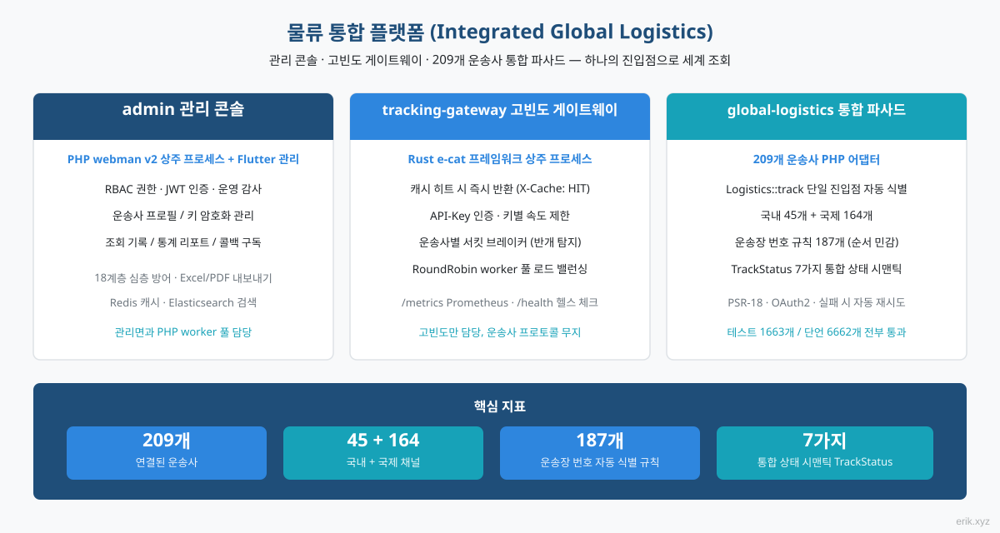
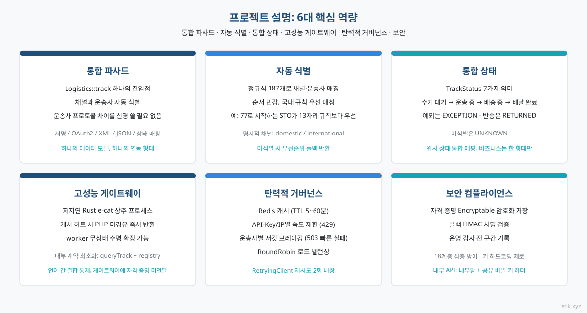
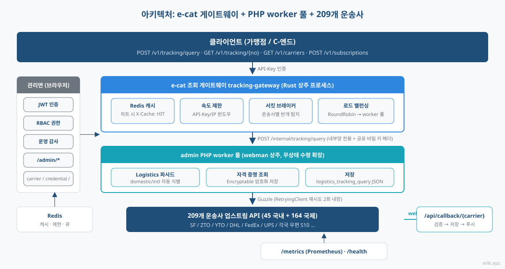
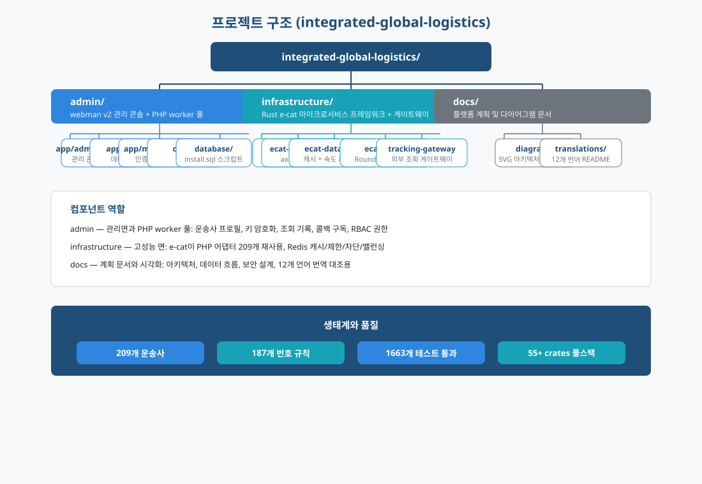
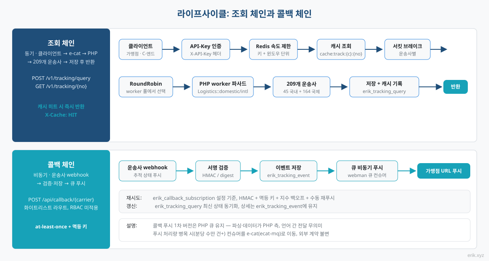
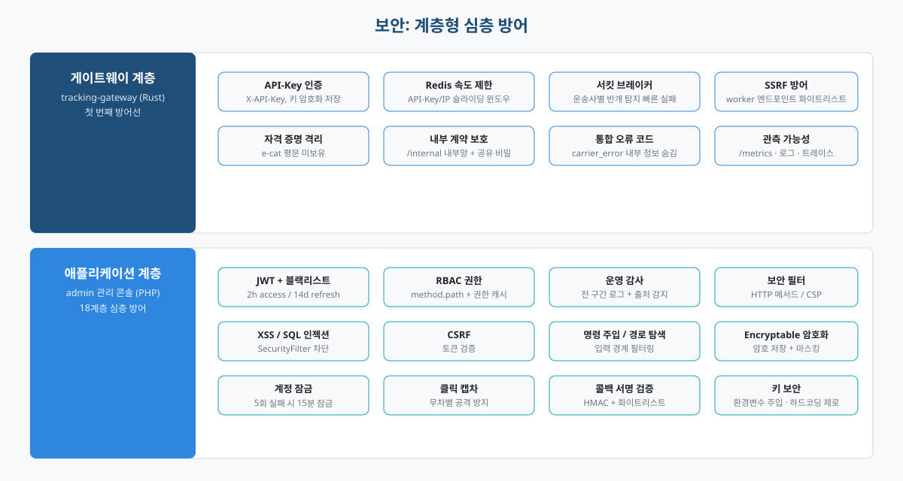

# 물류 통합 플랫폼 (Integrated Global Logistics)


전 세계 물류 배송 추적을 위한 원스톱 플랫폼: **admin 관리 콘솔**(PHP webman + Flutter)이 관리면과 조회 worker 풀을 담당하고, **e-cat 고빈도 게이트웨이**(Rust 상주 프로세스)가 조회 트래픽을 처리하며, **global-logistics 통합 파사드**(209개 운송사 PHP 어댑터)로 하나의 진입점에서 전 세계를 조회합니다.

> 언어: [English](/docs/translations/en/README.md) · [한국어](/docs/translations/ko/README.md) · [Русский](/docs/translations/ru/README.md) · [Deutsch](/docs/translations/de/README.md) · [Français](/docs/translations/fr/README.md) · [Español](/docs/translations/es/README.md) · [Português](/docs/translations/pt/README.md) · [हिन्दी](/docs/translations/hi/README.md) · [العربية](/docs/translations/ar/README.md) · [বাংলা](/docs/translations/bn/README.md) · [Bahasa Indonesia](/docs/translations/id/README.md) · [日本語](/docs/translations/ja/README.md)（[번역으로 이동](#번역기타-언어)）

## 프로젝트 소개



물류 통합 플랫폼은 전 세계 **209개** 택배 / 우편 운송사의 배송 추적 조회를 하나의 플랫폼으로 통합합니다. 가맹점과 C-엔드 고객은 운송장 번호 하나만 넣으면 플랫폼이 국내 / 국제 채널과 운송사를 자동으로 식별합니다. 각 운송사의 프로토콜 차이(서명, OAuth2, XML/JSON, 상태 매핑)를 신경 쓸 필요가 없습니다.

플랫폼은 세 가지 컴포넌트가 협력하여 구성됩니다:

- **admin 관리 콘솔**(PHP webman v2 + Flutter) — 관리면과 PHP worker 풀: 운송사 프로필, 키 암호화 관리, 조회 기록, 통계 리포트, 콜백 구독 설정, 완전한 RBAC / JWT / 운영 감사 체계;
- **tracking-gateway 고빈도 게이트웨이**(Rust e-cat 프레임워크) — 외부 조회 API의 첫 진입점: Redis 캐시, 속도 제한, 운송사별 서킷 브레이커, worker 로드 밸런싱. 고빈도 면만 담당하며 운송사 프로토콜은 알지 못합니다;
- **global-logistics 통합 파사드**(PHP 패키지) — 209개 운송사 어댑터(국내 45 + 국제 164), 운송장 번호 자동 식별 규칙 187개, `TrackStatus` 7가지 통합 상태 시맨틱.

**현재 진행 상황**: M1–M13 모두 완료 —— M1 관리면(운송사 / 자격증명 / 쿼리 기록 / 구독 CRUD), M2 쿼리 게이트웨이(외부 API 전체 체인), M3 콜백 구독, M4 모니터링 통계, M5 외부 OpenAPI 문서, M6 5개 클라이언트 SDK, M7 클라이언트 포털(등록 / 앱 / 요금제 / 주문), M8 결제(Stripe / PayPal), M9 가상화폐(USDT TRC20 / BEP20 / ERC20), M10 결제 방식 구성, M11 게이트웨이 보안 미들웨어, M12 CDN 도입 방안(Cloudflare + 캐시 헤더), M13 CDN 사업자 관리. 클라이언트 → e-cat → worker → 운송사 추적 쿼리 체인 시연 가능, 5개 무의존성 SDK 복사 즉시 사용.

## 프로젝트 설명



- **하나의 진입점**: `Logistics::track($trackingNo)`가 국내 / 국제 채널과 운송사를 자동 식별하며, 비즈니스 계층은 한 가지 형태만 다룹니다;
- **자동 식별**: 운송장 번호 정규식 규칙 187개는 순서에 민감하며 국내 채널을 우선 매칭합니다. 식별되지 않는 경우 `domestic()` / `international()`을 명시적으로 호출할 수 있습니다;
- **통합 상태**: 각 운송사의 다양한 원시 상태를 통합 `TrackStatus` 열거형(수거 대기 / 운송 중 / 배송 중 / 배달 완료 / 예외 / 반송 / 인식 불가)으로 매핑합니다;
- **글로벌 커버리지**: DHL, FedEx, UPS, USPS 4대 택배와 각국 우편 S10 시스템(유럽, 라틴아메리카·카리브, 아프리카·중동, 아시아·태평양 4개 지역);
- **외부 API**: e-cat 쿼리 게이트웨이가 API-Key 인증, Redis 캐시 히트(`X-Cache: HIT`), 레이트 제한 429, 운송사별 서킷 브레이커 503, RoundRobin worker 부하 분산 제공; 5개 무의존성 SDK(Python / PHP / Node.js / Go / Rust) 복사 즉시 사용;
- **클라이언트 포털 & 과금**（M7–M10）：클라이언트 등록 / 로그인（client JWT는 admin과 분리）、앱 관리와 X-API-Key 자체 설정、요금제 / 주문 API；Stripe / PayPal 양 채널 + USDT TRC20 / BEP20 / ERC20 가상화폐 결제, Stripe 결제 방식（Apple Pay / Google Pay / Klarna / SEPA 등）설정으로 즉시 적용；
- **CDN 가속**（M12/M13）：Cloudflare 무료 요금제 전 사이트 HTTPS + 정적 자산 엣지 캐시, CDN 사업자 / 도메인 / 키 관리면에서 설정（키 암호화 저장）；
- **키 하드코딩 제로**: 모든 키는 설정으로 주입되며, 데이터베이스 계층은 Encryptable 암호문으로 저장 — 코드와 키가 완전히 분리됩니다.

## 프로젝트 아키텍처



조회 체인: **클라이언트 → e-cat 조회 게이트웨이 → PHP worker 풀 → 209개 운송사**.

e-cat 게이트웨이(Rust)는 외부 API의 API-Key 인증, Redis 캐시 히트, 속도 제한, 운송사별 서킷 브레이킹, RoundRobin 로드 밸런싱을 담당합니다. 캐시 히트, 속도 제한 거부, 서킷 브레이커 빠른 실패는 모두 e-cat 측에서 처리되며, PHP worker는 실제 조회 트래픽만 받습니다. 수평 확장은 worker를 추가하기만 하면 됩니다.

**e-cat이 209개 PHP 어댑터를 재사용하는 분업 방안**: 209개 어댑터는 PHP(`src/Carriers/Domestic` 45개 + `International` 164개)입니다. Rust 재작성은 수개월 공정이고 상위 패키지의 지속적 업데이트 혜택도 잃게 됩니다. e-cat은 운송사 프로토콜을 알 필요 없이 안정적인 내부 계약(`/internal/tracking/query` + `/internal/carriers` 레지스트리 동기화)에만 의존합니다. 자격 증명은 e-cat에 절대 전달되지 않아 보안 경계가 명확합니다.

관리면(브라우저) → `/admin/*`: JWT + RBAC 권한 + 운영 감사로 carrier / carrier-credential / tracking-query / callback-subscription / statistics / client / client-app / plan / order / cdn-provider를 커버합니다.

## 프로젝트 구조



```
integrated-global-logistics/
├── admin/                          # PHP webman v2 管理后台 + worker 池
│   ├── app/
│   │   ├── admin/controller/       # 管理端控制器（carrier、tracking、统计等）
│   │   ├── api/                    # API v1（验证码 / 登录 / 刷新令牌）
│   │   ├── common/                 # Hashids / Snowflake / 加密脱敏服务
│   │   ├── middleware/             # 安全过滤 / 限流 / JWT / RBAC / 审计
│   │   └── model/                  # 数据模型（logistics_ 前缀，snowflake 主键）
│   ├── apps/
│   │   ├── flutter/                # Flutter Web 管理后台（PC 风格）
│   │   └── harmonyos/              # HarmonyOS 原生客户端
│   ├── config/                     # 配置（含中文注释）
│   ├── database/
│   │   └── install.sql             # SQL 安装脚本（含权限种子数据）
│   └── docs/                       # API / 架构 / 设计 / 安全文档（12 语言）
├── infrastructure/                 # Rust e-cat 微服务框架 + 查询网关
│   ├── ecat/                       # 聚合 crate（App 骨架）
│   ├── ecat-transport-http/        # axum HTTP 传输
│   ├── ecat-data-redis/            # 轨迹缓存 + 限流存储
│   ├── ecat-client/                # RoundRobin 负载均衡
│   └── tracking-gateway/           # 对外查询网关（workspace 新成员）
├── sdk/                            # 对外 API 客户端 SDK（Python / PHP / Node.js / Go / Rust）
└── docs/                           # 平台规划与图示
    ├── diagrams/                   # SVG 架构图（本 README 引用）
    ├── translations/               # 12 语言 README
    └── logistics-aggregation-platform-plan.md  # 实施规划
```

## 라이프사이클



**조회 체인(동기)**: 클라이언트 → API-Key 인증 → Redis 속도 제한 → 캐시 조회(히트 시 즉시 반환, `X-Cache: HIT`) → 서킷 브레이커 검사(OPEN이면 503 빠른 실패) → RoundRobin worker 선택 → PHP worker의 `Logistics` 파사드(패키지 내 RetryingClient가 재시도 2회 내장) → 209개 운송사 → `logistics_tracking_query` 저장 + 캐시 기록 → 표준화된 JSON 반환.

**콜백 체인(비동기)**: 운송사 webhook → `/api/callback/{carrier}` 화이트리스트 라우트 + 서명 검증 → `logistics_tracking_event` 저장 + 조회 기록 갱신 → webman 큐에 기록 → 비동기 컨슈머가 구독 설정에 따라 가맹점 콜백 URL로 푸시(HMAC 서명 + 멱등 키 + 지수 백오프 재시도 + 수동 재푸시 진입점).

> 콜백 푸시 1차 버전은 PHP 큐에 유지합니다 — 이벤트 파싱과 데이터가 모두 PHP 측에 있어 언어 간 이벤트 전달은 이점이 없습니다. 푸시 처리량이 병목이 되면(분당 수만 건 이상) 컨슈머를 e-cat(ecat-mq + retry 미들웨어)으로 옮기면 되며 외부 계약은 변하지 않습니다.

## 보안



계층형 심층 방어, 핵심 사항:

- **게이트웨이 계층**(tracking-gateway): API-Key 인증, Redis 속도 제한(키 / IP 단위), 운송사별 서킷 브레이킹, SSRF 방어(worker 엔드포인트 화이트리스트 해석); `/internal`은 내부망 + 공유 비밀 키 헤더만 수신; 자격 증명 격리 — e-cat은 평문 자격 증명을 보유하지 않음;
- **애플리케이션 계층**(admin): JWT + 블랙리스트(access 2h / refresh 14d), RBAC method.path 단위 권한, 전 구간 운영 감사; `SecurityFilter`가 XSS / SQL 인젝션 / CSRF / 명령 인젝션 / 경로 탐색을 차단; 민감 데이터는 `Encryptable` 암호화 저장 + 마스킹 내보내기; 로그인 5회 실패 시 15분 잠금 + 클릭 캡차;
- **콜백 보안**: 화이트리스트 라우트 + HMAC 서명 검증, at-least-once 전달 + 멱등 키로 중복 푸시 방지;
- **통합 오류 시맨틱**: 속도 제한 429, 서킷 브레이크 503, 운송사 오류 `carrier_error` — 클라이언트에 내부 세부 정보를 노출하지 않습니다.
- **결제 보안**（M8/M10）：Stripe / PayPal 웹훅 검증（HMAC-SHA256 / verify-webhook-signature）、자동 주문 확인 + admin 수동 폴백；결제 키는 `Encryptable`로 암호화해 `logistics_system_config`에 저장；
- **가상화폐 입금 검증**（M9）：USDT TRC20은 Tronscan API로 자동 검증, BEP20 / ERC20은 수동 확인；
- **클라이언트 키 보안**（M7）：X-API-Key는 클라이언트 자체 설정（16자 이상）、sha256으로 저장하고 평문은 생성 시 한 번만 반환；클라이언트 JWT（token_type=client）는 admin JWT와 분리；
- **게이트웨이 공격 탐지**（M11）：`ecat-security` SecurityBodyLayer를 게이트웨이에 통합（주입 / 프로토콜 / 데이터 직렬화 / 파일 / 민감 데이터 유출 탐지）, 공격 페이로드는 게이트웨이 계층에서 차단되고 애플리케이션 계층 보안 패키지가 폴백；
- **CDN 보안**（M12）：Cloudflare 무료 요금제 전 사이트 HTTPS + 이중 WAF（엣지 관리 규칙 + 게이트웨이 애플리케이션 계층 탐지）；Tunnel 오리진으로 소스 서버 무노출；콜백은 DNS 전용 하위 도메인 직접 연결로 CDN 장애 시 주문 유실 방지；속도 제한은 X-API-Key 기준으로 CDN 엣지 IP에 영향받지 않음；인증 엔드포인트는 항상 no-store로 사용자 간 캐시 혼동 방지；
- **CDN 자격 증명 관리**（M13）：CDN 사업자 access_key / access_secret을 `Encryptable`로 암호화해 `logistics_cdn_provider` 테이블에 저장, 관리면 `/admin/cdn/provider`에서 설정；

## 빠른 시작

**admin 관리 콘솔**(PHP webman):

```bash
cd admin
composer install
php start.php start
```

시작 후 브라우저에서 설치 마법사를 열어 데이터베이스 초기화와 관리자 생성을 완료하세요: `http://localhost:8787/install`(기본 포트 8787, `config/server.php`에서 변경 가능).

**infrastructure 조회 게이트웨이**(Rust e-cat):

```bash
cd infrastructure
cargo build
```

**SDK 호출**(5개 무의존성 클라이언트, 복사 즉시 사용):

```python
from tracking_client import TrackingClient
client = TrackingClient("demo-api-key", "http://127.0.0.1:8080")
result = client.query_tracking("LX123456789CN")
```

```bash
curl -H "X-API-Key: demo-api-key" http://127.0.0.1:8080/v1/tracking/query \
  -H "Content-Type: application/json" -d '{"tracking_no": "LX123456789CN"}'
```

각 언어 사용법과 예시는 [sdk/README.md](../../../sdk/README.md)를 참조하세요.

자세한 배포는 [admin/README.md](../../../admin/README.md)(Docker Compose로 Nginx / PHP / MySQL / Redis / Elasticsearch 5개 서비스 오케스트레이션)와 구현 계획 문서를 참조하세요.

## 문서

- [admin/docs/API.md](../../../admin/docs/API.md) — API 참조(통합 응답 형식, 오류 코드, 인증 흐름, 속도 제한 정책, 미들웨어 체인)
- [admin/docs/ARCHITECTURE.md](../../../admin/docs/ARCHITECTURE.md) — 아키텍처 설계
- [admin/docs/DESIGN.md](../../../admin/docs/DESIGN.md) — 설계 문서
- [admin/docs/SECURITY.md](../../../admin/docs/SECURITY.md) — 보안 아키텍처
- [docs/logistics-aggregation-platform-plan.md](../../../docs/logistics-aggregation-platform-plan.md) — 플랫폼 구현 계획(아키텍처, 데이터 흐름, 데이터베이스 설계, API 계약, 마일스톤)
- [admin/README.md](../../../admin/README.md) — 관리 콘솔 전체 설명(기술 스택, 데이터베이스 규칙, 배포, CI/CD)
- [sdk/README.md](../../../sdk/README.md) — 외부 API 클라이언트 SDK (Python / PHP / Node.js / Go / Rust, 5개 전부 제로 의존성, 복사 후 바로 사용)

## 번역(기타 언어)

- [English](/docs/translations/en/README.md)
- [한국어](/docs/translations/ko/README.md)
- [Русский](/docs/translations/ru/README.md)
- [Deutsch](/docs/translations/de/README.md)
- [Français](/docs/translations/fr/README.md)
- [Español](/docs/translations/es/README.md)
- [Português](/docs/translations/pt/README.md)
- [हिन्दी](/docs/translations/hi/README.md)
- [العربية](/docs/translations/ar/README.md)
- [বাংলা](/docs/translations/bn/README.md)
- [Bahasa Indonesia](/docs/translations/id/README.md)
- [日本語](/docs/translations/ja/README.md)

## 오픈소스는 쉽지 않습니다 — 후원해 주시면 감사합니다

| 위챗 | 알리페이 |
|:---:|:---:|
|  |  |

### 글로벌 송금 후원(해외 송금)

**수취인 정보**

- 수취인 이름: WANG KEXUN
- 수취인 계좌 번호: 881015918251

**수취 은행**

- ZA Bank SWIFT 코드: AABLHKHHXXX
- 은행 이름: ZA Bank Limited
- 은행 코드: 387
- 은행 주소: Core F, Cyberport 3, 100 Cyberport Road, Hong Kong

**해외 송금 중개 은행(필요 시)**

> 이는 해외 송금 중개(중계) 은행 정보이며 수취 은행 정보가 아닙니다. 송금 은행에 중개 은행 정보가 필요한지 문의하세요.

- **홍콩 달러(HKD), 위안화(CNY), 미국 달러(USD) 송금** 시 중개 은행은 Citibank입니다:
  - 은행 이름: Citibank N.A. Hong Kong
  - SWIFT 코드: CITIHKHXXXX
  - 은행 코드: 006
  - 지점 이름: Hong Kong Branch
  - 지점 코드: 391
  - 은행 주소: Citibank Tower, Citibank Plaza, 3 Garden Road, Central, Hong Kong
- **기타 통화 송금** 시 중개 은행은 BNY Mellon입니다:
  - 은행 이름: THE BANK OF NEW YORK MELLON
  - SWIFT 코드: IRVTUS3NXXX
  - 은행 주소: THE BANK OF NEW YORK MELLON, 240 GREENWICH STREET, NEW YORK, United States

### 암호화폐 후원 (Crypto Donation)

이 프로젝트가 도움이 되셨다면, QR 코드를 스캔하여 후원해 주세요. 감사합니다!

| <br>**BNB Smart Chain (BEP20)**<br>`0x355d429f97511897ccb4e271ec888205f9ab6629` | <br>**Tron (TRC20)**<br>`TEdDHWLajt1XvqtPDWmQctdrJaC3pzZZzz` |
| <br>**Ethereum (ERC20)**<br>`0x355d429f97511897ccb4e271ec888205f9ab6629` | <br>**Aptos**<br>`0x836e3780edfc3f7b2372b39e2a1a3a5d7adfaccd96c726f21cfde1b50dd68030` |
| <br>**Plasma**<br>`0x355d429f97511897ccb4e271ec888205f9ab6629` | <br>**Polygon POS**<br>`0x355d429f97511897ccb4e271ec888205f9ab6629` |
| <br>**Solana**<br>`2hfhboHdmdrYsY25XfQSsEWxq5ip4EQsR7f4AzSRMUyr` | <br>**The Open Network (TON)**<br>`UQB9kFQohzmXUir9QSSZq01iwl9aQZIDdBpNmDklljRtCoGK` |
| <br>**Arbitrum One**<br>`0x355d429f97511897ccb4e271ec888205f9ab6629` | <br>**AVAX C-Chain**<br>`0x355d429f97511897ccb4e271ec888205f9ab6629` |

---

## 라이선스

MIT

Copyright (c) 2026 erik <erik@erik.xyz> — https://erik.xyz

<!-- TRANSLATE-READY -->
