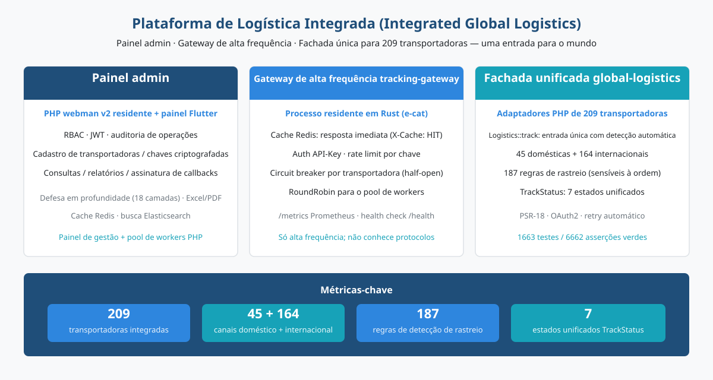
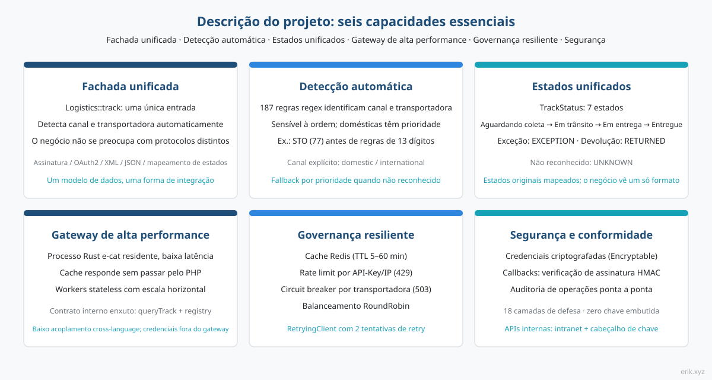
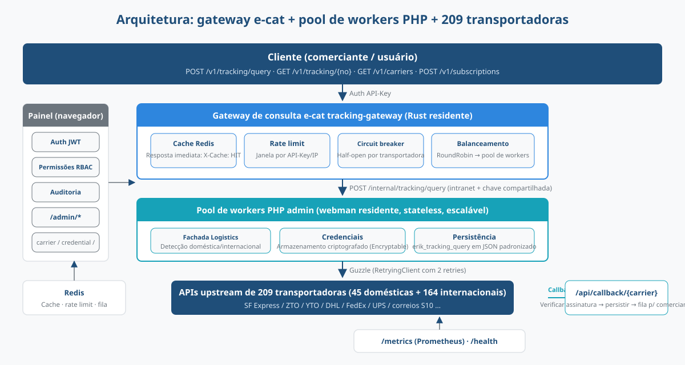
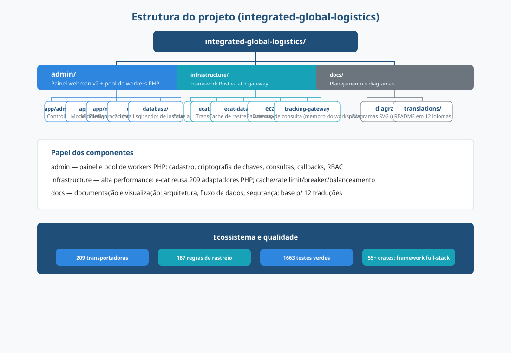
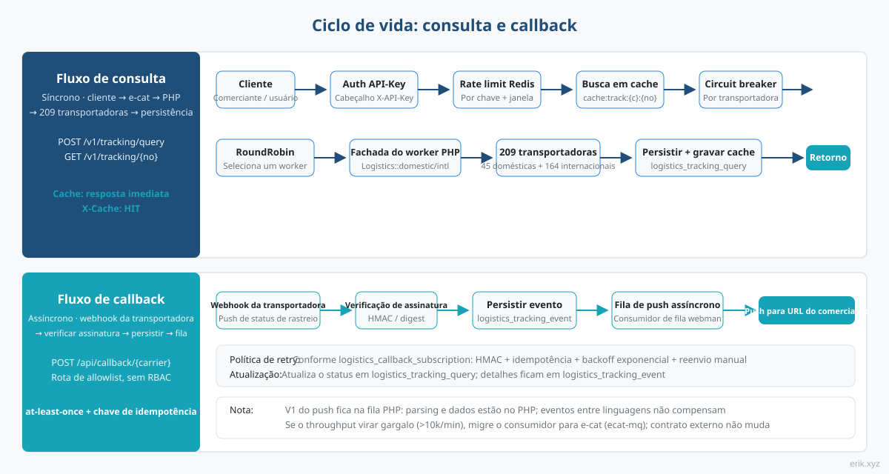
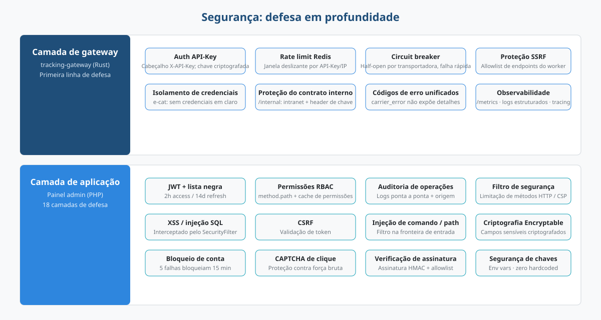

# Plataforma de Logística Integrada (Integrated Global Logistics)


Plataforma tudo-em-um para consulta de rastreio logístico global: o **painel admin** (PHP webman + Flutter) cuida da gestão e do pool de workers de consulta, o **gateway de alta frequência e-cat** (processo residente em Rust) absorve o tráfego de consultas, e a **fachada unificada global-logistics** (adaptadores PHP de 209 transportadoras) consulta o mundo inteiro por um único ponto de entrada.

> Idiomas: [[English]](/docs/translations/en/README.md) · [[한국어]](/docs/translations/ko/README.md) · [[Русский]](/docs/translations/ru/README.md) · [[Deutsch]](/docs/translations/de/README.md) · [[Français]](/docs/translations/fr/README.md) · [[Español]](/docs/translations/es/README.md) · [[Português]](/docs/translations/pt/README.md) · [[हिन्दी]](/docs/translations/hi/README.md) · [[العربية]](/docs/translations/ar/README.md) · [[বাংলা]](/docs/translations/bn/README.md) · [[Bahasa Indonesia]](/docs/translations/id/README.md) · [[日本語]](/docs/translations/ja/README.md)（[Ir para as traduções](#traduções)）

## Introdução



A plataforma unifica o rastreio de **209** transportadoras de encomendas e serviços postais do mundo em uma única plataforma: o comerciante e o usuário final informam apenas um número de rastreio, e a plataforma identifica automaticamente o canal (nacional/internacional) e a transportadora — sem se preocupar com as diferenças de protocolo de cada uma (assinatura, OAuth2, XML/JSON, mapeamento de estados).

A plataforma é composta por três componentes que trabalham juntos:

- **admin** (painel de gestão, PHP webman v2 + Flutter) — gestão e pool de workers PHP: cadastro de transportadoras, gerenciamento criptografado de chaves, registro de consultas, relatórios estatísticos, configuração de assinaturas de callback; RBAC / JWT / auditoria de operações completos;
- **tracking-gateway** (gateway de alta frequência, framework Rust e-cat) — primeira porta de entrada da API de consulta: cache Redis, rate limiting, circuit breaker por transportadora, balanceamento de carga entre workers; só lida com o tráfego de alta frequência e não entende os protocolos das transportadoras;
- **global-logistics** (fachada unificada, pacote PHP) — adaptadores de 209 transportadoras (45 nacionais + 164 internacionais), 187 regras de reconhecimento automático de números de rastreio, 7 semânticas de estado unificadas em `TrackStatus`.

**Progresso atual**: M1–M13 todos concluídos — M1 painel de administração (CRUD de transportadora / credencial / registro de consulta / assinatura), M2 gateway de consulta (cadeia completa de API externa), M3 assinaturas de callback, M4 monitoramento e estatísticas, M5 documentação OpenAPI externa, M6 cinco SDKs de cliente, M7 portal do cliente (registro / aplicativo / plano / pedido), M8 pagamentos (Stripe / PayPal), M9 criptomoedas (USDT TRC20 / BEP20 / ERC20), M10 configuração de métodos de pagamento, M11 middleware de segurança de gateway, M12 plano CDN (Cloudflare + cabeçalhos de cache), M13 gerenciamento de provedores CDN. A cadeia de consulta de rastreamento cliente → e-cat → worker → transportadora é demonstrável, e os cinco SDKs sem dependências estão prontos para copiar e usar.

## Descrição



- **Um único ponto de entrada**: `Logistics::track($trackingNo)` identifica automaticamente o canal (nacional/internacional) e a transportadora; a camada de negócio integra-se a apenas um formato;
- **Reconhecimento automático**: 187 regras de regex sensíveis à ordem, com prioridade para canais nacionais; quando não é possível reconhecer, é possível chamar explicitamente `domestic()` / `international()`;
- **Estados unificados**: os estados originais, que variam de transportadora para transportadora, são mapeados para o enum unificado `TrackStatus` (aguardando coleta / em trânsito / em entrega / entregue / exceção / devolvido / não reconhecido);
- **Cobertura global**: as quatro grandes transportadoras DHL, FedEx, UPS, USPS e os sistemas S10 dos correios nacionais (quatro regiões: Europa, América Latina e Caribe, África e Oriente Médio, Ásia-Pacífico);
- **API externa**: o gateway e-cat fornece autenticação API-Key, hits de cache Redis (`X-Cache: HIT`), limite de taxa 429, circuit breaker por transportadora 503, balanceamento RoundRobin de workers; cinco SDKs sem dependências (Python / PHP / Node.js / Go / Rust) prontos para copiar e usar;
- **Portal do cliente e cobrança**（M7–M10）：registro / login de cliente (JWT de cliente isolado do admin), gerenciamento de aplicativos com X-API-Key autodefinido, API de planos / pedidos; pagamentos Stripe / PayPal + cripto USDT TRC20 / BEP20 / ERC20, métodos de pagamento do Stripe (Apple Pay / Google Pay / Klarna / SEPA etc.) configuráveis sem código;
- **Aceleração CDN**（M12/M13）：plano gratuito Cloudflare — HTTPS completo + cache de borda para estáticos, provedores CDN / domínios / chaves configuráveis no painel (chaves criptografadas);
- **Zero chave embutida no código**: todas as chaves são injetadas por configuração; na camada de banco de dados, são armazenadas criptografadas via Encryptable; código e chaves totalmente separados.

## Arquitetura



Fluxo de consulta: **cliente → gateway de consulta e-cat → pool de workers PHP → 209 transportadoras**.

O gateway e-cat (Rust) é responsável pela autenticação API-Key da API externa, hits de cache Redis, rate limiting, circuit breaker por transportadora e balanceamento de carga RoundRobin; hits de cache, rejeições por rate limit e falhas rápidas por circuit breaker acontecem no lado do e-cat, e o worker PHP atende apenas o tráfego real de consultas — para escalar horizontalmente, basta adicionar workers.

**Divisão de trabalho com reuso dos 209 adaptadores PHP pelo e-cat**: os 209 adaptadores são em PHP (`src/Carriers/Domestic` com 45 + `International` com 164); reescrevê-los em Rust seria um projeto de meses e perderia os benefícios das atualizações contínuas do pacote upstream; o e-cat não precisa entender os protocolos das transportadoras, depende apenas de um contrato interno estável (`/internal/tracking/query` + sincronização do registro `/internal/carriers`). As credenciais nunca são entregues ao e-cat — a fronteira de segurança é clara.

Painel de gestão (navegador) → `/admin/*`: JWT + permissões RBAC + auditoria de operações, cobrindo carrier / carrier-credential / tracking-query / callback-subscription / statistics / client / client-app / plan / order / cdn-provider.

## Estrutura do projeto



```
integrated-global-logistics/
├── admin/                          # PHP webman v2 管理后台 + worker 池
│   ├── app/
│   │   ├── admin/controller/       # 管理端控制器（carrier、tracking、统计等）
│   │   ├── api/                    # API v1（验证码 / 登录 / 刷新令牌）
│   │   ├── common/                 # Hashids / Snowflake / 加密脱敏服务
│   │   ├── middleware/             # 安全过滤 / 限流 / JWT / RBAC / 审计
│   │   └── model/                  # 数据模型（logistics_ 前缀，snowflake 主键）
│   ├── apps/
│   │   ├── flutter/                # Flutter Web 管理后台（PC 风格）
│   │   └── harmonyos/              # HarmonyOS 原生客户端
│   ├── config/                     # 配置（含中文注释）
│   ├── database/
│   │   └── install.sql             # SQL 安装脚本（含权限种子数据）
│   └── docs/                       # API / 架构 / 设计 / 安全文档（12 语言）
├── infrastructure/                 # Rust e-cat 微服务框架 + 查询网关
│   ├── ecat/                       # 聚合 crate（App 骨架）
│   ├── ecat-transport-http/        # axum HTTP 传输
│   ├── ecat-data-redis/            # 轨迹缓存 + 限流存储
│   ├── ecat-client/                # RoundRobin 负载均衡
│   └── tracking-gateway/           # 对外查询网关（workspace 新成员）
├── sdk/                            # 对外 API 客户端 SDK（Python / PHP / Node.js / Go / Rust）
└── docs/                           # 平台规划与图示
    ├── diagrams/                   # SVG 架构图（本 README 引用）
    ├── translations/               # 12 语言 README
    └── logistics-aggregation-platform-plan.md  # 实施规划
```

## Ciclo de vida



**Fluxo de consulta (síncrono)**: cliente → autenticação API-Key → rate limit Redis → busca no cache (resposta imediata em caso de hit, `X-Cache: HIT`) → verificação do circuit breaker (503 em caso de OPEN) → seleção RoundRobin de worker → fachada `Logistics` do worker PHP (o RetryingClient do pacote faz 2 tentativas automaticamente) → 209 transportadoras → persistência em `logistics_tracking_query` + escrita no cache → resposta em JSON padronizado.

**Fluxo de callback (assíncrono)**: webhook da transportadora → rota de allowlist `/api/callback/{carrier}` + verificação de assinatura → persistência em `logistics_tracking_event` + atualização do registro de consulta → gravação na fila do webman → consumidores assíncronos enviam para a URL de callback do comerciante conforme a assinatura configurada (assinatura HMAC + chave de idempotência + retry com backoff exponencial + ponto de reenvio manual).

> O push de callbacks da primeira versão fica na fila PHP — a análise dos eventos e os dados estão todos no lado PHP, e transmitir eventos entre linguagens não traz benefício; se o throughput de envio virar gargalo (dezenas de milhares por minuto ou mais), migre o consumidor para o e-cat (ecat-mq + middleware de retry), sem alterar o contrato externo.

## Segurança



Defesa em profundidade em camadas; os pontos principais:

- **Camada de gateway** (tracking-gateway): autenticação API-Key, rate limit Redis (por key / IP), circuit breaker por transportadora, proteção contra SSRF (resolução com allowlist de endpoints dos workers); `/internal` escuta apenas na intranet + cabeçalho de chave compartilhada; isolamento de credenciais — o e-cat não mantém credenciais em texto puro;
- **Camada de aplicação** (admin): JWT + blacklist (access 2h / refresh 14d), permissões RBAC com granularidade method.path, auditoria de operações registrada em toda a cadeia; `SecurityFilter` bloqueia XSS / SQL injection / CSRF / command injection / path traversal; dados sensíveis armazenados criptografados com `Encryptable` + mascaramento na exportação; bloqueio de 15 minutos após 5 falhas de login + CAPTCHA de clique;
- **Segurança de callbacks**: rota de allowlist + verificação de assinatura HMAC, entrega at-least-once + chave de idempotência contra push duplicado;
- **Semântica de erro unificada**: rate limit 429, circuit breaker 503, erro de transportadora `carrier_error` — sem vazar detalhes internos ao cliente.
- **Segurança de pagamentos** (M8/M10): verificação de webhooks Stripe / PayPal (HMAC-SHA256 / verify-webhook-signature), confirmação automática de pedidos + fallback manual do admin; chaves de pagamento criptografadas via `Encryptable` em `logistics_system_config`;
- **Verificação de pagamentos cripto** (M9): USDT TRC20 verificado automaticamente via API Tronscan; BEP20 / ERC20 confirmados manualmente;
- **Segurança de chaves do cliente** (M7): X-API-Key definido pelo cliente (≥16 caracteres), armazenado como sha256 — o texto puro é retornado apenas uma vez na criação; JWTs de cliente (token_type=client) isolados dos JWTs de admin;
- **Detecção de ataques na gateway**（M11）：`ecat-security` SecurityBodyLayer integrado à gateway (detectores de injeção / protocolo / serialização de dados / arquivos / vazamento de dados sensíveis); cargas de ataque bloqueadas na camada da gateway, com o pacote de segurança da camada de aplicação como fallback;
- **Segurança CDN**（M12）：plano gratuito Cloudflare — HTTPS completo + WAF de dupla camada (regras gerenciadas na borda + detecção de camada de aplicação da gateway); origem Tunnel sem exposição pública; callbacks via subdomínio somente DNS direto para não perder pedidos em falha de CDN; limite de taxa por X-API-Key, independente de IPs de borda CDN; endpoints autenticados sempre no-store contra mistura de cache entre usuários;
- **Gerenciamento de credenciais CDN**（M13）：access_key / access_secret dos provedores CDN criptografados com `Encryptable` na tabela `logistics_cdn_provider`, configurados em `/admin/cdn/provider`;

## Início rápido

**Painel admin** (PHP webman):

```bash
cd admin
composer install
php start.php start
```

Após iniciar, acesse o assistente de instalação no navegador para concluir a inicialização do banco de dados e a criação do administrador: `http://localhost:8787/install` (porta padrão 8787, configurável em `config/server.php`).

**Gateway de consulta infrastructure** (Rust e-cat):

```bash
cd infrastructure
cargo build
```

**Chamada SDK** (cinco clientes sem dependências, prontos para copiar e usar):

```python
from tracking_client import TrackingClient
client = TrackingClient("demo-api-key", "http://127.0.0.1:8080")
result = client.query_tracking("LX123456789CN")
```

```bash
curl -H "X-API-Key: demo-api-key" http://127.0.0.1:8080/v1/tracking/query \
  -H "Content-Type: application/json" -d '{"tracking_no": "LX123456789CN"}'
```

Consulte [sdk/README.md](../../../sdk/README.md) para uso e exemplos em cada idioma.

Para detalhes de implantação, consulte [admin/README.md](../../../admin/README.md) (Docker Compose orquestra 5 serviços: Nginx / PHP / MySQL / Redis / Elasticsearch) e o documento de planejamento da implementação.

## Documentação

- [admin/docs/API.md](../../../admin/docs/API.md) — referência da API (formato de resposta unificado, códigos de erro, fluxo de autenticação, políticas de rate limit, cadeia de middlewares)
- [admin/docs/ARCHITECTURE.md](../../../admin/docs/ARCHITECTURE.md) — design de arquitetura
- [admin/docs/DESIGN.md](../../../admin/docs/DESIGN.md) — documento de design
- [admin/docs/SECURITY.md](../../../admin/docs/SECURITY.md) — arquitetura de segurança
- [docs/logistics-aggregation-platform-plan.md](../../../docs/logistics-aggregation-platform-plan.md) — planejamento da implementação da plataforma (arquitetura, fluxo de dados, design do banco, contratos da API, marcos)
- [admin/README.md](../../../admin/README.md) — documentação completa do painel (stack tecnológico, padrões de banco, implantação, CI/CD)
- [sdk/README.md](../../../sdk/README.md) — SDKs de cliente da API externa (Python / PHP / Node.js / Go / Rust, cinco sem dependências, copiar e usar)

## Traduções

- [English](/docs/translations/en/README.md)
- [한국어](/docs/translations/ko/README.md)
- [Русский](/docs/translations/ru/README.md)
- [Deutsch](/docs/translations/de/README.md)
- [Français](/docs/translations/fr/README.md)
- [Español](/docs/translations/es/README.md)
- [Português](/docs/translations/pt/README.md)
- [हिन्दी](/docs/translations/hi/README.md)
- [العربية](/docs/translations/ar/README.md)
- [বাংলা](/docs/translations/bn/README.md)
- [Bahasa Indonesia](/docs/translations/id/README.md)
- [日本語](/docs/translations/ja/README.md)

## Apoie o projeto de código aberto

| WeChat | Alipay |
|:---:|:---:|
|  |  |

### Doações por transferência internacional (remessa transfronteiriça)

**Dados do beneficiário**

- Nome do beneficiário: WANG KEXUN
- Número da conta do beneficiário: 881015918251

**Banco receptor**

- SWIFT Code do ZA Bank: AABLHKHHXXX
- Nome do banco: ZA Bank Limited
- Código do banco: 387
- Endereço do banco: Core F, Cyberport 3, 100 Cyberport Road, Hong Kong

**Banco intermediário para remessa internacional (se necessário)**

> Estas são as informações do banco intermediário (correspondente) para a remessa, não do banco receptor. Consulte o seu banco remetente sobre a necessidade de informar o banco intermediário.

- **Para remessas em dólares de Hong Kong, renminbi e dólares americanos**, o banco intermediário é o Citibank:
  - Nome do banco: Citibank N.A. Hong Kong
  - SWIFT Code: CITIHKHXXXX
  - Código do banco: 006
  - Nome da agência: Hong Kong Branch
  - Código da agência: 391
  - Endereço do banco: Citibank Tower, Citibank Plaza, 3 Garden Road, Central, Hong Kong
- **Para remessas em outras moedas**, o banco intermediário é o BNY Mellon:
  - Nome do banco: THE BANK OF NEW YORK MELLON
  - SWIFT Code: IRVTUS3NXXX
  - Endereço do banco: THE BANK OF NEW YORK MELLON, 240 GREENWICH STREET, NEW YORK, United States

### Doação em criptomoedas (Crypto Donation)

Se este projeto ajudar você, escaneie o código QR para doar, obrigado!

| <br>**BNB Smart Chain (BEP20)**<br>`0x355d429f97511897ccb4e271ec888205f9ab6629` | <br>**Tron (TRC20)**<br>`TEdDHWLajt1XvqtPDWmQctdrJaC3pzZZzz` |
| <br>**Ethereum (ERC20)**<br>`0x355d429f97511897ccb4e271ec888205f9ab6629` | <br>**Aptos**<br>`0x836e3780edfc3f7b2372b39e2a1a3a5d7adfaccd96c726f21cfde1b50dd68030` |
| <br>**Plasma**<br>`0x355d429f97511897ccb4e271ec888205f9ab6629` | <br>**Polygon POS**<br>`0x355d429f97511897ccb4e271ec888205f9ab6629` |
| <br>**Solana**<br>`2hfhboHdmdrYsY25XfQSsEWxq5ip4EQsR7f4AzSRMUyr` | <br>**The Open Network (TON)**<br>`UQB9kFQohzmXUir9QSSZq01iwl9aQZIDdBpNmDklljRtCoGK` |
| <br>**Arbitrum One**<br>`0x355d429f97511897ccb4e271ec888205f9ab6629` | <br>**AVAX C-Chain**<br>`0x355d429f97511897ccb4e271ec888205f9ab6629` |

---

## Licença

MIT

Copyright (c) 2026 erik <erik@erik.xyz> — https://erik.xyz

<!-- TRANSLATE-READY -->
