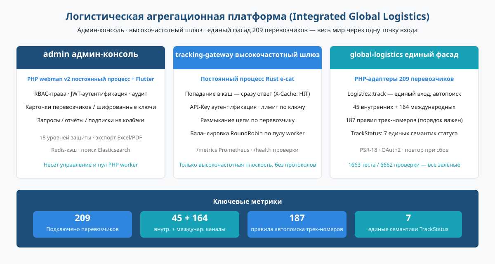
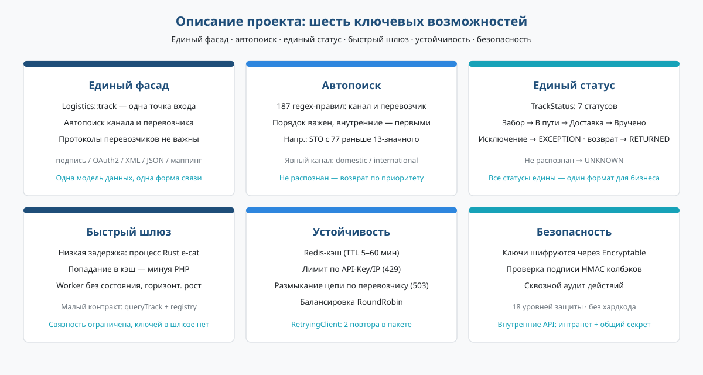
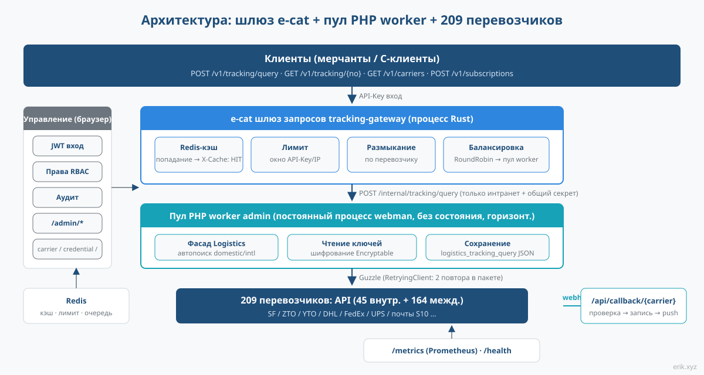
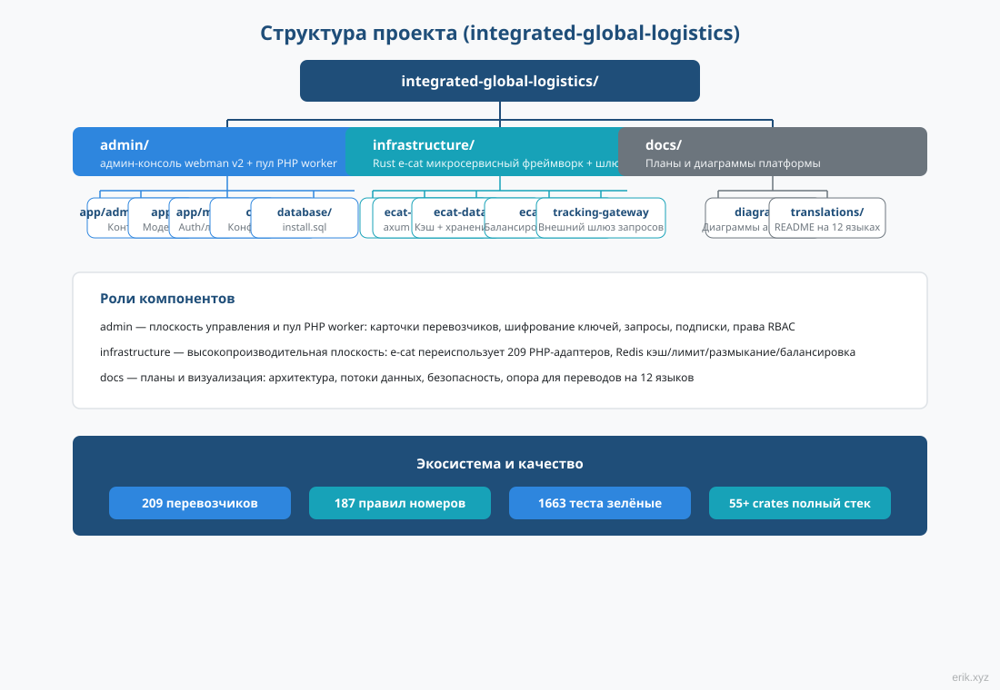
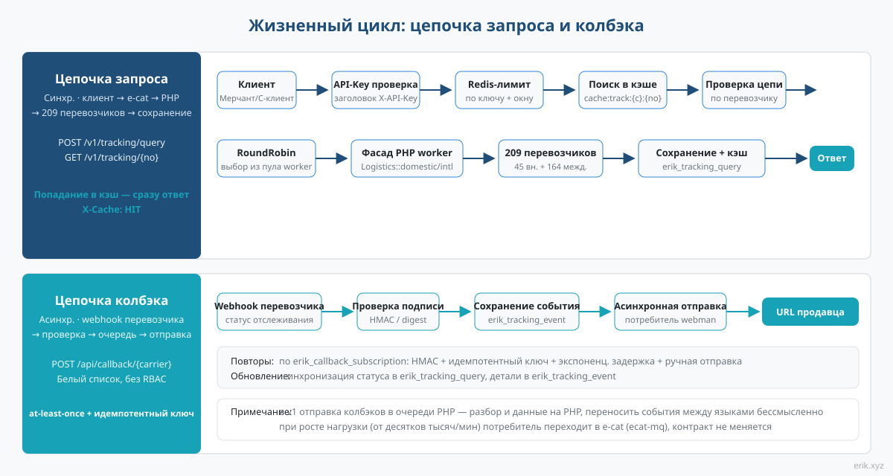
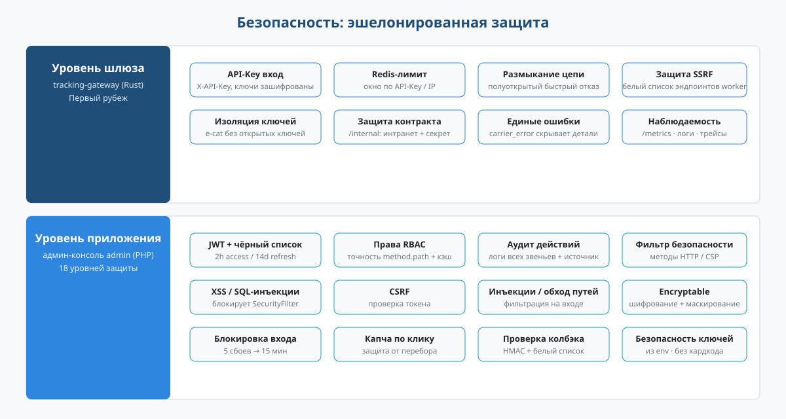

# Логистическая агрегационная платформа (Integrated Global Logistics)


Единая платформа для отслеживания мировой логистики: **админ-консоль admin** (PHP webman + Flutter) отвечает за управление и пул worker-процессов запросов, **высокочастотный шлюз e-cat** (постоянно работающий процесс на Rust) держит трафик запросов, а **единый фасад global-logistics** (PHP-адаптеры для 209 перевозчиков) позволяет запрашивать весь мир через одну точку входа.

> Языки: [English](/docs/translations/en/README.md) · [한국어](/docs/translations/ko/README.md) · [Русский](/docs/translations/ru/README.md) · [Deutsch](/docs/translations/de/README.md) · [Français](/docs/translations/fr/README.md) · [Español](/docs/translations/es/README.md) · [Português](/docs/translations/pt/README.md) · [हिन्दी](/docs/translations/hi/README.md) · [العربية](/docs/translations/ar/README.md) · [বাংলা](/docs/translations/bn/README.md) · [Bahasa Indonesia](/docs/translations/id/README.md) · [日本語](/docs/translations/ja/README.md) ([Перейти к переводам](#переводыдругие-языки))

## О проекте



Платформа сводит отслеживание грузов **209** курьерских / почтовых перевозчиков мира в единую систему: продавцы и C-клиенты передают только трек-номер, а платформа сама определяет внутренний / международный канал и перевозчика — разбираться в различиях протоколов (подпись, OAuth2, XML/JSON, маппинг статусов) не нужно.

Платформа состоит из трёх взаимодействующих компонентов:

- **админ-консоль admin** (PHP webman v2 + Flutter) — плоскость управления и пул PHP worker-процессов: карточки перевозчиков, шифрованное управление ключами, история запросов, статистические отчёты, настройка подписок на колбэки, полная система RBAC / JWT / аудита действий;
- **высокочастотный шлюз tracking-gateway** (Rust-фреймворк e-cat) — первая точка входа внешнего API запросов: Redis-кэш, ограничение частоты, размыкание цепи по перевозчикам, балансировка нагрузки worker-процессов; занимается только высокочастотной плоскостью и не знает протоколов перевозчиков;
- **единый фасад global-logistics** (PHP-пакет) — адаптеры для 209 перевозчиков (45 внутренних + 164 международных), 187 правил автоматического определения трек-номеров, 7 единых семантик статуса `TrackStatus`.

**Текущий прогресс**: M1–M13 полностью завершены — M1 панель администрирования (CRUD перевозчика / учётных данных / записи запроса / подписки), M2 шлюз запросов (полная цепочка внешнего API), M3 подписки на обратные вызовы, M4 мониторинг и статистика, M5 внешняя документация OpenAPI, M6 пять клиентских SDK, M7 клиентский портал (регистрация / приложение / тариф / заказ), M8 платежи (Stripe / PayPal), M9 криптовалюта (USDT TRC20 / BEP20 / ERC20), M10 настройка платёжных методов, M11 промежуточное ПО безопасности шлюза, M12 план CDN (Cloudflare + заголовки кэша), M13 управление CDN-провайдерами. Цепочка запросов отслеживания клиент → e-cat → worker → перевозчик демонстрируема, пять SDK без зависимостей готовы к использованию.

## Описание проекта



- **Одна точка входа**: `Logistics::track($trackingNo)` сам определяет внутренний / международный канал и перевозчика — бизнес-уровень работает с одной единственной формой;
- **Автоопределение**: 187 регулярных правил для трек-номеров чувствительны к порядку и в первую очередь находят внутренние каналы; для нераспознанных случаев можно явно вызвать `domestic()` / `international()`;
- **Единый статус**: разнородные исходные статусы перевозчиков маппятся в единый enum `TrackStatus` (ожидает забора / в пути / в доставке / доставлено / исключение / возврат / не распознан);
- **Мировой охват**: четыре крупных курьера DHL, FedEx, UPS, USPS и национальные почтовые системы S10 разных стран (Европа, Латинская Америка и Карибы, Африка и Ближний Восток, Азиатско-Тихоокеанский регион);
- **Внешний API**: шлюз e-cat предоставляет аутентификацию API-Key, попадания в кэш Redis (`X-Cache: HIT`), ограничение скорости 429, автоматический выключатель по перевозчику 503, балансировку RoundRobin; пять SDK без зависимостей (Python / PHP / Node.js / Go / Rust) готовы к копированию и использованию;
- **Клиентский портал и биллинг**（M7–M10）：регистрация / вход клиента (client JWT изолирован от admin), управление приложениями с самостоятельной установкой X-API-Key, API тарифов / заказов; платежи Stripe / PayPal + криптовалюта USDT TRC20 / BEP20 / ERC20, способы оплаты Stripe (Apple Pay / Google Pay / Klarna / SEPA и др.) настраиваются без изменения кода;
- **Ускорение CDN**（M12/M13）：полный HTTPS + кэширование статики на краю через бесплатный план Cloudflare, провайдеры CDN / домены / ключи настраиваются на панели администрирования (ключи шифруются);
- **Никаких захардкоженных ключей**: все ключи внедряются через конфигурацию, а на уровне БД хранятся как шифротекст Encryptable — код и ключи полностью разделены.

## Архитектура проекта



Цепочка запроса: **клиент → шлюз запросов e-cat → пул PHP worker-процессов → 209 перевозчиков**.

Шлюз e-cat (Rust) отвечает за аутентификацию API-Key, попадание в Redis-кэш, ограничение частоты, размыкание цепи по перевозчикам и балансировку RoundRobin внешнего API; попадания в кэш, отказы по лимиту и быстрые отказы при размыкании цепи происходят на стороне e-cat, а PHP worker-процессы принимают только реальный трафик запросов — горизонтальное масштабирование сводится к добавлению worker-процессов.

**Схема переиспользования e-cat 209 PHP-адаптеров**: 209 адаптеров написаны на PHP (`src/Carriers/Domestic` 45 + `International` 164); переписывание на Rust — это месяцы работы и потеря выгоды от постоянных обновлений вышестоящих пакетов. e-cat не обязан понимать протоколы перевозчиков — он зависит только от стабильного внутреннего контракта (`/internal/tracking/query` + синхронизация реестра `/internal/carriers`). Учётные данные никогда не передаются в e-cat — граница безопасности чёткая.

Плоскость управления (браузер) → `/admin/*`: JWT + права RBAC + аудит действий, покрытие carrier / carrier-credential / tracking-query / callback-subscription / statistics / client / client-app / plan / order / cdn-provider.

## Структура проекта



```
integrated-global-logistics/
├── admin/                          # PHP webman v2 管理后台 + worker 池
│   ├── app/
│   │   ├── admin/controller/       # 管理端控制器（carrier、tracking、统计等）
│   │   ├── api/                    # API v1（验证码 / 登录 / 刷新令牌）
│   │   ├── common/                 # Hashids / Snowflake / 加密脱敏服务
│   │   ├── middleware/             # 安全过滤 / 限流 / JWT / RBAC / 审计
│   │   └── model/                  # 数据模型（logistics_ 前缀，snowflake 主键）
│   ├── apps/
│   │   ├── flutter/                # Flutter Web 管理后台（PC 风格）
│   │   └── harmonyos/              # HarmonyOS 原生客户端
│   ├── config/                     # 配置（含中文注释）
│   ├── database/
│   │   └── install.sql             # SQL 安装脚本（含权限种子数据）
│   └── docs/                       # API / 架构 / 设计 / 安全文档（12 语言）
├── infrastructure/                 # Rust e-cat 微服务框架 + 查询网关
│   ├── ecat/                       # 聚合 crate（App 骨架）
│   ├── ecat-transport-http/        # axum HTTP 传输
│   ├── ecat-data-redis/            # 轨迹缓存 + 限流存储
│   ├── ecat-client/                # RoundRobin 负载均衡
│   └── tracking-gateway/           # 对外查询网关（workspace 新成员）
├── sdk/                            # 对外 API 客户端 SDK（Python / PHP / Node.js / Go / Rust）
└── docs/                           # 平台规划与图示
    ├── diagrams/                   # SVG 架构图（本 README 引用）
    ├── translations/               # 12 语言 README
    └── logistics-aggregation-platform-plan.md  # 实施规划
```

## Жизненный цикл



**Цепочка запроса (синхронная)**: клиент → аутентификация API-Key → ограничение частоты в Redis → поиск в кэше (при попадании сразу ответ, `X-Cache: HIT`) → проверка размыкания цепи (при OPEN быстрый отказ 503) → выбор worker-процесса RoundRobin → фасад `Logistics` в PHP worker-процессе (встроенный RetryingClient пакета делает 2 повтора) → 209 перевозчиков → сохранение в `logistics_tracking_query` + запись кэша → возврат стандартизированного JSON.

**Цепочка колбэка (асинхронная)**: webhook перевозчика → маршрут из белого списка `/api/callback/{carrier}` + проверка подписи → сохранение в `logistics_tracking_event` + обновление записи запроса → запись в очередь webman → асинхронные потребители отправляют на URL колбэка продавца по настройкам подписки (подпись HMAC + идемпотентный ключ + повторы с экспоненциальной задержкой + ручная повторная отправка).

> В первой версии отправка колбэков остаётся в очереди PHP — разбор событий и данные находятся на стороне PHP, передавать события между языками нет смысла; если пропускная способность отправки станет узким местом (десятки тысяч в минуту), потребитель переносится в e-cat (ecat-mq + retry-мидлварь), внешний контракт не меняется.

## Безопасность



Эшелонированная защита, ключевые моменты:

- **Уровень шлюза** (tracking-gateway): аутентификация API-Key, ограничение частоты в Redis (по ключу / IP), размыкание цепи по перевозчикам, защита от SSRF (разрешение эндпоинтов worker-процессов по белому списку); `/internal` слушает только внутреннюю сеть + заголовок общего секрета; изоляция учётных данных — e-cat не хранит их открытым текстом;
- **Уровень приложения** (admin): JWT + чёрный список (access 2 ч / refresh 14 дн), права RBAC с точностью method.path, сквозной аудит действий; `SecurityFilter` блокирует XSS / SQL-инъекции / CSRF / инъекции команд / обход путей; чувствительные данные шифруются через `Encryptable` + маскированный экспорт; после 5 неудачных входов — блокировка на 15 минут + капча по клику;
- **Безопасность колбэков**: маршрут из белого списка + проверка подписи HMAC, доставка at-least-once + идемпотентный ключ против повторных отправок;
- **Единая семантика ошибок**: лимит 429, размыкание 503, ошибка перевозчика `carrier_error` — внутренние детали клиентам не раскрываются.
- **Безопасность платежей** (M8/M10): проверка вебхуков Stripe / PayPal (HMAC-SHA256 / verify-webhook-signature), автоматическое подтверждение заказов + ручной резервный вариант в admin; платёжные ключи шифруются через `Encryptable` в `logistics_system_config`;
- **Проверка криптоплатежей** (M9): USDT TRC20 проверяется автоматически через API Tronscan; BEP20 / ERC20 — вручную;
- **Безопасность клиентских ключей** (M7): X-API-Key задаёт клиент (≥16 символов), хранится как sha256 — открытый текст возвращается только один раз при создании; клиентские JWT (token_type=client) изолированы от admin JWT;
- **Обнаружение атак на шлюзе**（M11）：`ecat-security` SecurityBodyLayer интегрирован в шлюз (детекторы инъекций / протокола / сериализации данных / файлов / утечки чувствительных данных); атакующие нагрузки блокируются на уровне шлюза, пакет безопасности уровня приложений — как запасной;
- **Безопасность CDN**（M12）：Cloudflare бесплатный план — полный HTTPS + двухслойный WAF (управляемые правила на краю + обнаружение на уровне приложений шлюза); Tunnel-происхождение — нулевая экспозиция исходного сервера; обратные вызовы идут по DNS-субдомену напрямую, чтобы не терять заказы при сбое CDN; ограничение частоты по X-API-Key не зависит от IP-адресов CDN; аутентифицированные конечные точки всегда no-store против смешивания кэша между пользователями;
- **Управление учётными данными CDN**（M13）：access_key / access_secret провайдеров CDN шифруются через `Encryptable` в таблице `logistics_cdn_provider`, настройка на панели `/admin/cdn/provider`;

## Возможности


- **Агрегированные запросы отслеживания: один трек-номер по всему миру — 187 правил шаблонов автоматически определяют внутренний/международный канал и перевозчика, 209 адаптеров унифицируют вывод в 7 стандартных статусов `TrackStatus`;**
- **Интеграция множества перевозчиков: 45 внутренних + 164 международных адаптера, полное покрытие DHL / FedEx / UPS / USPS и национальных почт S10, учётные данные зашифрованы, ноль захардкоженных ключей;**
- **RBAC админки: JWT + чёрный список + права уровня method.path + полный аудит, фильтр безопасности блокирует XSS / SQL-инъекции / CSRF / инъекции команд;**
- **Замкнутый цикл платежей: Stripe / PayPal плюс USDT TRC20 / BEP20 / ERC20, проверка подписи webhook автоматически подтверждает заказы, способы оплаты активируются через конфигурацию;**
- **Клиентский портал и тарифы: API регистрации / входа / управления приложениями / тарифов / заказов, X-API-Key задаётся клиентом, JWT клиента полностью изолирован от админки;**
- **Защита API-шлюза: аутентификация API-Key, лимит запросов Redis (429), circuit breaker по перевозчикам (503), защита от SSRF, атакующие нагрузки блокируются на уровне шлюза;**
- **Безопасная раздача через CDN: полный HTTPS на бесплатном плане Cloudflare + двойной WAF + кэш на границе, origin через Tunnel без публичной экспозиции;**
- **Многоязычные SDK: пять SDK без зависимостей для Python / PHP / Node.js / Go / Rust — скопировал и работаешь.**

## Установка в один клик

Рекомендуется: развёртывание одной командой через Docker Compose — запуск 5 сервисов (Nginx / PHP / MySQL / Redis / Elasticsearch) с health-чеками и сохранением данных:

```bash
bash install.sh
```

После клонирования репозитория:

```bash
cd integrated-global-logistics   # переход в корень проекта
bash install.sh                  # порт 80 по умолчанию, можно заменить NGINX_PORT=8080
```

Скрипт проверяет окружение Docker, запускает все сервисы и опрашивает health-чеки (до 120 секунд); после готовности откройте `http://localhost/install` и завершите мастер установки (инициализация БД + создание администратора). Подробное развёртывание: [admin/README.md](../../admin/README.md).

## Быстрый старт

**Админ-консоль admin** (PHP webman):

```bash
cd admin
composer install
php start.php start
```

После запуска откройте в браузере мастер установки, чтобы завершить инициализацию БД и создание администратора: `http://localhost:8787/install` (порт по умолчанию 8787, меняется в `config/server.php`).

**Шлюз запросов infrastructure** (Rust e-cat):

```bash
cd infrastructure
cargo build
```

**Вызов SDK** (пять клиентов без зависимостей, готовы к копированию и использованию):

```python
from tracking_client import TrackingClient
client = TrackingClient("demo-api-key", "http://127.0.0.1:8080")
result = client.query_tracking("LX123456789CN")
```

```bash
curl -H "X-API-Key: demo-api-key" http://127.0.0.1:8080/v1/tracking/query \
  -H "Content-Type: application/json" -d '{"tracking_no": "LX123456789CN"}'
```

Использование и примеры на каждом языке см. в [sdk/README.md](../../../sdk/README.md).

Подробное развёртывание — в [admin/README.md](../../../admin/README.md) (Docker Compose оркестрирует 5 сервисов: Nginx / PHP / MySQL / Redis / Elasticsearch) и в документе плана реализации.

## Документация

- [admin/docs/API.md](../../../admin/docs/API.md) — справочник API (единый формат ответа, коды ошибок, процесс аутентификации, политики лимитов, цепочка мидлварей)
- [admin/docs/ARCHITECTURE.md](../../../admin/docs/ARCHITECTURE.md) — архитектурный дизайн
- [admin/docs/DESIGN.md](../../../admin/docs/DESIGN.md) — дизайн-документ
- [admin/docs/SECURITY.md](../../../admin/docs/SECURITY.md) — архитектура безопасности
- [docs/logistics-aggregation-platform-plan.md](../../../docs/logistics-aggregation-platform-plan.md) — план реализации платформы (архитектура, потоки данных, дизайн БД, контракты API, вехи)
- [admin/README.md](../../../admin/README.md) — полное описание админ-консоли (технологический стек, правила БД, развёртывание, CI/CD)
- [sdk/README.md](../../../sdk/README.md) — клиентские SDK внешнего API (Python / PHP / Node.js / Go / Rust, пять без зависимостей, копируй и запускай)

## Переводы (другие языки)

- [English](/docs/translations/en/README.md)
- [한국어](/docs/translations/ko/README.md)
- [Русский](/docs/translations/ru/README.md)
- [Deutsch](/docs/translations/de/README.md)
- [Français](/docs/translations/fr/README.md)
- [Español](/docs/translations/es/README.md)
- [Português](/docs/translations/pt/README.md)
- [हिन्दी](/docs/translations/hi/README.md)
- [العربية](/docs/translations/ar/README.md)
- [বাংলা](/docs/translations/bn/README.md)
- [Bahasa Indonesia](/docs/translations/id/README.md)
- [日本語](/docs/translations/ja/README.md)

## Открытый код — дело непростое, поддержите проект

| WeChat | Alipay |
|:---:|:---:|
|  |  |

### Глобальный перевод в поддержку (международный платёж)

**Информация о получателе**

- Имя получателя: WANG KEXUN
- Номер счёта получателя: 881015918251

**Банк получателя**

- SWIFT-код ZA Bank: AABLHKHHXXX
- Название банка: ZA Bank Limited
- Код банка: 387
- Адрес банка: Core F, Cyberport 3, 100 Cyberport Road, Hong Kong

**Банк-посредник для международного перевода (при необходимости)**

> Это информация о банке-посреднике (промежуточном банке) для международных переводов, а не о банке получателя. Уточните в своём банке, требуется ли указывать банк-посредник.

- **При переводах в гонконгских долларах, юанях и долларах США** банк-посредник — Citibank:
  - Название банка: Citibank N.A. Hong Kong
  - SWIFT-код: CITIHKHXXXX
  - Код банка: 006
  - Название отделения: Hong Kong Branch
  - Код отделения: 391
  - Адрес банка: Citibank Tower, Citibank Plaza, 3 Garden Road, Central, Hong Kong
- **При переводах в других валютах** банк-посредник — BNY Mellon:
  - Название банка: THE BANK OF NEW YORK MELLON
  - SWIFT-код: IRVTUS3NXXX
  - Адрес банка: THE BANK OF NEW YORK MELLON, 240 GREENWICH STREET, NEW YORK, United States

### Пожертвование в криптовалюте (Crypto Donation)

Если этот проект помог вам, отсканируйте QR-код, чтобы сделать пожертвование, спасибо!

| <br>**BNB Smart Chain (BEP20)**<br>`0x355d429f97511897ccb4e271ec888205f9ab6629` | <br>**Tron (TRC20)**<br>`TEdDHWLajt1XvqtPDWmQctdrJaC3pzZZzz` |
| <br>**Ethereum (ERC20)**<br>`0x355d429f97511897ccb4e271ec888205f9ab6629` | <br>**Aptos**<br>`0x836e3780edfc3f7b2372b39e2a1a3a5d7adfaccd96c726f21cfde1b50dd68030` |
| <br>**Plasma**<br>`0x355d429f97511897ccb4e271ec888205f9ab6629` | <br>**Polygon POS**<br>`0x355d429f97511897ccb4e271ec888205f9ab6629` |
| <br>**Solana**<br>`2hfhboHdmdrYsY25XfQSsEWxq5ip4EQsR7f4AzSRMUyr` | <br>**The Open Network (TON)**<br>`UQB9kFQohzmXUir9QSSZq01iwl9aQZIDdBpNmDklljRtCoGK` |
| <br>**Arbitrum One**<br>`0x355d429f97511897ccb4e271ec888205f9ab6629` | <br>**AVAX C-Chain**<br>`0x355d429f97511897ccb4e271ec888205f9ab6629` |

---

## Лицензия

MIT

Copyright (c) 2026 erik <erik@erik.xyz> — https://erik.xyz

<!-- TRANSLATE-READY -->
